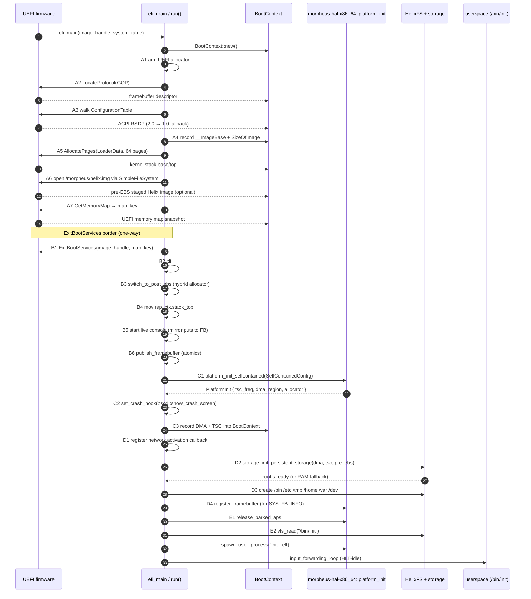
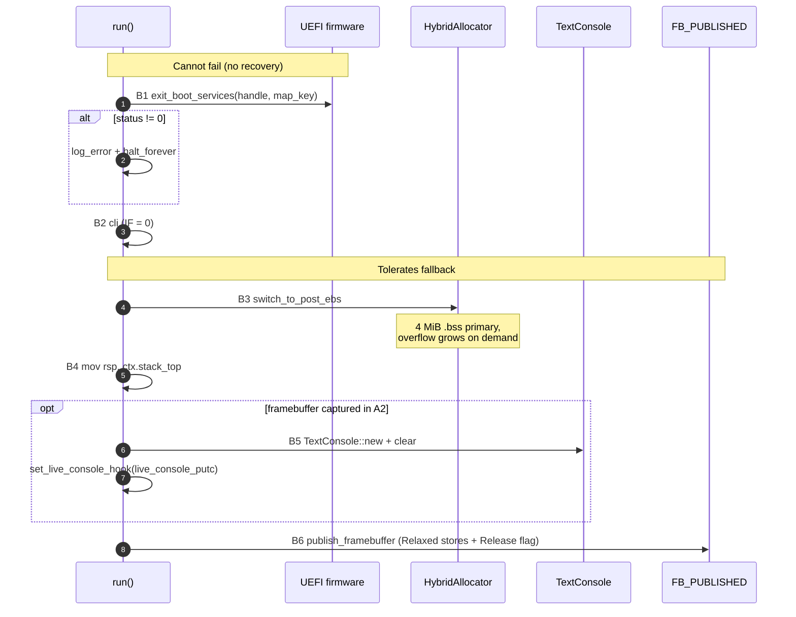
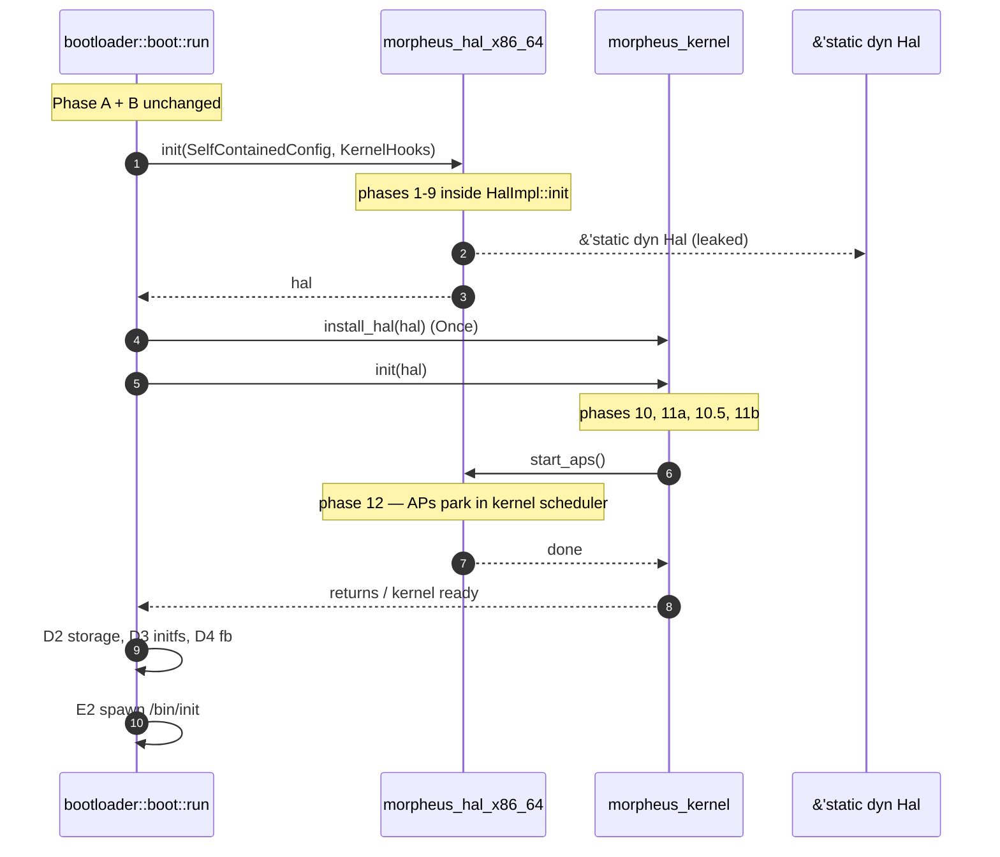
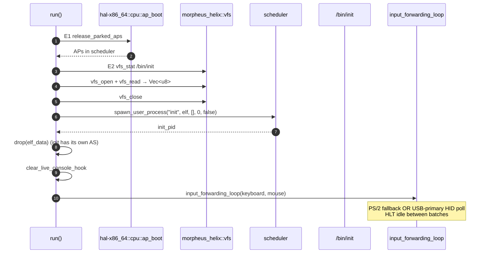
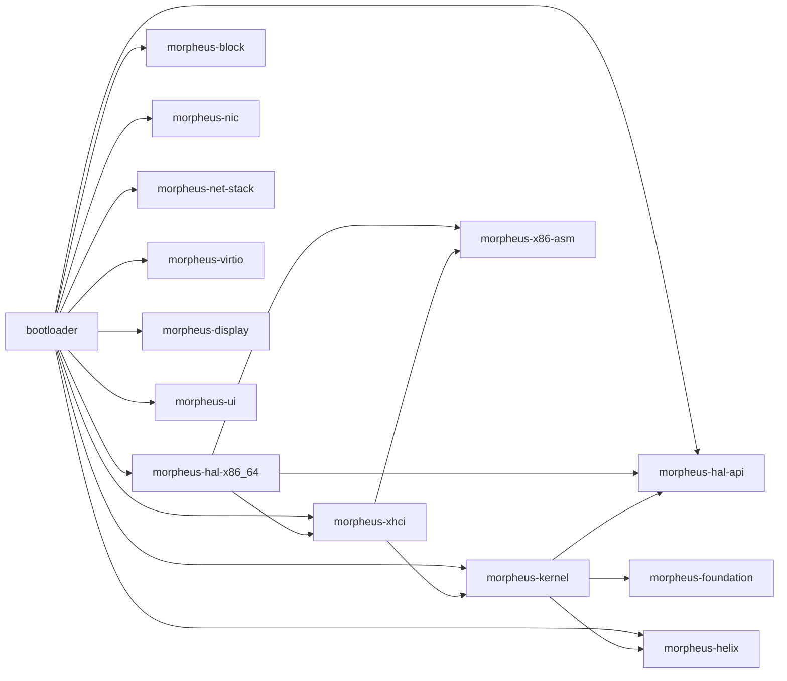

# Bootloader + early init

## Current architecture status

Phase 3.7 complete: 12-crate workspace, kernel fully arch-agnostic, the
previous `hwinit/` crate deleted. The bootloader imports
`morpheus-hal-x86_64` directly; the kernel sees only `morpheus-hal-api`.
`morpheus_hal_x86_64::platform::platform_init_selfcontained` runs phases
1-9 (HAL init); the bootloader then calls `morpheus_kernel::install_hal`
+ `morpheus_kernel::late_init(...)` for phases 10..12 (scheduler,
syscalls, reclaim, HelixFS) and `hal().smp().start_aps_from_list(...)`
for SMP. `elf.rs` lives in `morpheus-kernel/src/`.

> Original snapshot: `hardware-bringup` @ commit `4513930`. Most "current
> state" passages below have been edited in place to reflect Phase 3.7
> HEAD; line ranges in `platform.rs` are approximate.

## Purpose

MorpheusX boots through a single linear pipeline: UEFI firmware loads the
PE image, control enters `efi_main` in `bootloader/src/boot.rs`, the
`run()` orchestrator drives a sequence of named stages (`stage_a*` through
`stage_e*`) that accumulate a `BootContext`, calls `ExitBootServices`
exactly once, hands the resulting machine snapshot to
`morpheus_hal_x86_64::platform::platform_init_selfcontained()` (the
13-phase platform init in `morpheus-hal-x86_64/src/platform.rs`), then
mounts the root filesystem,
releases the parked APs, spawns `/bin/init`, and becomes the kernel input
forwarding loop. The chain is one-shot: there is no retry layer, no
fallback orchestrator, and no UEFI service called after `ExitBootServices`
returns. Every cross-stage value lives on the boot stack inside
`BootContext`; the only mutable global the bootloader publishes is the
framebuffer snapshot used by the crash hook.

## Architecture overview

## BootContext

`BootContext` (`bootloader/src/boot.rs:97-130`) is the only struct that
threads through the boot chain. Every stage takes `&mut BootContext` (or
`&BootContext`) and writes to a documented field set. Zero hidden globals
carry state between stages.

| Phase | Field(s) populated | Stage that writes it |
|-------|--------------------|----------------------|
| A pre-EBS | `image_handle`, `system_table` | `run()` |
| A pre-EBS | `framebuffer: FramebufferInfo` | A2 query GOP |
| A pre-EBS | `acpi_rsdp_phys` | A3 walk config table |
| A pre-EBS | `image_base`, `image_pages` | A4 read PE header |
| A pre-EBS | `stack_base`, `stack_pages`, `stack_top` | A5 allocate stack |
| A pre-EBS | `pre_ebs_helix: Option<PreEbsHelixImage>` | A6 stage helix.img |
| C mmap | `mmap_ptr`, `mmap_size`, `desc_size`, `desc_ver` | A7 GetMemoryMap |
| D post-platform | `platform_dma_cpu/bus/size`, `tsc_freq` | C3 record outputs |

`FramebufferInfo` (boot.rs:53-78) is **stride-in-pixels** (GOP
semantics); conversion to bytes happens at the consumer (B5 multiplies
by 4). It is `Copy` so it publishes cheaply into the lock-free
crash-hook atomics in B6. `PreEbsHelixImage` (boot.rs:86-90) holds
`(base, size, sector_size)` for an in-RAM `/morpheus/helix.img` staged
before EBS; storage init prefers it over PCI block probing.

## Pre-EBS phase (firmware still alive)

Phase A runs while UEFI is fully alive. The hybrid allocator
(`bootloader/src/uefi_allocator.rs`) is in its pre-EBS mode and routes
every Rust `Box`/`Vec` allocation through UEFI `allocate_pool`. UEFI's
own IDT is installed; the bootloader does not yet own interrupts.

| Stage | Function | What it does | Failure mode |
|-------|----------|--------------|--------------|
| A1 | `stage_a1_arm_uefi_allocator` | Calls `uefi_allocator::set_boot_services(st.boot_services)`. After this, `GlobalAlloc::alloc` resolves through `bs->allocate_pool(EFI_LOADER_DATA, ...)`. | Cannot fail; the BS pointer is from the UEFI handoff. |
| A2 | `stage_a2_query_gop` | `bs.locate_protocol(&GOP_GUID, ...)`. Captures `frame_buffer_base`, `frame_buffer_size`, `horizontal_resolution`, `vertical_resolution`, `pixels_per_scan_line`, `pixel_format` into `ctx.framebuffer`. | `log_warn` + headless boot. No panic. |
| A3 | `stage_a3_collect_acpi_rsdp` | Walks `st.configuration_table` for `ACPI_20_TABLE_GUID` first, then `ACPI_10_TABLE_GUID`. Stashes the vendor table pointer in `ctx.acpi_rsdp_phys`. | `log_warn`. SMP later falls back to CPUID-based topology scan. |
| A4 | `stage_a4_record_pe_image_bounds` | Reads `__ImageBase` linker symbol; parses PE32+ header at offset 0x3C, reads `SizeOfImage` at OptHdr+56. Stores `image_base` + `image_pages`. | No failure path — these bounds become the buddy allocator's exclusion range. |
| A5 | `stage_a5_allocate_kernel_stack` | `bs.allocate_pages(AllocateAnyPages, EfiLoaderData, KERNEL_STACK_PAGES=64)`. 256 KiB stack survives EBS because LoaderData is owned by us. | `boot_panic("EBS", "kernel stack allocation failed")`. |
| A6 | `stage_a6_stage_helix_image` | `handle_protocol(image_handle, LOADED_IMAGE)` → `handle_protocol(device_handle, SIMPLE_FILE_SYSTEM)` → `open_volume` → `open("\\morpheus\\helix.img")`, then streams the file into a freshly allocated LoaderData buffer in 1 MiB chunks. Size capped at `PRE_EBS_STAGE_MAX_BYTES = 512 MiB`, rounded up to 512-byte sectors. | All failures are non-fatal: `log_warn` and leave `ctx.pre_ebs_helix = None`. Storage init handles absence. |
| A7 | `stage_a7_fetch_memory_map` | `bs.get_memory_map(buf=65536-byte .bss MMAP_BUF, &map_key, &desc_size, &desc_ver)`. Stashes `map_key` in `EBS_MAP_KEY: AtomicUsize`. | `boot_panic("EBS", "get_memory_map failed")`. The map *must* be captured before EBS — its `map_key` is what `ExitBootServices` validates against. |

**Invariant on phase A exit**: `BootContext` carries every value needed to
survive `ExitBootServices`. After A7, the only remaining live UEFI calls
are `ExitBootServices` itself (B1) — no further `allocate_pages`,
`open_volume`, or `get_memory_map` is permitted because each would
invalidate `map_key`.

## ExitBootServices border (Stage B)

| Stage | Function | What it does | Failure mode |
|-------|----------|--------------|--------------|
| B1 | `stage_b1_exit_boot_services` | `bs.exit_boot_services(ctx.image_handle, EBS_MAP_KEY.load())`. UEFI is dead the instant this returns 0. | Non-zero status → `log_error` + `halt_forever`. There is no recovery because the IDT still points into BootServicesCode that is about to be reclaimed; even returning is unsafe. |
| B2 | `stage_b2_disable_interrupts` | Inline `cli`. UEFI's PIC/APIC timer may still be armed and OVMF DEBUG scrubs freed `BootServicesCode` with `0xAF`, so a single tick poisons buddy allocator FreeNodes. | Cannot fail. |
| B3 | `stage_b3_switch_allocator` | `uefi_allocator::switch_to_post_ebs()` — initializes the 4 MiB `.bss` primary heap (`linked_list_allocator::Heap`) and sets `POST_EBS = true`. Future allocations route through the primary; on miss, overflow heap grows in 16 MiB chunks (cap 256 MiB) from the registry. | Cannot fail; allocator is statically backed. |
| B4 | `stage_b4_switch_stack` | `mov rsp, ctx.stack_top`. The old UEFI stack is gone; locals on it are unreachable. | Cannot fail. |
| B5 | `stage_b5_start_live_console` | Constructs `morpheus_display::framebuffer::Framebuffer` (stride-bytes = `ctx.framebuffer.stride * 4`), wraps in `TextConsole`, clears it, stores in `static mut LIVE_CONSOLE`, registers `live_console_putc` as the `morpheus_hal_x86_64::serial` mirror hook. | Skipped (not failed) if no framebuffer. |
| B6 | `stage_b6_publish_framebuffer` | `publish_framebuffer(&ctx.framebuffer)` — 6 atomic `Relaxed` stores + one `Release` to `FB_PUBLISHED`. The BSoD/panic hook reads via `published_framebuffer()` with `Acquire`. | Cannot fail. |

**Cannot fail vs tolerates fallback**: B1 and B2 are absolute — failure
leaves the machine in an unrecoverable state. B3, B4, B6 are pure local
manipulations that always succeed. B5 silently no-ops when no framebuffer
was captured in A2.

## Post-EBS hardware init (Stage C — the 9-phase platform init)

`stage_c1_platform_init` invokes `morpheus_hal_x86_64::platform::platform_init_selfcontained(SelfContainedConfig)`
defined in `morpheus-hal-x86_64/src/platform.rs`. The function takes
ownership of the machine and returns a `PlatformInit { tsc_freq,
dma_region, allocator, kernel_stack_top, acpi_rsdp_phys }`. The phases
run synchronously, in numbered order, with `checkpoint()` markers
between each. Phases 1-9 live in `morpheus-hal-x86_64/src/platform.rs`;
phases 10, 11a, 10.5 and 11b live in `morpheus-kernel/src/init.rs`;
phase 12 is driven by the bootloader directly via
`hal().smp().start_aps_from_list`. The table below documents the *full*
13-phase boot ordering.

**CR0.WP clearing (`platform.rs:75-94`)**: before any buddy work, the
write-protect bit is cleared. UEFI marks some pages R/W=0 in their PTEs;
with WP=1 even ring-0 page-faults when writing FreeNode metadata into
those pages. After clearing, CR3 is reloaded to flush any TLB entries
that cached the prior state. WP stays off for the rest of uptime.

| # | Phase | platform.rs lines | Pre-conditions | What it does | Post-conditions / gotchas |
|---|-------|-------------------|----------------|--------------|---------------------------|
| 1 | Memory | 98-216 | UEFI map snapshot, image/stack bounds | `collect_page_table_pages()` walks PML4→PT, harvesting every live PT page. `sgdt`/`sidt` extract GDT/IDT bounds, page-aligned. Boot stack range from `config.stack_base/pages` (RSP-guess fallback if zero). All four sets are merged + insertion-sorted + de-duplicated into `hw_holes[]`. `init_global_registry(...)` builds the buddy from the UEFI map, **excluding** image, hw_holes. `validate_free_lists()` audits afterward. | The hole-punch list is the cure for the **FreeNode-in-PT-page hazard** (see [usb_xhci_real_hw_quirks.md]): `MemoryRegistry` writes a 16-byte FreeNode at every free block base, including spares from `carve_block` splits; landing one on a live page-table page rewrites the first two PTEs → garbage mapping → `#PF` on next TLB miss. The stack range must use the bootloader-reported bounds, not an RSP-guess — the latter missed the bottom on real silicon and let buddy plant FreeNodes in live LoaderData pages; OVMF's `0xAF` scrub then looked like corruption. |
| 2 | CPU state | 218-259 | Memory registry alive | Allocate kernel stack (`KERNEL_STACK_SIZE = 64 KiB`, LoaderData). `init_gdt(kernel_stack_top)` installs flat code/data + TSS. `init_idt()` installs the 256-entry IDT with stub handlers. `enable_sse()` (CR0.MP=1, CR0.EM=0, CR4.OSFXSR=1, CR4.OSXMMEXCPT=1, executes a `FNINIT`-equivalent). `apic::probe_lapic_base()` reads `IA32_APIC_BASE` MSR 0x1B (firmware can relocate it; trust MSR > spec default). `per_cpu::init_bsp(lapic_id, base)`. | Per-CPU init must follow GDT (so segment state is valid) and precede anything that touches `gs:[off]` (scheduler, interrupts, syscalls). The registry guard is dropped before exiting the scope — holding `SpinLock` across re-acquisition deadlocks instantly. |
| 3 | PIC | 261-265 | IDT installed | `init_pic()` remaps PIC1/PIC2 to vectors 0x20/0x28, masks all IRQs. | Stays in this state until phase 10 disables 8259 and switches to LAPIC. |
| 4 | Heap | 267-275 | Registry alive, phase 2 guard dropped | `init_heap(4 MiB)` — allocates pages via the registry, hands them to the kernel-side `linked_list_allocator`. | Bootloader's `#[global_allocator]` is independent (the hybrid allocator in `uefi_allocator.rs`); this heap backs kernel-side `alloc::*`. |
| 5 | TSC | 277-328 | PIT accessible | `calibrate_tsc_pit()` — gates the PIT for a known interval, samples TSC delta. CPUID 0x80000007:EDX[8] checked for invariant-TSC; warning if absent or leaf unavailable. `scheduler::set_tsc_frequency(freq)` records the result. | Failure (freq == 0) → `Err(InitError::TscCalibrationFailed)`. Without invariant TSC, P-state changes drift the TSC and break `delay_us` + scheduler timing on real silicon — non-fatal warning only. |
| 6 | DMA | 330-351 | Registry alive | `allocate_pages(MaxAddress(0xFFFF_FFFF), AllocatedDma, 512)` for 2 MiB below 4 GiB (32-bit BAR safety). `write_bytes(dma_phys, 0, DMA_SIZE)` scrubs the region. `DmaRegion::new(cpu=dma_phys, bus=dma_phys, size)` — identity-mapped so VA=PA=bus. | Zeroing is non-negotiable: **VirtIO reads `avail->idx` on enable**; uninitialized memory there (typically `0xFF` from BIOS POST) permanently desyncs the driver because the descriptor index will never match the device's. Bug was found the hard way on real hardware. |
| 7 | PCI | 353-357 | None (port I/O) | `enable_all_pci_devices()` — iterates bus 0..=255, dev 0..32, fn 0..8 (multi-function via header_type bit 7). For every non-bridge function, sets `COMMAND.MEM_SPACE | COMMAND.BUS_MASTER`. | Class 0x06 (bridges) is **skipped** — toggling BM on host/PCI-PCI/ISA bridges has triggered IOMMU faults and stray DMA from shadow BARs on real silicon. |
| 8 | Paging | 359-368 | Registry alive | `init_kernel_page_table()` builds a fresh 4-level page table covering all UEFI ConventionalMemory + MMIO ranges + identity-mapped LAPIC + image + heap + DMA, loads CR3. Then `apic::init_bsp()` remaps the LAPIC MMIO page as UC and brings BSP LAPIC fully online (SVR, LDR, DFR, TPR=0). | Until paging is up, LAPIC MMIO is identity-mapped by UEFI; the WB cache attribute is wrong but tolerated for the brief pre-paging window. |
| 9 | USB input | 370-466 | DMA region, paging up | `dump_usb_controllers()` lists every USB host controller (EHCI/UHCI/OHCI/xHCI). Then scans PCI for class 0x0C / subclass 0x03 / prog_if 0x30 (xHCI only). Per controller: `XhciController::new(bar0, tsc_freq)` (soft-restart, no HCRST, preserves UEFI port state), `wire_msix(addr, rt_base)` (Phase-2 MSI-X proof of delivery only — polling remains authoritative), `enumerate_and_bind_inputs(&mut controller)` walks slots, binds keyboard/mouse HID, returns the matched keyboard. `install_runtime(controller, keyboard)` hands the xHC to `usb::runtime` so the input loop can poll it later — **without this, `controller` drops here and the enumerated keyboard becomes unreachable**. | Enumerated synchronously **before** the scheduler so user processes never see a half-built input subsystem. See [usb_xhci_real_hw_quirks.md] for the catalog of "QEMU works, real silicon fails" bugs that surfaced here. |
| 10 | Scheduler | 468-472 | per-CPU init, paging, USB done | `init_scheduler()` builds the PID 0 process structure, sets up the run queue, captures kernel CR3 for `KernelCr3Guard`. | Required before any AP comes up (APs park-loop in scheduler). |
| 11a | Syscalls | 474-498 | Scheduler alive | `init_syscall()` programs MSRs `IA32_LSTAR/CSTAR/FMASK/STAR` to route `syscall`/`sysret` into the kernel entry asm. `apic::disable_pic8259()` masks both PICs; interrupts now flow through LAPIC only. `apic::setup_timer(100)` calibrates LAPIC timer against PIT ch2 (no PIC IRQ needed), arms it at ~100 Hz periodic. `set_interrupt_handler(0x20, irq_timer_isr, ...)`. `enable_interrupts()` — `sti`. | IDT vector 0x20 keeps its meaning across the PIC→APIC swap (same vector, LAPIC-sourced now). |
| 10.5 | Reclaim BootServices | 500-534 | LAPIC timer live | Disable interrupts (non-preemptible — we mutate allocator + paging meta). `collect_page_table_pages()` re-scans (post-paging) to build the PT-page exclusion set, insertion-sorted. `reg.reclaim_boot_services(&pt_pages)` walks the UEFI map and frees every `BootServicesCode`/`BootServicesData` page except those in the exclusion list. `validate_free_lists()`. `reserve_page_table_pages()` re-marks PT pages as Reserved. Second validate catches corruption from `carve_block` splits during reclaim. Re-enable interrupts. | Page-table pages live in `BootServicesData`; writing a FreeNode over a live PML4 entry is a one-way trip to `#PF`. The exclusion set + dual validate is the defense. |
| 11b | HelixFS | 536-559 | Heap up, registry alive | Allocate 16 MiB LoaderData, zero it, `morpheus_helix::vfs::global::init_root_fs(base, size)` mounts a bootstrap RAM-backed HelixFS at `/`. | **Non-fatal**: failure → `log_warn("root fs init failed; continuing without fs")`. Bootloader's `storage::init_persistent_storage` later attempts to override this with a real disk-backed root. Then sets `per_cpu::current().kernel_syscall_rsp = kernel_stack_top` (PID 0's syscall entry reads this from `gs:[0x20]`). |
| 12 | SMP | 567-610 | Scheduler ready (APs park there) | `acpi::set_rsdp_phys(config.acpi_rsdp_phys)`. `apic::read_lapic_id()` for BSP. `acpi::discover_ap_lapic_ids(bsp_id)` walks MADT → exact enabled-LAPIC set. If MADT yields ≥1 AP: `per_cpu::set_cpu_count(count+1)`, disable interrupts, `ap_boot::start_aps_from_list(&ids)`, re-enable. Fallback (no MADT or empty): `apic::detect_cpu_count()` via CPUID, then `ap_boot::start_aps()` brute-force. | CPUID fallback works on sparse topologies but is slow (ghost timeouts for absent LAPIC IDs). The MADT path is the happy case. Interrupts are explicitly disabled during AP startup because the trampoline write to 0x8000 conflicts with timer-tick scheduler entry. |

## Phase split (live)

`platform_init_selfcontained` splits at the end of phase 9. The boot
phases map to crates as follows:

| Phase | Live home | Notes |
|-------|-----------|-------|
| Phases 1-9 (memory through USB-host) | `morpheus_hal_x86_64::platform::platform_init_selfcontained` | All HAL work lives here. USB Phase 9 calls into `morpheus_xhci::enumerate_and_bind_inputs` plus `usb::runtime::install_runtime`. |
| Phase 10 (scheduler) | `morpheus_kernel::late_init` | Scheduler init routes through `hal().smp()` for per-CPU state. |
| Phase 11a (syscalls + LAPIC takeover) | `morpheus_kernel::late_init` | `hal().intr()` swaps PIC → LAPIC, installs the periodic 100 Hz timer ISR. |
| Phase 10.5 (reclaim BootServices) | `morpheus_kernel::late_init` | `hal().phys().reclaim_boot_services(...)`. |
| Phase 11b (HelixFS mount) | `morpheus_kernel::late_init` | Pure kernel policy; no arch-specific calls. |
| Phase 12 (SMP / AP bring-up) | bootloader → `hal().smp().start_aps_from_list(...)` after kernel `late_init` returns | LD16: kernel state must be ready before APs unpark. |

Key consequences:

- **Kernel ↔ HAL contract** is `morpheus-hal-api` (the trait surface in
  `docs/phase3-prep/hal-api-design.md`): `Hal { mmio, cpu, serial, phys,
  paging, intr, timer, dma, bus, usb, reset, smp }`, all object-safe.
- **Bootloader knows both crates**. It calls
  `morpheus_hal_x86_64::platform::platform_init_selfcontained(...)` and
  `morpheus_hal_x86_64::platform::init()` to get the HAL singleton, then
  `morpheus_kernel::install_hal(hal)` + `morpheus_kernel::late_init(...)`.
- **No upward refs** remain from HAL into kernel. Previously
  bidirectional cycles (timer ISR → scheduler, page fault → process
  table, LAPIC timer setup → scheduler tsc frequency) are broken via
  hook-registration patterns wired by the bootloader at boot.
- **SMP starts last**, after the kernel scheduler is up. APs that already
  parked in the trampoline are released into the live scheduler.

## Kernel handoff (Stage E)

`stage_e1_release_aps` calls `morpheus_hal_x86_64::cpu::ap_boot::release_parked_aps()`.
APs that arrived at the trampoline park in a tight `pause` loop checking
`AP_GO` until the BSP toggles it; they then enter the scheduler proper.

`stage_e2_enter_userspace` is the only stage that never returns. It
probes `usb::runtime::keyboard_present()` to decide the input path
(USB-present skips PS/2 reset to avoid log flood on USB-only boards),
runs `boot_log_gate` which spins until a press, clears the live
console hook (userspace now owns the FB), `load_init_elf()` reads
`/bin/init` via VFS, `spawn_user_process` creates init's address
space and PCB, drops the ELF buffer, and enters `input_forwarding_loop`.
The loop is USB-primary (`morpheus_xhci::usb::runtime::poll_keyboard()`
+ kernel input drain) or PS/2-fallback (up to 64 bytes per outer
iteration); on no-work it does `scheduler::mark_kernel_hlt()` + atomic
`sti;hlt;cli`.

**Post-EBS contracts the bootloader relies on**:

- Framebuffer must be published (B6) before any code path can panic
  (otherwise the BSoD has no render target).
- Live-console hook (B5) must be installed before any `log_*` we want
  mirrored to the FB.
- Crash hook (C2) must be registered before any code that may except
  (which is "everything after phase 1").
- `published_framebuffer()` reads with `Acquire`; B6 publish uses
  `Release` on `FB_PUBLISHED`. The 6 component atomics are `Relaxed`
  because `FB_PUBLISHED` is the synchronization point.

## Crash path

Two entry routes converge on the same BSoD code:

1. **Rust panic** → `bootloader::main::panic` (`main.rs:85-130`). Logs
   file/line to serial via a no-alloc decimal printer, calls
   `bsod::show_panic_screen(file, line, col)`, then `hlt`-loops.
2. **CPU exception** (`#PF`, `#GP`, `#UD`, ...) → IDT stub fills a
   `CrashInfo { vector, rip, rsp, cs, ss, rflags, error_code, cr2, cr3,
   16 GPRs, backtrace[10], backtrace_depth }` from the saved frame,
   walks rbp for the backtrace, calls the crash hook registered in C2
   (`bsod::show_crash_screen`).

Both paths fetch the framebuffer via `boot::published_framebuffer()` —
returns `None` until B6, then a snapshot from `FB_*` atomics under one
`Acquire` on `FB_PUBLISHED`.

**The "framebuffer from exception context" discipline** (boot.rs:159-200):

- No heap allocations (heap is what likely died).
- No `SpinLock` acquisitions (a deadlocked spinlock from a non-reentrant
  caller is the canonical reason we got here).
- All FB state through atomics, never through `static mut FB: Option<...>`.
- The BSoD renderer (`bsod.rs`) walks the framebuffer with raw volatile
  writes via `put_pixel` (no display crate locking).
- The 8x16 font is embedded as a const array; backgrounds are RLE-decoded
  from `bsod_bg_data.rs` into a 120-pixel `row_buf` on the stack, then
  nearest-neighbor scaled.

## UEFI FFI subset

The bootloader hand-codes a minimal repr-C subset of the UEFI types it
actually touches; it does not pull in `uefi-rs`. Layouts must match the
UEFI 2.10 spec byte-for-byte for the fields actually used; unused fields
are `usize` padding.

| Type | Used for | Source |
|------|----------|--------|
| `EfiSystemTable` | Anchor for everything UEFI | boot.rs:262-276 |
| `EfiBootServices` (full) | `allocate_pages`, `get_memory_map`, `handle_protocol`, `exit_boot_services`, `locate_protocol` | boot.rs:279-320 |
| `crate::BootServices` (allocator subset) | `allocate_pool`, `free_pool`, `locate_protocol` | main.rs:42-83 |
| `EfiConfigurationTable` | ACPI RSDP walk | boot.rs:322-326 |
| `EfiLoadedImage` | Resolve boot device handle in A6 | boot.rs:328-334 |
| `EfiSimpleFileSystem` + `EfiFileProtocol` | Read /morpheus/helix.img in A6 | boot.rs:336-358 |
| `Gop` + `GopMode` + `GopModeInfo` | A2 framebuffer capture | boot.rs:360-386 |

Authoritative GUIDs (UEFI 2.10):

| GUID | Constant | Hex (mixed-endian) |
|------|----------|--------------------|
| Loaded Image Protocol | `LOADED_IMAGE_PROTOCOL_GUID` | `5B1B31A1-9562-11D2-8E3F-00A0C969723B` |
| Simple File System Protocol | `SIMPLE_FILE_SYSTEM_PROTOCOL_GUID` | `964E5B22-6459-11D2-8E39-00A0C969723B` |
| ACPI 2.0 Table | `ACPI_20_TABLE_GUID` | `8868E871-E4F1-11D3-BC22-0080C73C8881` |
| ACPI 1.0 Table | `ACPI_10_TABLE_GUID` | `EB9D2D30-2D88-11D3-9A16-0090273FC14D` |
| Graphics Output Protocol | `GOP_GUID` | `9042A9DE-23DC-4A38-96FB-7ADED080516A` |

(Byte order in the source matches UEFI's mixed-endian GUID layout — first
three groups little-endian, last two big-endian.)

## Storage init (D2)

`stage_d2_storage_init` defers entirely to `storage::init_persistent_storage`
(`bootloader/src/storage.rs`). The probe order is:

1. **Pre-EBS staged image**: if `ctx.pre_ebs_helix` is `Some`, wrap the
   in-RAM buffer in a `MemBlockDevice`, expose it as a `RawBlockDevice`
   to HelixFS, and mount over the bootstrap RAM-fs from phase 11. This
   is the fastest path and survives any post-EBS PCI weirdness.
2. **PCI block scan**: `morpheus_block::scan_all_block_devices()` walks
   PCI for AHCI (`01:06:01`), VirtIO-blk (`01:00:?` + vendor `1AF4`),
   SDHCI, and USB-MSD. For each candidate, BARs are identity-mapped UC
   via `kmap_mmio`. The fixed DMA layout (8 KiB header pool, VirtIO
   ring slots at `0x0_0000-0x0_1200`, AHCI cmd list + FIS + IDENTIFY
   at `0x0_2000-0x0_5000`, 64 KiB I/O buffer at `0x1_0000`) lives in
   `storage.rs:25-37`.
3. **RAM-disk fallback**: if no persistent device passed superblock
   validation, the bootstrap RAM HelixFS from phase 11 stays mounted.

The **USB-MSD path triggers a second `XhciController` instance**. The
Phase-9 controller in `usb::runtime` is HID-only; it is quiesced via
`controller.quiesce()` (the boot integration memo
[usb_boot_integration] covers the handoff). The new instance in
`morpheus-block`'s `usb_msd` driver enumerates mass-storage class,
sets up Bulk-Only Transport rings, and exposes the device as a
`UnifiedBlockDevice`. Per memo: storage USB lives in `morpheus-block`,
HID USB lives in `morpheus-xhci::usb`.

## TUI subsystem (within bootloader)

The TUI (`bootloader/src/tui/`) runs only pre-userspace — boot-time
interactive surface (menu, log gate, debug overlay). Once `/bin/init`
is up, the TUI is dead and userspace owns the framebuffer via
`SYS_FB_MAP`.

- `tui/input.rs`: PS/2 keyboard (`Keyboard`). Scan Set 1 decoder, US +
  DE layouts (runtime-switchable). `asm_ps2_poll_any` (in
  `baremetal_ops`) returns a `(device << 8) | byte` packet from the
  unified PS/2 queue. `Keyboard::new()` runs full reset;
  `new_decoder_only()` skips it (USB-keyboard-present case).
- `tui/mouse.rs`: PS/2 mouse (`Mouse`). Same `new` / `new_decoder_only` split.
- `tui/renderer.rs` + `fb_canvas.rs`: framebuffer console, 8x16 font, ANSI subset.
- `tui/main_menu.rs`: boot menu (entries, navigation, dispatch).
- `tui/event_adapter.rs`: bridges PS/2 + USB events into the renderer loop.
- `tui/rain.rs` + `tui/debug.rs`: decorative screensaver + on-screen debug overlay.

`bsod.rs` + `bsod_bg_data.rs` are TUI peers serving the crash path
under tighter constraints (no heap, no locks). BG is a 120×N RLE
palette image, nearest-neighbor scaled to GOP resolution.

## Key invariants

- `CR0.WP` must be cleared **before** any `MemoryRegistry` operation
  (UEFI leaves some pages R/W=0 in their PTEs; with WP=1, even ring-0
  page-faults when writing FreeNode bookkeeping).
- Page-table pages **must be excluded from the buddy import** (PML4,
  PDPT, PD, PT). The FreeNode-in-PT-page hazard is the worst-case
  silent corruption — caught only by a TLB-miss page-fault much later.
- `ExitBootServices` is one-way. No UEFI service call may occur after
  B1 returns. No `static` pointing into UEFI memory may be dereferenced
  after B1 (the `mmap_ptr` is fine because `MMAP_BUF` is `.bss`).
- Framebuffer publish (B6) **must use lock-free atomics**. The
  crash-context BSoD reads them with no lock, no heap, no alloc. The
  current implementation uses 6 `Relaxed` stores + `Release` flag and
  6 `Relaxed` loads + `Acquire` flag.
- TSC frequency **must be calibrated before** the scheduler tick is
  set up (the scheduler reads it for time-quantum math). `init_scheduler`
  and `set_tsc_frequency` are ordered accordingly in phases 5 → 10.
- SMP **must not start until the scheduler is up**. APs park in the
  scheduler's idle loop; bringing them up before the scheduler exists
  is undefined. Current code runs SMP as phase 12, after scheduler
  (10) + syscalls (11a) + reclaim (10.5) + FS (11b).
- HelixFS init is **non-fatal**. Bootloader continues without `/`;
  storage init will retry with a real disk-backed root.
- The Phase-9 `XhciController` **must be handed to `usb::runtime::install_runtime`**
  before its enclosing scope ends — otherwise `Drop` releases the xHC
  and the just-enumerated HID becomes unreachable.
- `enable_all_pci_devices` **must skip class 0x06 (bridges)**. Toggling
  BM on bridges causes IOMMU faults + stray DMA from shadow BARs on
  real silicon.

## Dependency surface

### Live (Phase 3.7 HEAD)

`bootloader/Cargo.toml` at HEAD lists `morpheus-block`, `morpheus-display`,
`morpheus-helix`, `morpheus-hal-x86_64`, `morpheus-hal-api`,
`morpheus-kernel`, `morpheus-net-stack`, `morpheus-nic`, `morpheus-ui`,
`morpheus-virtio`, `morpheus-xhci`, plus `linked_list_allocator` +
`spin` for the post-EBS hybrid allocator's primary heap. The kernel
depends on `morpheus-hal-api` only; the contractually-empty
`grep -rn "morpheus_hal_x86_64" morpheus-kernel/src/` is verified.

## Known intentional changes vs pre-refactor

- **`alloc_heap.rs` moved** from `network/src/` to `bootloader/src/`
  (Wave 4 of Phase 3.1; locked decision 17: `#[global_allocator]` in
  the binary, not in a library crate). The file at HEAD is
  `uefi_allocator.rs` — same role, name reflects the hybrid nature.
- **`morpheus_network::*` imports rewired** (Phase 3.1 Wave 4 done):
  bootloader now imports from `morpheus_{block,nic,net-stack,virtio}::*`
  directly; the `morpheus-network` umbrella crate was deleted.
- **`DmaRegion` consolidation**: the divergent pre-refactor shapes are
  gone. The canonical type lives in `morpheus-hal-api`, with `morpheus-virtio`
  providing its own `DmaRegion` for the VirtIO 2 MB transport region
  (different shape, different role — the audit-sin-#6 duplication is
  resolved).
- **Per-CPU shutdown-quiesce policy** stays in the kernel (locked
  decision 12). HAL exposes only the per-CPU state ops; the policy
  of when to quiesce remains in `morpheus-kernel::shutdown`.

## Cross-references

- **HAL trait surface**: `docs/phase3-prep/hal-api-design.md` — the
  bootloader+kernel contract: `PhysAlloc`, `PageTable`,
  `InterruptController`, `Timer`, `DmaAllocator`, `BusEnumerator`,
  `UsbHost`, `Reset`, `Smp` traits and 13 open decisions.
- **Lower-half move plan**: `docs/phase3-prep/lower-half-move-plan.md`
  — file-by-file inventory of every lower-half module (historical
  record of the move that delivered `morpheus-hal-x86_64`).
- **Upper-half move plan**: `docs/phase3-prep/upper-half-move-plan.md`
  — same treatment for the kernel half (process, scheduler, syscall
  dispatcher, ELF loader); `platform.rs` line ranges per phase.
- **Verification plans**: `docs/phase3-prep/verification-plan.md`,
  `docs/phase3-prep/post-refactor-verification-plan.md` — QEMU +
  real-hw gates that 3.2 and 3.3 must pass.
- **xHCI real-hardware quirks**:
  `~/.claude/projects/.../memory/usb_xhci_real_hw_quirks.md` —
  catalog of "works on QEMU, fails on Intel silicon" bugs that drove
  the Phase-9 design. Check this first when real-hw diverges from virt.
- **Boot integration memo**: `usb_boot_integration.md` — Phase 9
  ordering, `XhciController` drop-after-Phase-9, storage USB in D2.
- **Storage stack**: future doc; covers `storage.rs` boot_probe, the
  fixed DMA layout, GPT/ESP parsing, pre-EBS staging path, and the
  RawBlockDevice ↔ UnifiedBlockDevice bridge.
- **Network stack**: future doc; post-userspace bring-up. Bootloader's
  D1 `register_network_activation` is the contract handoff — net stays
  offline until userspace opts in via `SYS_NET_CFG(NET_CFG_ACTIVATE)`.
