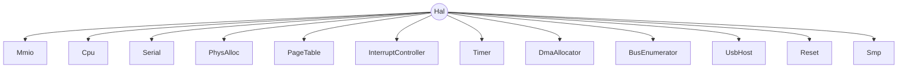
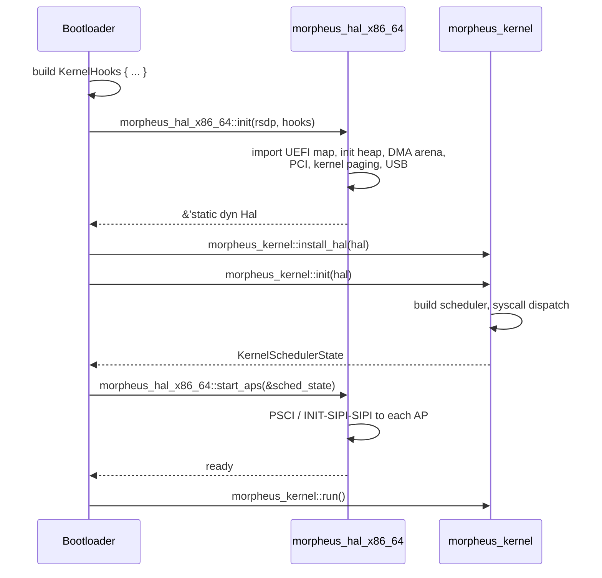

# HAL trait surface — the kernel↔machine contract

## Current architecture status

Phase 3.7 complete: 12-crate workspace, kernel fully arch-agnostic,
the previous `hwinit/` crate deleted. The 13-sub-trait surface
(`Mmio`, `Cpu`, `Serial`, `PhysAlloc`, `PageTable`,
`InterruptController`, `Timer`, `DmaAllocator`, `BusEnumerator`,
`UsbHost`, `Reset`, `Smp`, `Compositor`) is the final shape and is
implemented by `morpheus-hal-x86_64`. `morpheus-kernel/src/` contains
zero `asm!`, zero references to `morpheus_hal_x86_64`, and zero
`#[cfg(target_arch)]`. The kernel reaches the HAL through
`morpheus_kernel::hal() -> &'static dyn Hal`. All previous
`sched_hooks` indirections and K10 shims have been retired in favor of
direct trait calls.

## Purpose

`morpheus-hal-api` is the portable-kernel boundary. It is a `no_std`, zero-workspace-dep leaf crate that exports a set of object-safe traits and a handful of plain `#[repr(C)]`/`#[repr(transparent)]` types. Any HAL implementation — `morpheus-hal-x86_64` today, a hypothetical `morpheus-hal-aarch64` tomorrow — that satisfies this trait surface can host `morpheus-kernel` unmodified. The kernel never directly imports a HAL implementation crate; it only sees `&'static dyn Hal` and the plain types. This single contract is what makes the rest of MorpheusX portable, and it is the most load-bearing interface in the workspace.

## Design philosophy

- **Dynamic dispatch via `&dyn Hal`.** Locked decision: vtable dispatch is the only call form. The cost of an indirect call (~1 ns plus a possible icache miss) is paid once per kernel→HAL crossing. The alternative — making the kernel generic over `H: Hal` — would force every kernel signature (every syscall handler, every scheduler entry, every driver callback) to carry an `H` type parameter, which collapses on contact with `dyn`-only sites like ISR thunks and trait-object queues.
- **Object-safe throughout.** No generic methods, no `Self`-typed returns, no `impl Iterator`, no `Vec`/`String`/`Box` on the surface. Enumeration is done via `&mut dyn FnMut(...)` callbacks. Per-process address spaces use opaque `Pml4Handle` newtypes instead of returning a fresh `Self`-like trait object.
- **Zero workspace deps.** `morpheus-hal-api/Cargo.toml` has an empty `[dependencies]` table. It depends on `core` only. This is what lets the kernel and every HAL impl compile in parallel without a circular-dep dance.
- **Plain repr-stable types live here.** `DmaRegion`, `BusAddr`, `PageFlags`, `Pml4Handle`, `MemoryType`, `MemoryDescriptor`, `MemoryAttribute`, `E820Entry`, `AllocKind`, `MemError`, `PageError`, `MsiError`, `IsrFn` — all are defined in `hal-api`. Both kernel and HAL agree on their layout because both `use morpheus_hal_api::*`. This kills the "two `DmaRegion` shapes" sin (#6) from the architecture audit.
- **One global per process.** `morpheus-kernel::global` holds a `static HAL: SyncLazy<&'static dyn Hal>` (effectively a once-cell). `install_hal()` is called exactly once by the bootloader before any kernel code that needs the HAL. There is no thread-local HAL, no per-CPU HAL — the trait object itself is `Send + Sync` and methods are re-entrant.

## Root `Hal` trait

`Hal` is a pure accessor trait: it owns no state itself, it just gives the kernel a handle to each sub-trait. The implementation backs each accessor with a `&'static` to a concrete struct living in HAL-impl static storage (`static MMIO: X86Mmio = ...;` etc.).

```rust
pub trait Hal: Send + Sync {
    fn mmio(&self)   -> &dyn Mmio;
    fn cpu(&self)    -> &dyn Cpu;
    fn serial(&self) -> &dyn Serial;
    fn phys(&self)   -> &dyn PhysAlloc;
    fn paging(&self) -> &dyn PageTable;
    fn intr(&self)   -> &dyn InterruptController;
    fn timer(&self)  -> &dyn Timer;
    fn dma(&self)    -> &dyn DmaAllocator;
    fn bus(&self)    -> &dyn BusEnumerator;
    fn usb(&self)    -> &dyn UsbHost;
    fn reset(&self)  -> &dyn Reset;
    fn smp(&self)    -> &dyn Smp;
}
```



Why a hub-and-spoke trait instead of one giant flat trait? Two reasons. First, a 100+ method trait makes the vtable enormous and `cargo doc` unreadable. Second, sub-traits let drivers narrow their dependency: `morpheus-xhci` only needs `&dyn Mmio + &dyn DmaAllocator + &dyn InterruptController`, not the entire HAL. A driver crate can take those three references in its constructor and never touch the rest.

## Sub-trait deep dives

### 1. `Mmio` — memory-mapped I/O primitives

**Purpose.** Every driver that talks to a device through MMIO BAR — xHCI, VirtIO, NVMe, AHCI — needs typed, volatile, side-effect-correct reads and writes plus arch-appropriate memory fences. Volatile semantics and barriers are arch-specific; the kernel must not encode them inline.

**Methods.**

```rust
fn read8 (&self, addr: u64) -> u8;
fn read16(&self, addr: u64) -> u16;
fn read32(&self, addr: u64) -> u32;
fn read64(&self, addr: u64) -> u64;
fn write8 (&self, addr: u64, val: u8);
fn write16(&self, addr: u64, val: u16);
fn write32(&self, addr: u64, val: u32);
fn write64(&self, addr: u64, val: u64);
fn mfence(&self);
fn sfence(&self);
fn lfence(&self);
```

- **Pre.** `addr` must point into a region previously mapped via `PageTable::kmap_mmio` (so it's UC or WC in the kernel page table). Hot-path: called per-doorbell, per-CSR-read. No async semantics — fully synchronous.
- **Post.** A `writeN` followed by `mfence` is observed by the device. A `readN` after `mfence` is observed strictly after all prior `writeN`.

**Hidden globals.** None. Implementation is fully stateless — each method is one `core::ptr::write_volatile` / `read_volatile` plus a barrier instruction.

**ARM implementation hints.**
- `mfence` → `dsb sy` (full system barrier). The x86 `MFENCE` instruction is replaced by AArch64's Data Synchronization Barrier with `sy` scope.
- `sfence` → `dmb st` (store-store ordering).
- `lfence` → `dmb ld` (load-load ordering); note that the semantics differ subtly — on x86 `LFENCE` is also a serializing barrier, while on ARM `dmb ld` is only a memory ordering hint.
- All MMIO accesses must use the `_relaxed` or normal load/store variants on a region mapped as `Device-nGnRnE` in the translation tables, *not* `_acquire`/`_release`.

**Why these methods and not that ones.** No `read_array`/`write_array` — those would be either a pile of typed variants or a generic, and we forbid generics. Drivers compose primitives manually. No `cmpxchg` — atomics are not HAL territory; the kernel uses `core::sync::atomic` directly.

### 2. `Cpu` — interrupt-flag and idle primitives

**Purpose.** Lock primitives (`SpinLockIrqSave`), the `KernelCr3Guard`, and the `reset_machine` path all need to manipulate the interrupt-enable bit and halt the CPU. These are one-instruction operations on x86 but the kernel has no business knowing `cli` from `sti`.

**Methods.**

```rust
fn disable_interrupts(&self);
fn enable_interrupts(&self);
fn interrupts_enabled(&self) -> bool;
fn halt(&self);
```

- **Hot-path.** `disable_interrupts`/`enable_interrupts` are called by every IRQ-save spinlock acquisition, so they're on the hottest path that exists. `interrupts_enabled` is read by `KernelCr3Guard::new` to decide whether to re-enable on drop.
- **Sync.** Synchronous; both modify a CPU-local flag register.

**Hidden globals.** None per-instance, but `disable_interrupts` modifies CPU-local state (RFLAGS.IF on x86, DAIF on ARM). The HAL must guarantee that consecutive disable/enable pairs nest correctly when used by the IRQ-save lock pattern.

**ARM implementation hints.**
- `disable_interrupts` → `msr DAIFSet, #2` (mask IRQ).
- `enable_interrupts` → `msr DAIFClr, #2`.
- `interrupts_enabled` → `mrs Xn, DAIF; tst Xn, #(1<<7); ...`.
- `halt` → `wfi` (Wait For Interrupt). Note: `wfi` is interruptible by both masked and unmasked interrupts depending on configuration; the kernel only uses `halt` from the idle thread so the exact semantics are forgiving.

**Why these and not more.** No `pause`/`spin_loop_hint` — that's `core::hint::spin_loop()` and doesn't need HAL routing. No CPUID — that's a one-shot init detail, hidden in `HalImpl::init`.

### 3. `Serial` — early-debug UART

**Purpose.** The kernel's logging macros (`klog!`, `kerror!`) must produce bytes on the serial port without pulling in `core::fmt` (which is heavy and depends on `alloc`). Methods are chosen to cover every formatter the kernel uses: ASCII bytes, hex words, newlines.

**Methods.**

```rust
fn putc(&self, c: u8);
fn puts(&self, s: &str);
fn put_hex32(&self, v: u32);
fn put_hex64(&self, v: u64);
fn newline(&self);
```

- **Hot-path.** None. Logging is called only on rare paths (boot, errors, debug). Synchronous, polling.
- **Pre.** UART must be initialized inside `HalImpl::init` before the first `puts` lands.

**Hidden globals.** A static `Mutex<Uart16550>` or equivalent — the HAL impl owns it. Kernel never sees the struct.

**ARM implementation hints.** Most ARM boards have a PL011 UART (QEMU virt machine), not 16550. The HAL impl picks the right driver; the trait surface is unchanged. `put_hex64` typically uses a stack buffer + manual nibble→ASCII loop to avoid `format_args!`.

### 4. `PhysAlloc` — buddy allocator backed by the UEFI memory map

**Purpose.** The kernel needs to allocate physical pages for: per-process page tables, DMA buffers (via `DmaAllocator`), kernel stacks, ELF image backing, heap expansion. It also needs to interrogate the memory map for `is_valid_cr3` (PCID safety check), `find_largest_free_below_4gb` (AP trampoline, 32-bit DMA), and `export_e820` (Linux-handoff diagnostics).

**Methods.**

```rust
fn allocate_pages(&self, kind: AllocKind, mt: MemoryType, pages: u64)
    -> Result<u64, MemError>;
fn free_pages(&self, addr: u64, pages: u64) -> Result<(), MemError>;
fn is_initialized(&self) -> bool;
fn page_size(&self) -> u64;
fn total_memory(&self) -> u64;
fn free_memory(&self) -> u64;
fn allocated_memory(&self) -> u64;
fn memory_type_at(&self, phys: u64) -> MemoryType;
fn is_valid_cr3(&self, cr3: u64) -> bool;
fn find_largest_free_below_4gb(&self) -> Option<(u64, u64)>;
fn for_each_descriptor(&self, f: &mut dyn FnMut(&MemoryDescriptor));
fn export_e820(&self, out: &mut [E820Entry]) -> usize;
```

- **Hot-path.** `allocate_pages` is called per-syscall (process create, mmap, kernel stack alloc). `memory_type_at` is called on every page-fault in the user-pointer validator. `is_valid_cr3` is called on every `sys_exec`.
- **Pre.** `allocate_pages` must be called only after `HalImpl::init` finishes the UEFI-map import. `pages` is in units of `page_size()` (4 KiB on x86, 4 KiB or 16 KiB or 64 KiB on ARM depending on TG selection).

**Hidden globals.** A buddy allocator (`morpheus_hal_x86_64::memory::MemoryRegistry`), a parsed copy of the UEFI memory map, and an inflight allocator-tag table. The kernel sees none of this.

**ARM implementation hints.**
- AArch64 supports 4 KiB / 16 KiB / 64 KiB granules. `page_size()` is the trait's way of letting the kernel ask without assuming. The kernel uses `phys.page_size()` rather than the constant `4096` everywhere.
- ARM doesn't have CR3; `is_valid_cr3` on ARM checks that the physical address could legally land in TTBR0 (correct alignment, within RAM). The trait name stays "cr3" for now because renaming it would touch the kernel; future cleanup might call it `is_valid_root_page_table`.
- `find_largest_free_below_4gb` matters less on ARM (no real-mode legacy) but stays for 32-bit DMA-capable devices.

**Why these and not others.** `import_uefi_map` and `reclaim_boot_services` are *not* on the trait. They're one-shot init steps called by `HalImpl::init` and would clutter the trait with methods that may only be called once during boot. Keeping them off the trait also prevents the kernel from accidentally calling them post-init.

### 5. `PageTable` — kernel + per-process virtual memory

**Purpose.** Every process needs its own address space (separate PML4 / TTBR0). The kernel needs to map its own MMIO regions, kernel stacks, and the global kernel half. The ELF loader maps user pages.

**Methods.**

```rust
// Kernel PML4 (single shared kernel-half page table).
fn kmap_4k(&self, virt: u64, phys: u64, flags: PageFlags) -> Result<(), PageError>;
fn kmap_2m(&self, virt: u64, phys: u64, flags: PageFlags) -> Result<(), PageError>;
fn kunmap_4k(&self, virt: u64) -> Result<(), PageError>;
fn kvirt_to_phys(&self, virt: u64) -> Option<u64>;
fn kensure_4k(&self, virt: u64) -> Result<(), PageError>;
fn kmap_mmio(&self, phys: u64, size: u64) -> Result<(), PageError>;
fn kmark_uncacheable(&self, virt: u64) -> Result<(), PageError>;
fn kernel_pml4_phys(&self) -> u64;

// Per-process PML4 via opaque handle.
fn pml4_new_empty(&self) -> Result<Pml4Handle, PageError>;
fn pml4_translate(&self, pml4: Pml4Handle, virt: u64) -> Option<u64>;
fn pml4_map_4k(&self, pml4: Pml4Handle, virt: u64, phys: u64, flags: PageFlags)
    -> Result<(), PageError>;
fn pml4_clone_kernel_half(&self, dst: Pml4Handle) -> Result<(), PageError>;

fn flush_tlb_page(&self, virt: u64);
fn flush_tlb_all(&self);
fn for_each_pt_page(&self, f: &mut dyn FnMut(u64));
```

- **Hot-path.** `pml4_map_4k` is called O(pages-mapped) per `sys_exec` and per `sys_mmap`. `flush_tlb_page` is called per-unmap.
- **One-shot.** `kmap_mmio` is called once per driver during init. `pml4_clone_kernel_half` is called once per process creation.

**Hidden globals.** The kernel PML4 root (a single physical frame), the table-allocator state, and the per-CPU TLB-shootdown queues. ASID/PCID bookkeeping lives here too.

**ARM implementation hints.**
- `kmap_4k` → walks the translation table at the selected granule, allocates next-level tables, writes a Block/Page descriptor.
- `kmap_2m` → AArch64 has natural 2 MiB block descriptors at level 2 (with 4 KiB granule); the mapping is direct.
- `flush_tlb_page` → `tlbi vaae1, X` followed by `dsb ish; isb`. The `dsb ish` is critical and easy to forget.
- `pml4_*` methods rename to `root_*` for an ARM HAL; or just keep the names since the kernel doesn't care.
- `Pml4Handle` opacity matters here: on x86 it wraps a physical frame address; on ARM it wraps a pair (TTBR0 frame + ASID).

**Why these and not others.** `kensure_4k` is a separate method (rather than auto-splitting in `kmap_4k`) because some callers want explicit control over when a 2 MiB region is downgraded to 4 KiB — the cost of splitting is non-trivial and the kernel sometimes wants to fail loudly instead. `for_each_pt_page` exists so the buddy allocator can hole-punch the regions occupied by page tables when free space is reported.

### 6. `InterruptController` — IDT, PIC, LAPIC, MSI/MSI-X

**Purpose.** Every IRQ-driven driver — xHCI, NIC, AHCI, the scheduler tick — registers an ISR and acknowledges interrupts. The kernel must not know whether the underlying controller is an 8259 PIC, an x2APIC, or a GIC.

**Methods.**

```rust
fn set_handler(&self, vector: u8, handler: IsrFn, ist: u8, dpl: u8);
fn enable_irq(&self, irq: u8);
fn disable_irq(&self, irq: u8);
fn send_pic_eoi(&self, irq: u8);
fn send_lapic_eoi(&self);
fn read_lapic_id(&self) -> u32;
fn lapic_base(&self) -> u64;
fn enable_msi_single(&self, dev: BusAddr, apic_id: u32, vec: u8) -> Result<(), MsiError>;
fn enable_msix_single(&self, dev: BusAddr, apic_id: u32, vec: u8) -> Result<(), MsiError>;
fn disable_intx(&self, dev: BusAddr);
```

- **Hot-path.** `send_lapic_eoi` is called from every IRQ handler tail. `set_handler` is called once per driver during init.
- **Pre.** `set_handler` must be called before the IRQ is unmasked. `enable_msi_single` requires the device to already be MSI-capable; the call walks the PCI capability list and writes the message-address/data pair.

**Hidden globals.** The IDT (256 entries), the PIC remap state (offset 0x20/0x28), the LAPIC MMIO base, and any per-vector inflight bookkeeping.

**ARM implementation hints.**
- Replace the entire "PIC + LAPIC + MSI/MSI-X" cluster with GICv2 or GICv3. `set_handler` writes the GIC vector table (or just installs the C handler — ARM uses a single vectored entry that demuxes via `ICC_IAR1_EL1`).
- `send_lapic_eoi` → write `ICC_EOIR1_EL1`. `send_pic_eoi` is irrelevant on ARM and becomes a no-op.
- `enable_msi_single` / `enable_msix_single` → ITS (Interrupt Translation Service) on GICv3, or message-routing through the GIC distributor on simpler systems. The same `BusAddr` argument still identifies the device, but for non-PCI ARM boards `BusAddr` may be a synthetic tuple keyed off the device-tree path.
- `read_lapic_id` → `mrs Xn, MPIDR_EL1` (with affinity-bit extraction).

**Why these and not others.** `IsrFn` is a newtype around `unsafe extern "C" fn()` (locked decision 6). The old API took a raw `u64` and lost all type-safety; passing a wrong-arity function would compile and crash at first IRQ. The newtype catches the mismatch at the call site. MSI/MSI-X don't return a capability handle (locked decision 7) — no current caller needs to disable them after enable, so the handle would be dead weight.

### 7. `Timer` — TSC, LAPIC timer, delays

**Purpose.** Timestamps on every syscall, periodic scheduler tick at 100 Hz, microsecond-scale delays for hardware bring-up, monotonic clock for `sys_clock_gettime`.

**Methods.**

```rust
fn read_tsc(&self) -> u64;
fn tsc_frequency(&self) -> u64;
fn delay_us(&self, us: u64);
fn now_ns(&self) -> u64;
fn setup_periodic(&self, hz: u32);
```

- **Hot-path.** `read_tsc` is called on every syscall entry/exit. `now_ns` on every scheduler decision. Both must be inlinable through the vtable (the optimizer can sometimes devirtualize when the impl is known to be unique, but more often they remain indirect calls; the cost is accepted).
- **One-shot.** `setup_periodic` is called once when the scheduler installs its tick handler.

**Hidden globals.** Calibration constants (TSC frequency, computed in `HalImpl::init` via PIT or HPET cross-reference), boot timestamp.

**ARM implementation hints.**
- `read_tsc` → `mrs Xn, CNTPCT_EL0` (physical counter).
- `tsc_frequency` → `mrs Xn, CNTFRQ_EL0` — and unlike x86, ARM's counter frequency is reported by hardware directly, so calibration is trivial.
- `setup_periodic` → `CNTP_TVAL_EL0` / `CNTP_CTL_EL0` for the per-CPU generic timer.
- `delay_us` → busy-loop on `CNTPCT_EL0`.

**Why these and not others.** No `gettimeofday`-style absolute time — that's `sys_clock_gettime` policy and the kernel composes it from `now_ns + boot_wallclock`. `setup_periodic` does not install a handler (locked decision 8) — the scheduler installs the handler via `intr().set_handler(0x20, ...)` first, then calls `timer().setup_periodic(100)`. Splitting keeps Timer and InterruptController orthogonal.

### 8. `DmaAllocator` — coherent DMA arena

**Purpose.** xHCI rings, VirtIO queues, NIC descriptors, NVMe submission/completion queues — all need physically contiguous, identity-mapped, device-visible buffers with a known bus address.

**Methods.**

```rust
fn alloc_dma(&self, bytes: usize) -> Result<DmaRegion, MemError>;
fn free_dma(&self, region: DmaRegion);
fn sync_for_device(&self, region: &DmaRegion, off: usize, len: usize);
fn sync_for_cpu(&self, region: &DmaRegion, off: usize, len: usize);
```

- **Hot-path.** `sync_for_device` / `sync_for_cpu` are called per-transaction on every block I/O and packet send on architectures with non-coherent DMA.
- **One-shot.** `alloc_dma` is called during driver init and occasionally on hotplug.

**Hidden globals.** A 288 KiB statically-reserved DMA arena (lives in `morpheus-hal-x86_64::dma`), the inflight-region table.

**ARM implementation hints.**
- Many ARM SoCs have non-coherent DMA. `sync_for_device` → `dc cvac, X` per cache line followed by `dsb sy` (clean to PoC). `sync_for_cpu` → `dc ivac, X` per cache line (invalidate). On x86 (write-back coherent DMA on all modern parts), both are no-ops.
- `alloc_dma` on ARM may need to mark the region `Normal Non-Cacheable` in the page table if the device can't snoop; that's an internal implementation detail.
- The trait API forces drivers to call the sync methods even on x86 where they're no-ops. This is a deliberate cost — it keeps drivers portable.

**Why these and not others.** The CMO methods are present *now* (locked decision 9) even though they're no-ops on x86, specifically so that drivers written today compile and run correctly on a future ARM HAL with no edits. `DmaRegion` lives in `hal-api` — see "Plain types" below — to fix the audit sin where xHCI and the bootloader each had their own `DmaRegion` shape.

### 9. `BusEnumerator` — PCI configuration access

**Purpose.** Discover devices, read BARs, enable bus-mastering, dispatch device-specific drivers. On ARM this might become "PlatformBus" backed by a device-tree walk, but the trait shape stays the same.

**Methods.**

```rust
fn cfg_read8 (&self, dev: BusAddr, off: u16) -> u8;
fn cfg_read16(&self, dev: BusAddr, off: u16) -> u16;
fn cfg_read32(&self, dev: BusAddr, off: u16) -> u32;
fn cfg_write8 (&self, dev: BusAddr, off: u16, val: u8);
fn cfg_write16(&self, dev: BusAddr, off: u16, val: u16);
fn cfg_write32(&self, dev: BusAddr, off: u16, val: u32);
fn for_each_device(&self, f: &mut dyn FnMut(BusAddr));
fn read_bar(&self, dev: BusAddr, bar_idx: u8) -> u64;
fn enable_bus_master(&self, dev: BusAddr);
```

- **Hot-path.** None — config-space access is rare (init + IRQ-routing changes).
- **Pre.** ECAM region must be mapped (handled in `HalImpl::init`).

**Hidden globals.** The PCI bus topology cache, the per-vendor quirk table, the ECAM base pointer.

**ARM implementation hints.**
- On most ARM SoCs, PCI is optional. The HAL impl can return zero from `for_each_device` and the kernel will simply skip all PCI driver init paths.
- Where PCI does exist (SBSA-compliant servers), ECAM is the only access method; the trait shape doesn't change.
- For SoCs without PCI, an ARM HAL would still implement `BusEnumerator` but with synthetic `BusAddr` tuples mapping to device-tree paths, and `read_bar` returning the `reg = <...>` MMIO base.

**Why these and not others.** Offset is `u16` (locked decision 10) to cover PCIe extended config space (4 KiB per function). All current callers use offsets that fit in `u8`, so widening is free. VirtIO capability parsing — which involves walking inline structures inside the BAR — stays inside `morpheus-hal-x86_64` / `morpheus-virtio` and does not surface here. The trait gives drivers the primitives; composition is theirs.

### 10. `UsbHost` — HID input runtime

**Purpose.** The thinnest trait. The kernel's only USB question is "is there a key pressed right now?" — the bootloader TUI and the post-boot login prompt both call `poll_keyboard`. xHCI bring-up, MSI-X wiring, device enumeration, and HID class-driver installation all happen inside `HalImpl::init`.

**Methods.**

```rust
fn keyboard_present(&self) -> bool;
fn poll_keyboard(&self) -> bool;
```

- **Hot-path.** Polling, but the polling itself is a 100 Hz scheduler-tick affair, not per-syscall.
- **Pre.** Both methods are safe to call any time after `HalImpl::init` returns; they return `false` if no USB keyboard was found.

**Hidden globals.** The `XhciController`, its event-ring drain state, the HID class driver's report buffer, the USB→PS/2 scancode translator. None of this is visible to the kernel.

**ARM implementation hints.** xHCI is the dominant USB host controller on ARM too (Raspberry Pi 4+, Apple Silicon, most embedded boards). The same `morpheus-xhci` crate compiles for ARM unchanged, provided MMIO and DMA traits work. A board with no USB stubs `keyboard_present → false` and gets keyboard input from a serial console or framebuffer driver instead.

**Why these and not others.** Locked decision 11: a richer `for_each_input_event` API would let userland subscribe to mouse/joystick/touch events, but Phase 3 doesn't need that and the API can be added without breaking existing impls. Defer.

### 11. `Reset` — machine reset / shutdown / boot-time wait

**Purpose.** `sys_reboot`, the IDT crash hook, and the bootloader's "press any key to continue" prompt.

**Methods.**

```rust
fn reset_machine(&self) -> !;
fn wait_for_keypress_or_timeout_ms(&self, ms: u64);
```

- **One-shot.** Both are called at most once per uptime.

**Hidden globals.** None beyond the underlying serial/USB-HID polling that `wait_for_keypress` rides on.

**ARM implementation hints.**
- `reset_machine` → PSCI `SYSTEM_RESET` via SMC instruction (`hvc #0` or `smc #0` depending on EL configuration), or write to the SoC's reset controller.
- `wait_for_keypress_or_timeout_ms` is identical in shape; just uses the ARM HAL's USB+serial poll.

**Why these and not others.** The SMP-quiesce path (broadcast halt, wait for ack, force-reset stragglers) is *scheduler policy*, not HAL machinery (locked decision 12). The HAL only exposes the per-CPU quiesce bits via `Smp`; the kernel composes the quiesce protocol on top.

### 12. `Smp` — CPU topology and AP bring-up

**Purpose.** Multi-core scheduling, per-CPU current-PID tracking, AP wake-up after the kernel scheduler is online, shutdown-quiesce coordination.

**Methods.**

```rust
fn cpu_count(&self) -> u32;
fn current_core_index(&self) -> u32;
fn current_lapic_id(&self) -> u32;
fn current_pid(&self) -> u32;
fn set_current_pid(&self, pid: u32);
fn for_each_ap_lapic_id(&self, f: &mut dyn FnMut(u32));
fn start_aps(&self) -> u32;
fn release_parked_aps(&self);
fn request_shutdown_quiesce(&self);
fn shutdown_quiesce_ack(&self, core_idx: u32);
fn wait_for_shutdown_quiesce(&self, ms: u64) -> bool;
```

- **Hot-path.** `current_pid` is read on every syscall to identify the caller. `current_core_index` is read by per-CPU lookups. `set_current_pid` is called on every context switch.
- **One-shot.** `start_aps` is called once after the scheduler is fully initialized.

**Hidden globals.** The per-CPU GDT/TSS array, the `gs:[off]` per-CPU struct layout, the AP trampoline frame (allocated below 1 MiB), the parked-AP wakeup flag.

**ARM implementation hints.**
- `current_core_index` → `mrs Xn, MPIDR_EL1` + a topology-table lookup.
- `set_current_pid` → write to the per-CPU TPIDR_EL1 register or to a TPIDR-based struct field. The `gs:[0x0C]` x86 idiom maps cleanly onto TPIDR + offset on ARM.
- `start_aps` → PSCI `CPU_ON` per secondary core. The trampoline is much simpler on ARM (no real-mode stage).
- The per-CPU struct ABI (`PERCPU_*` offsets) is tightly coupled to assembly in `context_switch.s` and `syscall.s`. An ARM HAL will have its own pair of `.s` files and may use a different per-CPU layout; the kernel never reads the offsets directly.

**Why these and not others.** SMP quiesce stays as primitives (request/ack/wait), not as a single `shutdown_machine` method, because the kernel uses the same primitives for non-shutdown coordination (TLB shootdown ack, etc.).

## Plain types in `hal-api`

These types are not behind any trait — they are pure data. Both the kernel and every HAL impl `use` them by path, which means there's exactly one definition and zero risk of layout drift. All are `#[repr(C)]` or `#[repr(transparent)]`.

| Type | Shape | Notes |
|------|-------|-------|
| `DmaRegion` | `{ cpu_ptr: *mut u8, bus_addr: u64, size: usize }` | Single source of truth. Kills audit sin #6 (xHCI and bootloader each had their own `DmaRegion`). `cpu_ptr` is the kernel-virtual address; `bus_addr` is what the device sees. On identity-mapped x86 they're numerically equal; on ARM with IOMMU they differ. |
| `BusAddr` | `{ bus: u8, device: u8, function: u8 }` | PCI BDF tuple. On non-PCI ARM, a synthetic value derived from the device-tree path. |
| `PageFlags(u64)` | `#[repr(transparent)]` newtype around a `u64` | Locked decision 3: presets-only API. Constants are `PageFlags::KERNEL_RW`, `PageFlags::KERNEL_RX`, `PageFlags::KERNEL_RO`, `PageFlags::USER_RW`, `PageFlags::USER_RO`, `PageFlags::MMIO_UC`. No `with_writable()` / `without_present()` combinators — those leak x86 PTE-bit semantics into the kernel. ARM HAL re-uses the same struct but interprets the bits as AArch64 descriptor fields. |
| `Pml4Handle(u64)` | `#[repr(transparent)]` newtype | Opaque per-process address-space handle. On x86 it wraps the PML4 root physical frame. On ARM it wraps TTBR0 (and possibly an ASID). Kernel treats it as opaque. |
| `MemoryType` | C-like enum | UEFI memory-type taxonomy (`Conventional`, `LoaderCode`, `BootServicesData`, `AcpiReclaim`, ...) plus MorpheusX allocator tags (`KernelHeap`, `DmaBuffer`, `PageTable`, ...). Locked decision: enum lives in `hal-api`, not opaque `u32`. |
| `MemoryDescriptor` | `#[repr(C)]` matching UEFI `EFI_MEMORY_DESCRIPTOR` | Used by `for_each_descriptor`. Shape preserved so the bootloader can pass it through unchanged. |
| `MemoryAttribute` | `#[repr(transparent)] u64` | UEFI memory-attribute bitfield (`UC`, `WC`, `WT`, `WB`, `RUNTIME`, ...). |
| `E820Entry` | `#[repr(C, packed)]` | Linux-handoff format. The kernel can dump an E820 map for inspection or for a future kexec-style handoff. |
| `AllocKind` | Enum: `AnyPages`, `MaxAddress(u64)`, `Address(u64)` | UEFI-style allocation hint. `MaxAddress` matters for legacy 32-bit DMA devices. |
| `MemError` | Enum: `OutOfMemory`, `InvalidAddress`, `Unaligned`, `NotInitialized`, `RegionInUse` | Returned from `PhysAlloc::*` and `DmaAllocator::*`. |
| `PageError` | Enum: `OutOfMemory`, `AlreadyMapped`, `NotMapped`, `Misaligned`, `InvalidFlags` | Returned from `PageTable::*`. |
| `MsiError` | Enum: `NotCapable`, `AlreadyEnabled`, `InvalidVector`, `BadApicId` | Returned from `InterruptController::enable_msi*`. |
| `IsrFn(unsafe extern "C" fn())` | `#[repr(transparent)]` newtype | Locked decision 6: typed handler instead of raw `u64`. Catches arity/calling-convention mistakes at the call site. |

## `KernelHooks` struct

The original (pre-refactor) lower half had "upward" references to scheduler internals (timer ISR), to the process table (for `current_pid`), to the helix VFS (for boot-time root-fs setup), and to a few other kernel-owned subsystems. When the lower half moved into `morpheus-hal-x86_64`, those upward references would have created a circular dep. Locked decision 15 solved this with a single `KernelHooks` struct that the bootloader builds and passes atomically into `HalImpl::init`.

```rust
pub struct KernelHooks {
    /// Called from the timer ISR at scheduler frequency. The HAL
    /// captures the interrupt context; the kernel decides whether to
    /// preempt.
    pub scheduler_tick: fn(&CpuContext),

    /// Called when a process exits via syscall or fault; lets the
    /// scheduler reap the PCB and the page-table allocator free its
    /// frames.
    pub process_exit: fn(u32),

    /// PID → ProcessInfo lookup, used by the HAL when reporting
    /// faults that need a process identity in the log.
    pub process_lookup: fn(u32) -> Option<&'static ProcessInfo>,

    /// The HAL's `KernelCr3Guard` needs to know the kernel-half
    /// PML4 physical address. It can ask `PageTable::kernel_pml4_phys`
    /// directly, but this hook is also used during very early init
    /// before the page-table accessor is wired.
    pub kernel_cr3: fn() -> u64,

    /// Provided by the HAL's TSC calibrator; the kernel uses it to
    /// initialize its own time-keeping. The HAL also exposes it via
    /// `Timer::tsc_frequency`, but the hook lets the kernel cache it.
    pub tsc_frequency_provider: fn() -> u64,

    // Additional hooks surfaced by Phase 3.2/3.3 work (TLB shootdown
    // callback, fault routing, etc.).
}
```

Why a struct rather than several `set_X_hook` calls? Atomicity. With per-function setters, the HAL has to validate that *all* hooks have been registered before it can run (otherwise the first timer tick crashes trying to call a null `scheduler_tick`). A struct passed by value to `init` makes the contract enforced by the type system: you cannot call `init` without supplying every hook, and you cannot change hooks after `init` returns.

Why function pointers (`fn(...)`) and not trait objects? Function pointers don't carry data, but the hooks the kernel needs are pure — they look up a global (the scheduler, the process table) and operate on it. Trait objects would need lifetime annotations and a `'static` bound; function pointers are simpler. If a future hook needs state, the design escalates to `&'static dyn SomeKernelTrait`.

## `HalImpl::init()` / `start_aps()` signatures

```rust
// In morpheus-hal-x86_64
pub fn init(rsdp_phys: u64, hooks: KernelHooks /*, ...*/) -> &'static dyn Hal;

pub fn start_aps(kernel_state: &KernelSchedulerState);
```

`init` is the one-shot constructor. It runs the entire lower-half boot sequence (memory map import → CPU init → IDT → heap → DMA arena → PCI scan → kernel paging → SMP topology discovery → USB bring-up) and returns a `&'static dyn Hal` whose vtable points into static storage owned by `morpheus-hal-x86_64`.

`start_aps` is split out (locked decision: see "SMP placement" in `lower-half-move-plan.md`) because AP bring-up depends on the kernel scheduler already being initialized: APs come up, immediately call into their per-CPU idle thread, and that thread can only exist if the scheduler is alive. The bootloader's job is to interleave the two:



After `run()`, the kernel takes over and the bootloader's stack is freed; the `&'static dyn Hal` keeps working forever.

## What's NOT in the trait (intentionally)

- **`import_uefi_map`, `reclaim_boot_services`.** One-shot init. Called inside `HalImpl::init` from data passed in at construction. Putting them on the trait would let the kernel call them at runtime, which is a bug.
- **GDT/TSS layout, SSE/CR0/CR4 setup.** Arch-bound init bowels. Hidden inside `HalImpl::init`. The kernel never sees a GDT and shouldn't have to.
- **`#[global_allocator]` binding.** Locked decision 17: stays in the bootloader binary, which `#[global_allocator]`-binds the HAL's heap allocator type by path. The kernel uses `alloc::*` freely; the runtime allocator is wired by the binary, not by hal-api.
- **Process / scheduler / syscall dispatch.** Kernel-side (Phase 3.3 territory). The HAL knows nothing about PIDs, processes, or syscalls beyond the `current_pid` accessor; it just routes IRQs to the registered handler.
- **VirtIO capability parsing, xHCI bring-up internals.** Driver concerns. They consume the trait surface (`Mmio`, `DmaAllocator`, `InterruptController`) but their internal state is opaque to the kernel.

## Writing a new HAL — what an ARM author needs

A practical bring-up checklist for `morpheus-hal-aarch64`:

1. **Create the crate.** `cargo new --lib morpheus-hal-aarch64`. `Cargo.toml` deps: `morpheus-foundation` and `morpheus-hal-api` only. Add `morpheus-xhci` if you plan to drive USB through the same xHCI crate.

2. **Implement each sub-trait.** Per-method ARM notes:
   - `Mmio::mfence` → `dsb sy`. `Mmio::sfence` → `dmb st`. `Mmio::lfence` → `dmb ld`.
   - `Cpu::disable_interrupts` → `msr DAIFSet, #2`. `Cpu::halt` → `wfi`.
   - `Serial` → typically PL011 on QEMU virt and many SBC boards.
   - `PhysAlloc` — same logic, but pick a granule (4 KiB recommended) and stick with it; `page_size()` must be consistent throughout the HAL.
   - `PageTable` — Stage 1 translation tables. Pay attention to `MAIR_EL1` (memory-attribute indirection) and `TCR_EL1` (translation control); these are the equivalent of x86's PAT/CR4 setup. Cache `kernel_pml4_phys` early.
   - `InterruptController` → GICv2 or GICv3. `set_handler` may install a single vector that demuxes via `ICC_IAR1_EL1`; per-vector handlers live in a HAL-internal table.
   - `Timer` → ARM generic timer. `read_tsc` → `CNTPCT_EL0`; the name "tsc" is borrowed from x86 but the kernel doesn't care.
   - `DmaAllocator` — non-coherent. Implement `sync_for_device` / `sync_for_cpu` with `dc cvac` / `dc ivac` loops.
   - `BusEnumerator` → if the SoC has PCI, ECAM. Otherwise, a synthetic device-tree-backed bus enumerator with `for_each_device` walking DT nodes.
   - `UsbHost` → if xHCI present, share `morpheus-xhci` via the trait composition; otherwise stub `keyboard_present → false`.
   - `Reset::reset_machine` → PSCI `SYSTEM_RESET` via `smc #0` (or `hvc #0` depending on EL).
   - `Smp::start_aps` → PSCI `CPU_ON` per secondary core. The trampoline is a few instructions (set stack, branch to kernel entry).

3. **Provide `init` and `start_aps`.**
   ```rust
   pub fn init(dtb_phys: u64, hooks: KernelHooks) -> &'static dyn Hal;
   pub fn start_aps(kernel_state: &KernelSchedulerState);
   ```
   Note: ARM uses a device-tree blob (`dtb_phys`) where x86 uses an RSDP. The argument names differ; the kernel never sees either, only the HAL impl does.

4. **Write `bootloader-aarch64`.** A separate bootloader binary that:
   - Receives control from U-Boot / UEFI / a custom shim with the DTB in `x0`.
   - Builds `KernelHooks { ... }`.
   - Calls `morpheus_hal_aarch64::init(dtb, hooks)`.
   - Calls `morpheus_kernel::install_hal(hal); morpheus_kernel::init(hal);`.
   - Calls `morpheus_hal_aarch64::start_aps(kernel.scheduler_state())`.
   - Calls `morpheus_kernel::run()`.

5. **Kernel source is unchanged.** This is the test: if `morpheus-kernel/src/**/*.rs` needs an edit to support ARM, the trait surface failed at its job and needs revision before the ARM port can land.

## Portability gates (Phase 3.5 acceptance criteria)

These are the mechanical checks that prove the kernel is arch-agnostic. They run in CI:

- `grep -rn "asm!" morpheus-kernel/src/` returns 0 matches.
- `grep -rn "morpheus_hal_x86_64" morpheus-kernel/src/` returns 0 matches.
- `grep -rn "#\[cfg(target_arch" morpheus-kernel/src/` returns 0 matches.
- `cargo tree -p morpheus-kernel --no-default-features` shows `morpheus-hal-api` but *not* `morpheus-hal-x86_64`.
- `cargo check -p morpheus-kernel --target aarch64-unknown-none-softfloat` succeeds (the kernel compiles for ARM with nothing more than a target-spec change; the bootloader fails because there's no ARM HAL yet — that's expected and the diff is the missing crate, not kernel edits).

## Key invariants

- **One-shot init.** `install_hal` is called exactly once; subsequent calls panic. The HAL impl's `init` is called exactly once; it returns `&'static dyn Hal` and cannot be re-invoked.
- **Re-entrancy.** Every trait method may be called from any kernel context — interrupt, syscall, scheduler tick, AP idle loop. The HAL impl must use interior synchronization (spinlocks, atomics) for any state it owns.
- **No kernel-heap allocation inside trait methods.** A trait method that needs scratch memory uses the HAL's internal arena (e.g., the page-table allocator's own free-list) or a stack buffer. Calling `alloc::alloc` from inside a HAL method risks deadlock if the heap itself is partially under construction during early boot, and it pollutes the dependency direction (HAL would gain a runtime dep on the kernel's allocator).
- **Hot-path inlinability.** `Mmio::readN/writeN`, `Cpu::disable_interrupts`, `Timer::read_tsc` are the methods on the hottest paths. They cannot be `#[inline]` across a vtable boundary, but the underlying instructions are 1–2 cycles each, so the indirect-call cost dominates the actual work. The cost is accepted (locked decision: dynamic dispatch). Where the impl is statically known (the bootloader binary that links exactly one HAL), the optimizer often devirtualizes; where it isn't, the vtable is what it is.
- **No locking primitives on the trait.** The HAL gives the kernel `disable_interrupts` and `enable_interrupts`; the kernel composes its own spinlocks on top. This keeps the trait surface small and the lock policy in one place.

## Dependency surface

```
morpheus-hal-api
    └── core (only)

morpheus-hal-x86_64
    ├── morpheus-foundation
    ├── morpheus-hal-api
    └── morpheus-xhci   (for the UsbHost trait impl)

morpheus-kernel
    ├── morpheus-foundation
    ├── morpheus-hal-api      ← ONLY hal-api, never hal-x86_64
    ├── morpheus-helix
    └── morpheus-persistent

bootloader (x86_64 binary)
    ├── morpheus-hal-x86_64   ← binds #[global_allocator]
    ├── morpheus-kernel
    └── leaf crates (display, network, ...)
```

The critical invariant is the third entry: `morpheus-kernel` depends on `morpheus-hal-api` and **never** on a concrete HAL impl. The CI grep above enforces it.

## Cross-references

- **Bootloader doc** — see `HalImpl::init` handoff sequence; what the bootloader builds and in what order.
- **Storage stack doc** — `BlockDriver` and the AHCI/VirtIO impls consume `Mmio`, `DmaAllocator`, `InterruptController`.
- **USB stack doc** — `XhciController` will consume the same three sub-traits in Phase 3.2 once the HAL promote lands.
- **Foundation + userland doc** — describes the kernel↔userland ABI (`FileStat`, `DirEntry`, `SYS_*`); orthogonal to the HAL ABI but parallel in spirit.
- **`docs/phase3-prep/hal-api-design.md`** — the design proposal that this doc materializes.
- **`docs/phase3-prep/lower-half-move-plan.md`** — historical file-by-file inventory of the code that moved into `morpheus-hal-x86_64` to back the trait impls.
- **`docs/phase3-prep/post-refactor-verification-plan.md`** — the locked-decisions checklist (LD1–LD27) and the mechanical CI greps that enforce them.
