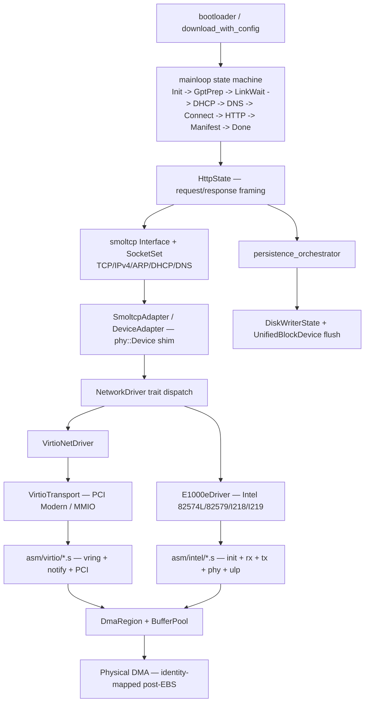
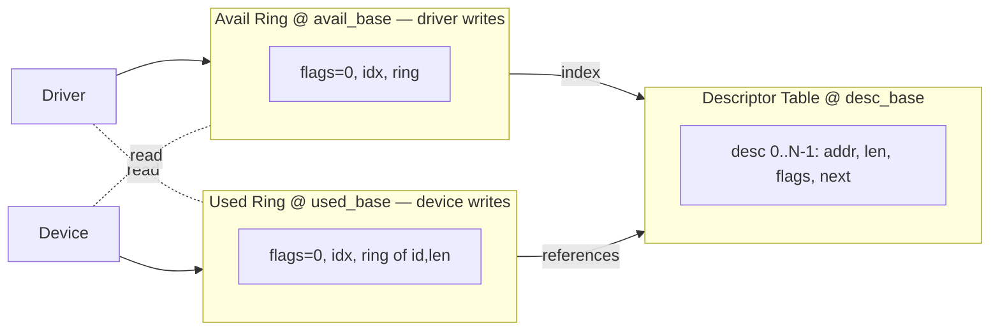
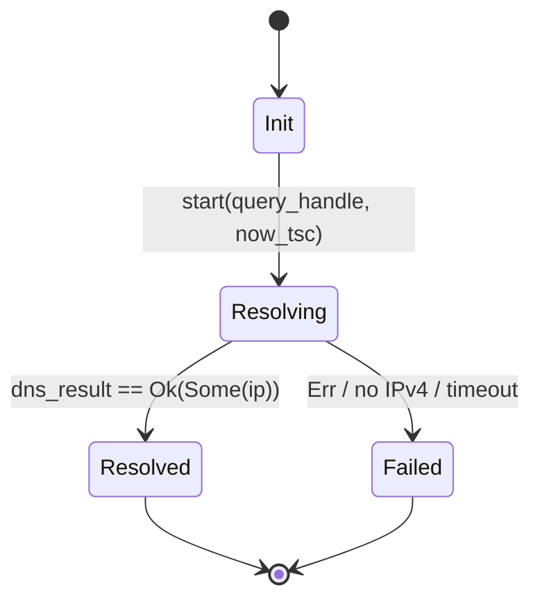
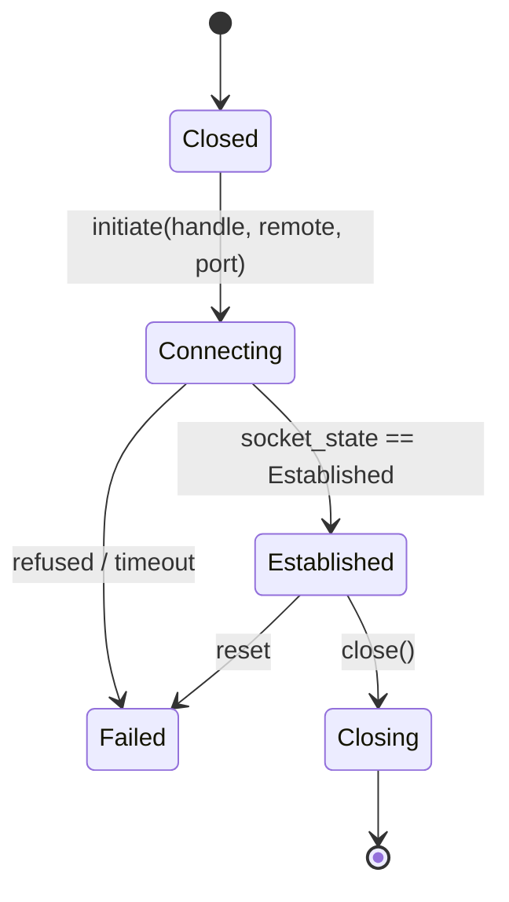
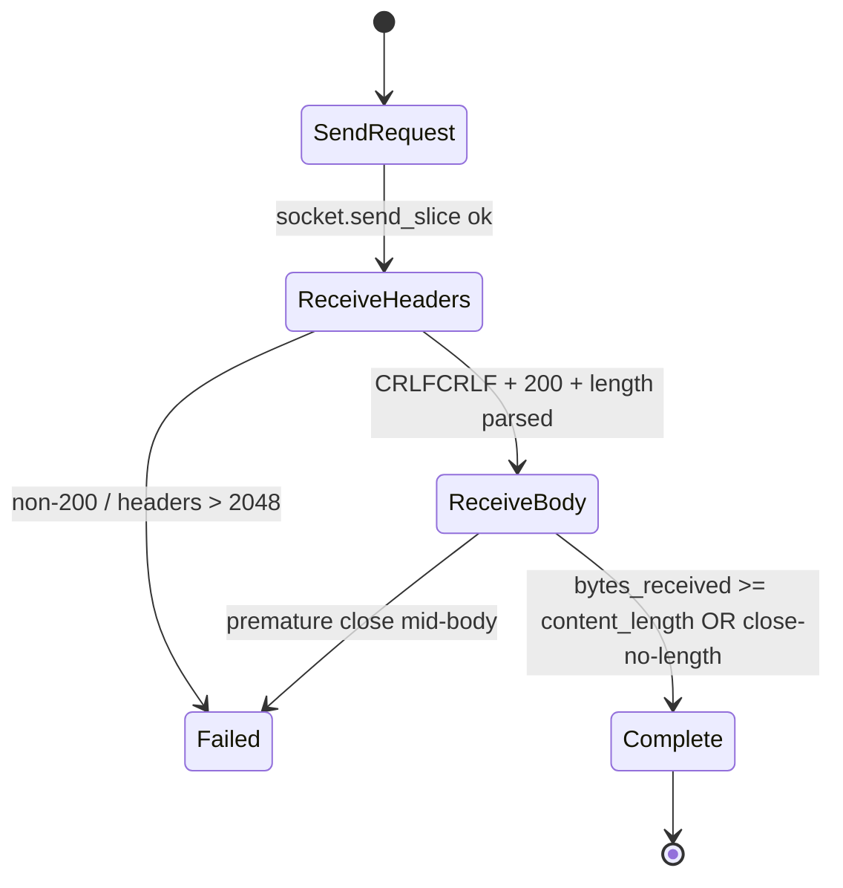

# Network stack

## Current architecture status

Phase 3.7 complete: 12-crate workspace, kernel fully arch-agnostic, the
previous `hwinit/` crate deleted. `morpheus-virtio`, `morpheus-nic` and
`morpheus-net-stack` are the three crates the network stack lives in,
plus `morpheus-block` for the disk-write tail of the persistence
orchestrator. PCI accessors are imported directly from
`morpheus_hal_x86_64::pci`.

## Purpose

The MorpheusX network subsystem is a kernel-resident IPv4/TCP/HTTP stack that brings up a NIC, acquires a DHCP lease, resolves a hostname, opens a TCP connection, and streams an HTTP body to disk — all in ring 0, post-`ExitBootServices`. Although MorpheusX is an exokernel, the network path is a deliberate **pragmatic-exokernel** concession: smoltcp's TCP/IP state machine and HTTP framing live in the kernel binary because exposing raw frames to userland would require shipping a userspace TCP, incompatible with the "one ELF, no syscalls during bring-up" boot model. The trade-off is documented in `morpheus-net-stack/src/lib.rs`: *"Pragmatic exokernel: stack lives in ring 0."*

Three workspace crates:

- `morpheus-virtio` — VirtIO PCI/MMIO transport, virtqueue ASM helpers, DMA region/pool/buffer ownership. Shared with `morpheus-block` (virtio-blk).
- `morpheus-nic` — Intel e1000e + virtio-net drivers, `NetworkDriver` trait, PCI probe, `UnifiedNetworkDriver` enum, `BootHandoff` ABI.
- `morpheus-net-stack` — smoltcp adapter, DHCP/DNS/TCP/HTTP state machines, URL parser, HTTP client, mainloop state machine, persistence orchestrator.

## Architecture overview



## Crate inventory

**`morpheus-virtio`** — Public API: `transport::{VirtioTransport, PciModernConfig, TransportType, VirtioTransportError}`; `asm::{device, queue, tx, rx, notify}`; `types::{VirtqueueState, VirtqDesc, VirtqAvailHeader, VirtqUsedHeader, VirtqUsedElem, RxResult}`; `dma::{DmaRegion, BufferPool, DmaBuffer, BufferOwnership}`. Modules: `asm.rs`, `transport.rs`, `types.rs`, `dma/{region,pool,buffer,ownership}.rs`. ASM via `build.rs` from `asm/virtio/{init,blk,notify,pci_modern,queue,rx,tx}.s`.

**`morpheus-nic`** — Public API: `traits::{NetworkDriver, DriverInit, MacAddress, TxError, RxError}`; `unified::{UnifiedNetworkDriver, UnifiedDriverError}`; `boot_probe::{scan_for_nic, probe_and_create_driver, DetectedNic, ProbeResult, ProbeError}`; `boot_handoff::{BootHandoff, HandoffError, has_invariant_tsc, read_tsc_raw}`; `intel::{E1000eDriver, E1000eError, E1000eConfig, find_intel_nic, IntelNicInfo}`; `virtio::{VirtioNetDriver, VirtioConfig, VirtioInitError, VirtioNetHdr}`; `device::{NetworkDevice, UnifiedNetDevice, NullDevice}`. Modules: `boot_probe.rs`, `boot_handoff.rs`, `traits.rs`, `unified.rs`, `device/{mod,pci,registers}.rs`, `intel/{mod,e1000e,init,phy,regs,rx,tx}.rs`, `virtio/{mod,config,driver,init,rx,tx}.rs`, `serial.rs` (shim). ASM in `asm/intel/{init,phy,rx,tx,ulp}.s`.

**`morpheus-net-stack`** — Public API: `stack::{DeviceAdapter, NetConfig, NetInterface, NetState}`; `mainloop::{download, download_with_config, DownloadConfig, DownloadResult, Context, SmoltcpAdapter, run_iteration}`; `http::{Headers, Request, Response}`; `url::Url`; `client::{HttpClient, NativeHttpClient}`; `transfer::{PersistenceOrchestrator, PersistenceConfig, PersistenceResult, ChunkedDecoder, StreamReader, StreamWriter}`; `entry::{run_download, RunConfig, RunResult}`. Modules: `stack/{mod,interface}.rs`, `mainloop/{adapter,context,disk_writer,orchestrator,phases,runner,serial,state,states/*}.rs`, `state/{dhcp,dns,tcp,http,download,disk_writer}.rs`, `http/{request,response,headers}.rs`, `url/parser.rs`, `transfer/{chunked,streaming,persistence_orchestrator}.rs`, `types/{ethernet,repr_c,result,virtio_hdr}.rs`.

## NetworkDriver trait

The unified driver contract (`morpheus-nic/src/traits.rs`); both `E1000eDriver` and `VirtioNetDriver` implement it; `UnifiedNetworkDriver` (`morpheus-nic/src/unified.rs`) enum-dispatches.

```rust
pub trait NetworkDriver {
    fn mac_address(&self) -> MacAddress;
    fn can_transmit(&self) -> bool;
    fn can_receive(&self) -> bool;
    fn transmit(&mut self, frame: &[u8]) -> Result<(), TxError>;
    fn receive(&mut self, buffer: &mut [u8]) -> Result<Option<usize>, RxError>;
    fn refill_rx_queue(&mut self);                // Mainloop Phase 1
    fn collect_tx_completions(&mut self);         // Mainloop Phase 5
    fn link_up(&self) -> bool { true }
}
```

Errors: `TxError::{QueueFull, DeviceNotReady, FrameTooLarge}`, `RxError::{BufferTooSmall { needed }, DeviceError}`. `transmit()` is fire-and-forget; `receive()` returns `Ok(None)` when idle — never blocks.

A second trait `device::NetworkDevice` (`morpheus-nic/src/device/mod.rs`) typed in foundation `NetworkError` exists for legacy callers; `UnifiedNetDevice` maps domain errors into `NetworkError`. The older `DeviceAdapter` (`morpheus-net-stack/src/stack/mod.rs`) is generic over `NetworkDevice`; the newer `SmoltcpAdapter` (`morpheus-net-stack/src/mainloop/adapter.rs`) is generic over `NetworkDriver`.

**DMA ring conventions** (`morpheus-virtio/src/dma/region.rs`): 2 MB identity-mapped region; fixed offsets RX desc `0x0000`, RX avail `0x0200`, RX used `0x0400`, TX desc `0x0800`, TX avail `0x0A00`, TX used `0x0C00`, RX bufs `0x1000` (32 × 2 KB), TX bufs `0x11000` (32 × 2 KB). Intel ignores the avail/used offsets (linear descriptors); VirtIO uses all six.

## Per-driver deep dive

### Intel e1000e

Spec: Intel 82579 datasheet §10 (register map), §14 (init), plus Linux `drivers/net/ethernet/intel/e1000e/ich8lan.c` for PCH workarounds. Supported device IDs in `morpheus-nic/src/intel/mod.rs:15-35` — 82540EM (QEMU e1000) through I219-LM/V (Skylake/Kaby/Coffee Lake).

#### Init sequence (`morpheus-nic/src/intel/init.rs::init_e1000e`)

```mermaid
sequenceDiagram
    participant Probe as boot_probe
    participant Init as init_e1000e (10 phases)
    participant MMIO as Intel BAR0
    participant PHY as PHY via MDIC

    Probe->>MMIO: enable_device (CMD|=MSE|BME); validate_mmio_access
    Probe->>Init: E1000eDriver::new
    Init->>MMIO: P1 IMC=0xFFFFFFFF, drain ICR
    Init->>MMIO: P2 RCTL/TCTL &=~EN; poll RXDCTL/TXDCTL quiesce
    Init->>MMIO: P3 CTRL|=GIO_MASTER_DISABLE; wait STATUS clear
    Init->>MMIO: P4 CTRL|=RST (timeout fatal)
    Init->>MMIO: P5 wait EECD.AUTO_RD (500ms)
    Init->>MMIO: P6 re-mask IRQs; zero all RD/TD pointers
    Init->>PHY: P7 disable_ulp + ensure_phy_accessible (LANPHYPC dance)
    Init->>PHY: wake_phy: clear PDOWN+ISOLATE, 100ms, BMCR.RESET, autoneg restart
    Init->>MMIO: P8 read MAC (RAL0/RAH0); reject all-0/all-FF
    Init->>MMIO: P9 program RDBAL/H/LEN + TDBAL/H/LEN; rx_ring.init_descriptors + sfence
    Init->>MMIO: P10 clear GIO_MASTER_DISABLE; enable_rx; update_tail; enable_tx; set_link_up
    Init-->>Probe: E1000eDriver { mac, rx_ring, tx_ring }
```

Every MMIO write is flushed by a follow-up `STATUS` read. Every poll loop is TSC-bounded. Interrupts stay masked — polled mode.

#### TX path (`morpheus-nic/src/intel/tx.rs`)

```mermaid
sequenceDiagram
    participant App as HttpState (smoltcp)
    participant Drv as E1000eDriver::transmit
    participant Ring as TxRing
    participant Asm as asm_intel_tx_*
    participant HW as Intel TDT

    App->>Drv: transmit(&frame)
    Drv->>Ring: copy into buffer_cpu[next_to_use]
    Ring->>Asm: tx_init_desc(EOP|RS|IFCS); sfence; tx_update_tail
    Asm->>HW: write32(TDT) -- doorbell
    HW-->>HW: DMA desc + buffer; transmit
    Note over Drv,HW: transmit() returns immediately
    App->>Drv: (later) collect_tx_completions()
    Drv->>Asm: tx_poll(desc) -- check DD bit; advance next_to_clean
```

#### RX path (`morpheus-nic/src/intel/rx.rs`)

```mermaid
sequenceDiagram
    participant HW as Intel DMA
    participant Drv as E1000eDriver::receive
    participant Asm as asm_intel_rx_*

    HW->>HW: receive frame; DMA into rx_buffer[head]; set DD
    Drv->>Asm: rx_poll(desc); lfence; read len+errors
    alt no packet
        Asm-->>Drv: Ok(None)
    else
        Drv->>Drv: lfence; copy buffer_cpu -> out_buffer
        Drv->>Asm: rx_clear_desc(desc); rx_update_tail
        Drv-->>Drv: Ok(Some(len))
    end
```

#### Intel hardware quirks

- **I218 ULP / LANPHYPC / SWFLAG dance** — Real I218-LM (T450s, T440s, X240) parks the PHY in Ultra-Low-Power mode at BIOS handoff. `asm/intel/ulp.s` mirrors Linux `e1000_disable_ulp_lpt_lp` and `e1000_toggle_lanphypc_pch_lpt`. After ULP exit the PHY may still not respond on MDIC; `ensure_phy_accessible` (`morpheus-nic/src/intel/init.rs:334`) makes three attempts: 50 ms wait → LANPHYPC toggle → SMBus force + LANPHYPC toggle. The `EXTCNF_CTRL.SWFLAG` hardware semaphore must be acquired before touching PHY registers on PCH parts; `asm_intel_acquire_swflag` polls EXTCNF_CTRL for up to ~5 ms.
- **T450s erratum** — On I218-LM device 0x155A, BIOS leaves `BMCR.PDOWN` set even after CTRL.RST. `wake_phy` (`morpheus-nic/src/intel/init.rs:398`) clears `BMCR.PDOWN`+`ISOLATE`, waits 100 ms (QEMU tolerates 1 ms, real silicon does not), issues `BMCR.RESET`, polls reset clear with a 500 ms ceiling, restarts auto-negotiation.
- **GIO master disable** before CTRL.RST is mandatory on real silicon to avoid in-flight DMA poisoning. QEMU tolerates omission; Lynx Point PCH hangs on the subsequent reset.
- **sfence before enabling RX** — `RxRing::init_descriptors` issues `sfence` after writing all 32 descriptors so the device sees a coherent table before `RCTL.EN`.

### virtio-net

Spec: VirtIO 1.1 §5.1 (network device), §4.1.4 (PCI Modern capability layout), §4.1.5.1 (legacy BAR0 I/O — minimal support).

#### Init sequence (`morpheus-nic/src/virtio/init.rs::virtio_net_init_transport`)

```mermaid
sequenceDiagram
    participant Probe as boot_probe
    participant Caps as probe_virtio_caps
    participant Init as virtio_net_init_transport
    participant T as VirtioTransport
    participant HW as PCI device

    Probe->>HW: PCI CMD |= MSE|BME
    Probe->>Caps: walk capabilities
    Caps-->>Probe: PciModernConfig (common/notify/isr/device cfg)
    Probe->>T: pci_modern(cfg) | mmio(bar0)
    Probe->>Init: VirtioNetDriver::new_with_transport
    Init->>T: reset (status=0; poll clear)
    Init->>T: status |= ACKNOWLEDGE | DRIVER
    Init->>T: read_features; negotiate (require F_VERSION_1; desire F_MAC|F_STATUS; forbid GUEST_TSO/MRG_RXBUF/CTRL_VQ)
    Init->>T: write_features; status |= FEATURES_OK; verify still set
    Init->>T: setup_queue(0=RX, 1=TX): select; size=min(dev,32); set desc/avail/used; enable
    Init->>T: status |= DRIVER_OK
    Init->>T: read_mac if F_MAC
    Init-->>Probe: VirtioNetDriver; rx::prefill_queue submits 32 RX bufs, notify
```

#### TX path (`morpheus-nic/src/virtio/tx.rs`)

```mermaid
sequenceDiagram
    participant App as HttpState
    participant Drv as VirtioNetDriver::transmit
    participant Pool as TX BufferPool
    participant Asm as asm_vq_submit_tx + notify
    participant HW as virtio-net

    App->>Drv: transmit(&frame)
    Drv->>Pool: alloc(); write [VirtioNetHdr(12 zero) | frame]; mark_device_owned
    Drv->>Asm: submit_tx(state, idx, len)
    Asm->>Asm: desc[i] = {bus,len,flags=0}; avail.ring[avail_idx]=i; sfence; avail.idx++
    Asm->>HW: write_volatile(notify_addr, queue_idx)
    HW-->>HW: read avail.idx; consume; transmit
    App->>Drv: collect_tx_completions()
    Drv->>Asm: poll_tx_complete -- compare used.idx vs last_used_idx
    Drv->>Pool: mark_driver_owned; free
```

#### RX path (`morpheus-nic/src/virtio/rx.rs`)

```mermaid
sequenceDiagram
    participant HW as virtio-net
    participant Drv as VirtioNetDriver::receive
    participant Pool as RX BufferPool

    Note over HW: 32 RX buffers pre-filled at init
    HW->>HW: DMA into desc[i].addr; write used.ring[used_idx]; bump used.idx
    Drv->>Drv: asm_vq_poll_rx (load-acquire used.idx)
    alt nothing
        Drv-->>Drv: None
    else packet
        Drv->>Pool: mark_driver_owned(idx)
        Drv->>Drv: skip 12-byte hdr; copy payload to out
        Drv->>Drv: resubmit_buffer (mark_device_owned + submit_rx + notify)
    end
```

#### virtio-net quirks

- Device IDs `0x1041` (modern) and `0x1000` (transitional) are both accepted by `boot_probe`; the MMIO vs PCI-Modern choice is by capability discovery, not device ID.
- Indirect descriptors are unused — every TX/RX chains exactly one descriptor (12-byte header + payload in a single 2 KB buffer).
- Mergeable RX buffers (`VIRTIO_NET_F_MRG_RXBUF`) are *forbidden* (`FORBIDDEN_FEATURES` in `morpheus-nic/src/virtio/config.rs`) — they'd extend `VirtioNetHdr` to 14 bytes (`num_buffers`) and break the fixed-offset copy. Same for `CTRL_VQ`, `GUEST_TSO*`, `GUEST_UFO`.
- No event-idx suppression; `notify::notify` called unconditionally; `flags=0` on both rings.

## VirtIO transport (`morpheus-virtio`)

`VirtioTransport` (`morpheus-virtio/src/transport.rs`) is the device-side façade dispatching every operation to either the MMIO ASM path (`asm::device`, `asm::queue`) or the PCI Modern ASM path (`pci_modern::*` extern block).

| Operation | MMIO | PCI Modern |
| --- | --- | --- |
| Reset | `asm_virtio_reset` | `asm_virtio_pci_reset(common_cfg, tsc_freq)` |
| Status | `asm_virtio_{get,set}_status` | `asm_virtio_pci_{get,set}_status` |
| Features | `asm_virtio_{read,write}_features` | `asm_virtio_pci_{read,write}_features` |
| Queue select / size | MMIO 0x030 / 0x034/0x038 | `asm_virtio_pci_select_queue` / `_queue_size` |
| Queue addrs | MMIO 0x080..0x0A4 (split lo/hi 32) | `asm_virtio_pci_set_queue_{desc,avail,used}` |
| Notify | MMIO 0x050 write | `notify_cfg + queue_notify_off × multiplier` |
| MAC read | device config @ MMIO + offset | `asm_virtio_pci_read_mac(device_cfg, ...)` |

### `PciModernConfig` parsing

`probe_virtio_caps` (`morpheus_hal_x86_64::pci::capability`) walks the PCI capability list, decodes the VIRTIO_PCI_CAP_{COMMON, NOTIFY, ISR, DEVICE} blocks, and populates `PciModernConfig` with `BAR + cap.offset` absolute addresses plus the notify multiplier. `boot_probe::probe_and_create_driver` picks PCI Modern when `caps.has_required()`, else falls back to legacy MMIO.

### vring queue layout



`VirtqueueState` (`morpheus-virtio/src/types.rs`) is the shared CPU/ASM control block — caches `last_used_idx` (driver read cursor), `next_avail_idx` (driver write cursor), buffer-region CPU+bus addresses, notify MMIO address, queue size. Layout must match ASM exactly.

### DMA region ownership

`DmaRegion` (`morpheus-virtio/src/dma/region.rs`) is the 2 MB chunk handed over by the bootloader (PCI I/O Protocol alloc → identity-mapped post-EBS). `BufferPool` (`morpheus-virtio/src/dma/pool.rs`) carves it into 32 × 2 KB buffers per direction with a `[u16; 32]` LIFO free list. `DmaBuffer` (`morpheus-virtio/src/dma/buffer.rs`) cycles `FREE → DRIVER_OWNED → DEVICE_OWNED → DRIVER_OWNED → FREE`. `BufferOwnership` (`morpheus-virtio/src/dma/ownership.rs`) enforces the invariant via runtime asserts in `as_slice`/`as_mut_slice`; touching a `DEVICE_OWNED` buffer panics, catching use-after-submit early.

### Asm primitives

- `asm/virtio/queue.s` — `asm_vq_{select,get_max_size,set_size,setup,init_desc,init_desc_chain}` for MMIO queue + descriptor programming.
- `asm/virtio/tx.s` — `asm_vq_{submit_tx,poll_tx_complete,tx_avail_slots}`.
- `asm/virtio/rx.s` — `asm_vq_{submit_rx,poll_rx,rx_pending}`.
- `asm/virtio/notify.s` — `asm_vq_{notify,notify_direct,should_notify}`.
- `asm/virtio/pci_modern.s` — `asm_virtio_pci_*` PCI-Modern register access.
- `asm/virtio/init.s` — `asm_virtio_{verify_magic,get_version,get_device_id,reset,read_mac}` legacy MMIO control.

## Boot probe + handoff

PCI enumeration is done by `morpheus-nic/src/boot_probe.rs::scan_for_nic`, which walks bus/device/function (0..256 × 0..32 × 0..8), short-circuits on `0xFFFF` reads, prefers Intel (real-hardware priority), falls back to VirtIO. Vendor/device matching: Intel `0x8086` + `E1000E_DEVICE_IDS`; VirtIO `0x1AF4` + `0x1000`/`0x1041`.

```mermaid
graph TD
    A[scan_for_nic] --> B{Intel?}
    B -->|yes| C[find_intel_nic -> IntelNicInfo]
    B -->|no| D[find_virtio_nic -> addr, mmio]
    C --> G[probe_and_create_driver]
    D --> G
    G --> H[Intel: enable_device + validate; 10-phase init]
    G --> I[VirtIO: PCI CMD MSE|BME; probe_virtio_caps]
    I --> N[pci_modern or legacy MMIO]
    H --> P[ProbeResult::Intel]
    N --> Q[ProbeResult::VirtIO]
    P --> R[UnifiedNetworkDriver]
    Q --> R
```

`UnifiedNetworkDriver` (`morpheus-nic/src/unified.rs`) is the runtime enum higher layers consume; it forwards every `NetworkDriver` method to the active variant. The parallel `UnifiedNetDevice` (`morpheus-nic/src/device/mod.rs`) is the older foundation-`NetworkError`-typed wrapper; `morpheus-net-stack/src/stack/interface.rs` is generic over `NetworkDevice`, the newer `mainloop::orchestrator` over `NetworkDriver`.

### BootHandoff ABI

`BootHandoff` (`morpheus-nic/src/boot_handoff.rs`) is the 256-byte `#[repr(C, align(64))]` contract the bootloader populates pre-EBS and the post-EBS path validates. Size enforced at compile time (`const _: () = assert!(core::mem::size_of::<BootHandoff>() == 256);`). Validates `magic == "MORPHEUS"` (0x5355_4548_5052_4F4D), `version == 1`, `size == 256`; TSC freq in `1..=10` GHz; DMA ≥ 2 MB with non-zero CPU/bus pointers; stack ≥ 64 KB; NIC type present (`NIC_TYPE_{VIRTIO,INTEL,REALTEK,BROADCOM}`) and `nic_mmio_base != 0`. Carries both MMIO and PCI-Modern coordinates (`nic_common_cfg`, `nic_notify_cfg`, `nic_isr_cfg`, `nic_device_cfg`, `nic_notify_off_multiplier`) so the post-EBS path recreates the exact `VirtioTransport` without re-walking PCI.

## smoltcp adapter

Two bridges to `smoltcp::phy::Device`: `DeviceAdapter<D: NetworkDevice>` (`morpheus-net-stack/src/stack/mod.rs`) — used by `NetInterface`; 1536-byte RX buffer; packet counters under single-threaded try-lock. `SmoltcpAdapter<'a, D: NetworkDriver>` (`morpheus-net-stack/src/mainloop/adapter.rs`) — used by the mainloop; 2048-byte RX buffer, MTU 1514, `max_burst_size = Some(32)`; `TxToken` writes directly via `driver.transmit()`.

Polling is caller-driven: `iface.poll(now, &mut adapter, &mut sockets)` exactly once per iteration. The adapter owns the RX scratch; the driver owns the DMA pool. Frame copies happen exactly once per direction.

## Mainloop state machine

The post-EBS download flow (`morpheus-net-stack/src/mainloop/`) is a `Box<dyn State<D>>` transition graph driven by `orchestrator::download_with_config`. Transitions return `(Box<dyn State<D>>, StepResult)`.

```mermaid
stateDiagram-v2
    [*] --> Init
    Init --> GptPrep: URL parsed
    Init --> Failed: invalid scheme
    GptPrep --> LinkWait: GPT space verified or relocated
    GptPrep --> LinkWait: write_to_disk == false
    GptPrep --> Failed: no free GPT range
    LinkWait --> DHCP: PHY link up + 500ms stabilize
    LinkWait --> DHCP: 15s timeout (continue anyway)
    DHCP --> DNS: lease acquired
    DHCP --> Failed: 10s timeout
    DNS --> Connect: A record resolved (or host is literal IPv4)
    DNS --> Failed: 5s timeout / NXDOMAIN / no DNS server
    Connect --> HTTP: TcpState::Established
    Connect --> Failed: 10s timeout / RST / Closed
    HTTP --> Manifest: download complete, content_length satisfied or EOF
    HTTP --> Failed: bad status / 30s idle timeout / send error
    Manifest --> Done: manifest written (or Skip)
    Manifest --> Failed: FAT32 or raw write failed
    Done --> [*]: reboot via keyboard ctrl 0xFE, fallback 0xCF9
    Failed --> [*]: report reason, halt
```

| State | File | Exit condition |
| --- | --- | --- |
| `InitState` | `states/init.rs` | URL split into host/port/path |
| `GptPrepState` | `states/gpt.rs` | GPT range claimed or `write_to_disk == false` |
| `LinkWaitState` | `states/link.rs` | `driver.link_up()` for ≥500 ms, or 15 s deadline |
| `DhcpState` | `states/dhcp.rs` | `DhcpEvent::Configured`; iface IP/route/DNS populated |
| `DnsState` | `states/dns.rs` | A-record returned, or host is IPv4 literal |
| `ConnectState` | `states/connect.rs` | TCP socket reaches `Established` |
| `HttpState` | `states/http.rs` | Body fully received per `Content-Length` or EOF |
| `ManifestState` | `states/manifest.rs` | Manifest written (FAT32 / raw sector / Skip) |
| `DoneState` | `states/done.rs` | `flush()` on block device; system reboot |
| `FailedState` | `states/done.rs` | Reason logged; returns `DownloadResult::Failed` |

`mainloop/orchestrator.rs::download_with_config` calls `iface.poll(now, &mut adapter, &mut sockets)` once per iteration before stepping. `StepResult::Continue` issues `core::hint::spin_loop()`; `Transition` logs the new state; `Done`/`Failed` return.

## State machines (DHCP/DNS/TCP/HTTP)

A second *library* set (`morpheus-net-stack/src/state/{dhcp,dns,tcp,http,download,disk_writer}.rs`) provides non-blocking primitives for callers that bypass the orchestrator. Both kernel mainloop and library variants share `StepResult::{Pending, Done, Timeout, Failed}`.

### DhcpState (`state/dhcp.rs`)

```mermaid
stateDiagram-v2
    [*] --> Init
    Init --> Discovering: start(now_tsc)
    Discovering --> Bound: smoltcp DhcpEvent::Configured
    Discovering --> Failed: timeout elapsed
    Bound --> [*]
    Failed --> [*]
```

Smoltcp owns the DHCP protocol; the library wrapper tracks the start TSC and the bound `DhcpConfig { ip, prefix_len, gateway, dns }`. Timeout is observation-only (no spin). The mainloop variant (`states/dhcp.rs:84-117`) also writes IP/route/DNS into the smoltcp interface.

### DnsResolveState (`state/dns.rs`)



Caller passes `dns_result: Result<Option<Ipv4Addr>, ()>` from `dns.get_query_result(query_handle)`. Mainloop `DnsState` (`states/dns.rs`) additionally lazy-creates the DNS socket with the DHCP server and short-circuits IPv4-literal hosts via `parse_ipv4`; uses `DnsQueryType::A`.

### TcpConnState (`state/tcp.rs`)



Library version takes a `TcpSocketState` enum (manual mirror of smoltcp's `tcp::State`). Mainloop `ConnectState` queries `socket.state()` directly; treats `SynSent`/`SynReceived` as in-progress, anything else terminal.

### HttpDownloadState (`state/http.rs`) and mainloop `HttpState`



`HttpState` (`mainloop/states/http.rs`) carries a 2048-byte `header_buf` (fail-closed on overflow), `Content-Length` parsed via case-insensitive line scan, `Transfer-Encoding: chunked` flag (parsed; not yet wired through `ChunkedDecoder`), and an optional `DiskWriter` that pipelines body bytes to a 64 KB buffered block write. 30 s idle timeout, reset on activity. All TSC values are passed in by the orchestrator — no hidden `read_tsc()` so tests can substitute time.

## HTTP client

`Request`/`Response`/`Headers` live in `morpheus-net-stack/src/http/`. `Request::new` (`http/request.rs:26`) pre-populates `Host`, `User-Agent: MorpheusX/1.0`, `Accept: */*`, `Connection: close`. `Response` (`http/response.rs`) carries version/status/reason/headers/body and `is_{success,redirect,client_error,server_error}`. `Headers` (`http/headers.rs`) are case-insensitive on lookup, original-case on storage, backed by `Vec<Header>`; supports multi-valued `add`, `set`, `get`/`get_all`/`remove`, typed accessors.

Transfer modes (`transfer/`): `ChunkedDecoder` (`chunked.rs`) implements RFC 7230 §4.1 with states `ChunkSize → ChunkSizeExtension → ChunkData → ChunkDataCRLF → TrailerLine → Done`. `StreamReader`/`StreamWriter` (`streaming.rs`) handle incremental bodies. The bootstrap path in `mainloop/states/http.rs` is a hand-rolled HTTP/1.1 GET that bypasses `Request::to_bytes()` to avoid allocs on the kernel hot path — `format_http_request` builds into a 512-byte stack buffer. `HttpClient`/`NativeHttpClient` (`client/{mod,native}.rs`) wrap the library state machines.

## URL parser

`url::Url::parse` (`url/parser.rs:66`) accepts the RFC 3986 subset `scheme://host[:port][/path][?query]`; errors `NetworkError::InvalidUrl`. Only `http`/`https`; default ports 80/443; default path `/`. `host_header()` omits the port if it matches the scheme default. The mainloop `InitState` uses its own non-allocating parser (`states/init.rs:69-93`) because the orchestrator may run before heap init.

## persistence_orchestrator

`PersistenceOrchestrator` (`morpheus-net-stack/src/transfer/persistence_orchestrator.rs`) is the Wave-4 post-EBS HTTP-to-disk pipeline coordinating `HttpDownloadState` + `DiskWriterState` (`state/disk_writer.rs`) + optional chunk-manifest.

```mermaid
sequenceDiagram
    participant App
    participant Orc as PersistenceOrchestrator
    participant Net as NetInterface
    participant Disk as DiskWriterState
    participant Blk as UnifiedBlockDevice

    App->>Orc: new(PersistenceConfig)
    loop
        App->>Orc: step(now_tsc, network_state)
        Orc->>Net: drive DhcpState -> HttpDownloadState
        Orc->>Disk: write(body chunk)
        Disk->>Blk: submit_write; notify; poll_completion
    end
    Orc->>Disk: flush_remaining (zero-pad)
    Orc->>Blk: flush -- VirtIO FLUSH
    Orc-->>App: Done(PersistenceResult)
```

Originally `network/src/transfer/orchestrator.rs`; Wave 4 moved it here because it depends on both local download state machines and `morpheus-block::UnifiedBlockDevice`.

## Key invariants

- **VirtIO avail-ring ordering**: `avail.ring[i]` writes complete *before* the `avail.idx` store-release (sfence between). The MMIO doorbell write must follow `avail.idx`.
- **VirtIO descriptor chain integrity**: every chain ends with `flags & NEXT == 0`. The driver never reuses a device-owned descriptor index (`BufferOwnership` enforced).
- **Intel RX tail trails head**: `RDT` always points to the *last* descriptor the device may overwrite — never equal to or past `RDH`. `RxRing::release_descriptor` writes `RDT` only on change.
- **`sfence` before doorbell on real Intel**: descriptor writes must be globally visible before `RDT`/`TDT` writes. `RxRing::init_descriptors`, `TxRing::transmit`, and `asm_intel_rx_clear_desc` all enforce this. QEMU tolerates omission; I218 does not.
- **`lfence` before reading RX buffer payload**: DD bit set doesn't guarantee the buffer payload writes have landed. `lfence` after `asm_intel_rx_poll` matches Linux `dma_rmb()` in `e1000_clean_rx_irq`.
- **DHCP append-only until ACK**: smoltcp owns DISCOVER/OFFER/REQUEST/ACK. Our `DhcpState` only observes `DhcpEvent::Configured`; on `Deconfigured` (lease lost) we re-enter discovery and never mutate the interface IP until fresh `Configured` arrives.
- **TCP retransmit driven by external poll**: smoltcp's retransmit timer fires inside `iface.poll`; the mainloop calls it exactly once per iteration before stepping the state.
- **Buffer ownership state machine**: `Free → DriverOwned → DeviceOwned → DriverOwned → Free`. The asserts in `as_slice`/`as_mut_slice`/`mark_*` catch double-submit, use-after-submit, double-free at runtime.
- **DMA region identity-mapped post-EBS**: bootloader's PCI-IO-Protocol alloc gives matching CPU/bus addresses; post-EBS paging must keep 1:1 or `dma_bus_base` silently goes wrong.

## Dependency surface

- `morpheus-virtio` depends on `morpheus-foundation` and `morpheus-hal-x86_64` (`mmio::read32/write32`, `barriers::sfence/lfence`, `tsc::read_tsc`). No upward deps.
- `morpheus-nic` depends on `morpheus-foundation`, `morpheus-hal-x86_64` (for PCI: `pci::{PciAddr, pci_cfg_read*, pci_cfg_write*, capability::probe_virtio_caps, offset::*}`), and `morpheus-virtio`.
- `morpheus-net-stack` depends on `morpheus-foundation`, `morpheus-hal-x86_64`, `morpheus-nic`, `morpheus-block` (`UnifiedBlockDevice` for the orchestrator), `morpheus-virtio` (`DmaRegion`), `morpheus-storage-format` (`IsoManifest`), `gpt_disk_io`/`gpt_disk_types`, `spin`, and `smoltcp 0.11` (features: `alloc`, `medium-ethernet`, `proto-ipv4`, `proto-dhcpv4`, `socket-{tcp,udp,icmp,dhcpv4,dns}`).
- **Cycle-breaker**: `morpheus-nic` can't depend on `morpheus-net-stack` (`net-stack → nic` exists). `morpheus-nic/src/serial.rs` re-exports `morpheus-hal-x86_64::serial::{puts, puts_hex_u64, puts_dec_u32}` as `serial_print`/`serial_println`/`serial_print_hex`/`serial_print_decimal` so e1000e diagnostics keep compiling (Wave 3 finding).
- **Canonical `NetworkError`** lives in `morpheus-foundation/src/error.rs`; `morpheus-nic::device` and `morpheus-net-stack::error` re-export. Single source of truth as of Wave 4.

## Known intentional changes vs pre-refactor

- **`network::serial_str` no longer mirrors to `display::display_write`** (Wave 1.6) — `NET:*` debug is COM1-only; framebuffer mirror caused frame drops at 115200 during `iface.poll`. The `display` feature exists but defaults off.
- **VirtIO transport split** (Wave 1) — extracted to `morpheus-virtio` so virtio_blk and virtio-net share one `VirtqueueState`/ASM/DMA stack (pre-refactor both lived in monolithic `network/`).
- **`UnifiedNetworkDriver`** moved from `network/src/driver/unified.rs` to `morpheus-nic/src/unified.rs` (Wave 3).
- **`UnifiedBlockDevice`** moved from `morpheus-nic` to `morpheus-block::device` (Wave 4) — block-not-NIC. `morpheus-net-stack` now imports from `morpheus_block::device`.
- **`VirtioNetHdr` inlined in nic** (Wave 3) — defined in both `morpheus-nic/src/virtio/mod.rs:24-61` and `morpheus-net-stack/src/types/virtio_hdr.rs`; duplication breaks the `nic → net-stack → nic` cycle.
- **No soft-reset shortcuts** — VirtIO `status=0`; Intel `CTRL.RST` after GIO-master-disable. Pre-EBS state assumed dirty.
- **`network::error::NetworkError` removed** (Wave 4); canonical is `morpheus_foundation::error::NetworkError`. `morpheus-net-stack::error` re-exports.

## Cross-references

- **Storage** (`docs/subsystems/storage.md` when written) — `morpheus-block::virtio_blk` shares `VirtioTransport`/`DmaRegion`; `UnifiedBlockDevice` mirrors `UnifiedNetworkDriver`; `DoneState::reboot` calls `blk.flush()` (VirtIO FLUSH) before keyboard-controller reset.
- **USB** (memory note `usb_subsystem_overview.md`) — USB-MSD (`morpheus-block::usb_msd`) follows the same `UnifiedBlockDevice` pattern.
- **Boot** — `bootloader/src/main.rs` populates `BootHandoff` pre-EBS, hands to `entry::run_download` or `mainloop::download_with_config`.
- **PCI / MSI** — see `pci-msi-programming` skill and `interrupt-refactor-plan.md`. Drivers are polled-mode today (Intel `IMS=0`, no event-idx on VirtIO).
