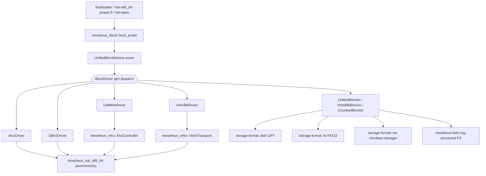
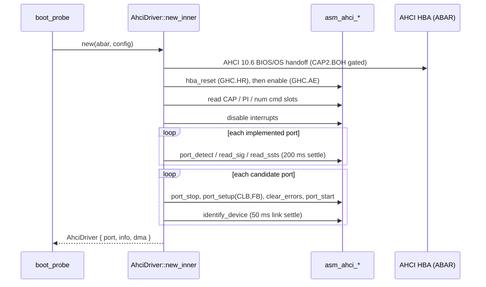
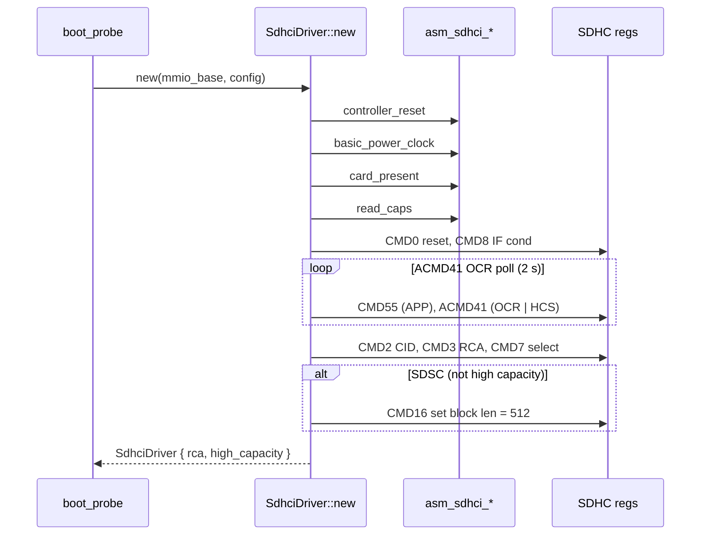
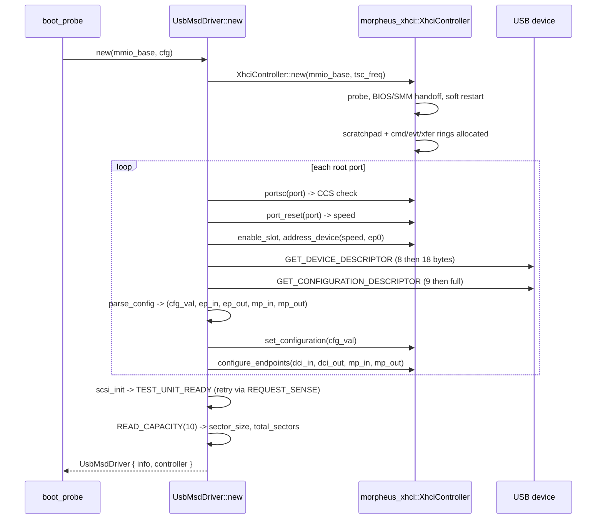
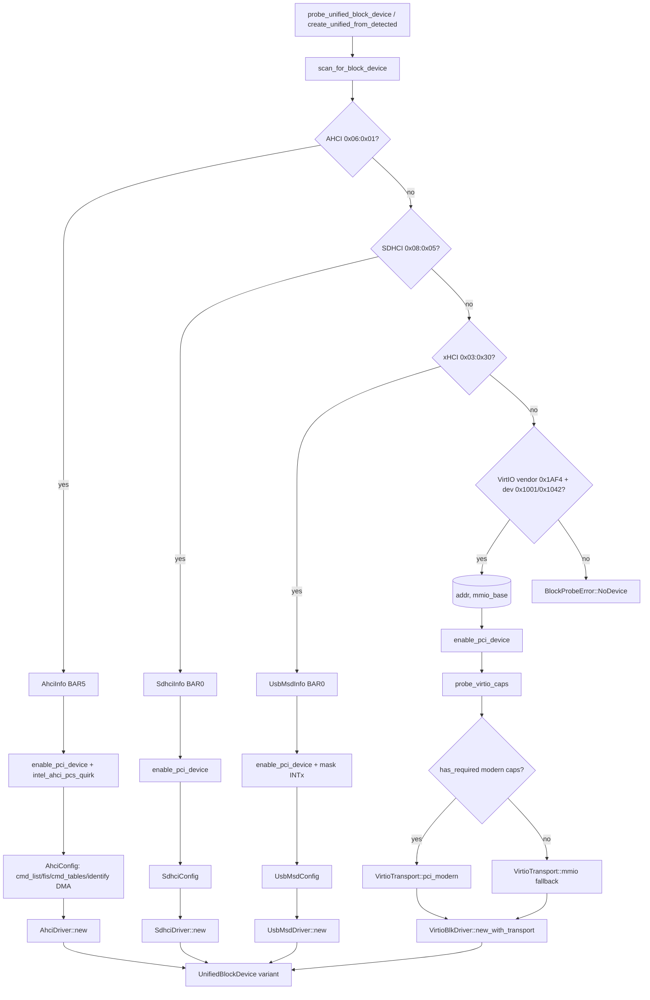

# Storage stack

## Current architecture status

Phase 3.7 complete: 12-crate workspace, kernel fully arch-agnostic, the
previous `hwinit/` crate deleted. `morpheus-block`,
`morpheus-storage-format`, `morpheus-virtio`, and `morpheus-xhci` own
the storage stack; they consume `morpheus-hal-x86_64` for
asm/MMIO/TSC and `morpheus-x86-asm` (the leaf primitives crate) where
applicable. PCI accessor calls are now `morpheus_hal_x86_64::pci::*`
directly.

## Purpose

The MorpheusX storage stack is a no_std, polling-only Rust block I/O subsystem
that lifts raw PCI/MMIO into a unified `BlockDriver` dispatch layer, a set of
bootloader-friendly on-disk format parsers (GPT, FAT32, ISO chunked storage),
and a log-structured time-travel filesystem (HelixFS). It is the sole path for
non-network persistent I/O in the exokernel — every other crate that needs
sectors reaches through `morpheus_block::BlockDriver` or a gpt_disk_io::BlockIo
adapter on top of it.

## Architecture overview



## Crate inventory

| Crate | Purpose | Key public surface | Internal modules |
|---|---|---|---|
| `morpheus-block` (`morpheus-block/src/lib.rs`) | Block driver traits + 4 concrete drivers + boot-time probe + gpt_disk_io adapters | `BlockDriver`, `BlockDriverInit`, `BlockCompletion`, `BlockError`, `BlockDeviceInfo`, `UnifiedBlockDevice`, `boot_probe::*` | `ahci/`, `sdhci/`, `usb_msd/`, `virtio_blk.rs`, `boot_probe.rs`, `block_traits.rs`, `device.rs`, `block_io_adapter.rs`, `unified_block_io.rs`, `transfer/disk/` |
| `morpheus-storage-format` (`morpheus-storage-format/src/lib.rs`) | Pure parsers / writers for on-disk formats; alloc-light | `disk::gpt::{GptHeader, GptPartitionEntry, GptPartitionTable}`, `fs::{format_fat32, read_file, write_file, ...}`, `iso::{IsoStorageManager, ChunkedBlockIo, ChunkReader, ChunkedIso, IsoBlockIoAdapter, IsoManifest}` | `disk/`, `disk/gpt_ops/`, `fs/fat32_ops/`, `fs/fat32_format/`, `iso/`, `uefi_alloc.rs` |
| `morpheus-helix` (`helix/src/lib.rs`) | Log-structured time-travel filesystem on top of `gpt_disk_io::BlockIo` | `format::format_helix`, `log::{LogEngine, recovery}`, `index::btree::NamespaceIndex`, `ops::{read_file, write_file, list_versions, delete_file}`, `vfs::global` | `bitmap.rs`, `crc.rs`, `device.rs`, `error.rs`, `format.rs`, `index/`, `log/`, `ops/`, `types.rs`, `vfs/` |
| `morpheus-xhci` (`morpheus-xhci/src/lib.rs`) | Shared xHCI host controller; consumes `morpheus-x86-asm` for bare primitives; consumed by HID (`usb/hid`) and USB-MSD (block) | `XhciController`, `XhciError`, `XhciDevice`, `HIDInterface`, `enumerate_and_bind_inputs`, `rings::{vr32, vw32}`, `dma::*`, `usb::{hid, msi, runtime}` | `controller.rs`, `dma.rs`, `enum.rs` (`enum_`), `enumerate.rs`, `rings.rs`, `regs.rs`, `hid_iface.rs`, `hub.rs`, `asm.rs`, `logger.rs`, `usb/` |
| `morpheus-virtio` (`morpheus-virtio/src/lib.rs`) | Shared VirtIO transport + virtqueue infrastructure | `transport::{VirtioTransport, PciModernConfig, TransportType, VirtioTransportError}`, `types::VirtqueueState`, `asm::*`, `dma::*` | `transport.rs`, `types.rs`, `asm.rs`, `dma/` |

Invariants per crate:

- `morpheus-block` — driver structs own raw DMA pointers; `Send`-asserted with
  `unsafe impl Send` and a justification comment (e.g. `AhciDriver` at
  `morpheus-block/src/ahci/mod.rs:657`). No allocation in the hot I/O path.
- `morpheus-storage-format` — alloc-light; the FAT32 hot path uses
  `uefi_alloc::allocate_pages` while UEFI BootServices are still alive and
  switches to `alloc::vec` once we are in `no_std` post-EBS. The crate's
  `Cargo.toml` carries `feature = ["fat32_manifest"]` so a heap-less build is
  still possible.
- `morpheus-helix` — dual-superblock invariant; alternating writes; CRC32C on
  every record; B-tree only on checkpoint. See `helix/src/lib.rs:7-12`.
- `morpheus-xhci` — single static 288 KB identity-mapped DMA region; volatile
  access only; cycle bit as the sole ring sync primitive.
- `morpheus-virtio` — split virtqueues; transport-agnostic so the same `_blk`
  / `_net` driver code works under MMIO, PCI Legacy and PCI Modern.

## BlockDriver trait

Defined in `morpheus-block/src/block_traits.rs:56-98`. Semantics:

| Method | Contract |
|---|---|
| `info(&self) -> BlockDeviceInfo` | Returns geometry: `total_sectors`, `sector_size`, `max_sectors_per_request`, `read_only`. Pure. (`block_traits.rs:57`) |
| `can_submit(&self) -> bool` | True iff `submit_{read,write}` would not immediately return `QueueFull`. (`block_traits.rs:61`) |
| `submit_read(sector, buffer_phys, num_sectors, request_id) -> Result<(), BlockError>` | Fire-and-forget. MUST return immediately. Buffer must be a physical/bus address that stays valid until matching `BlockCompletion`. Preconditions: `sector + num_sectors <= total_sectors`, `num_sectors <= max_sectors_per_request`. Errors: `InvalidSector`, `RequestTooLarge`, `QueueFull`, `DeviceError`. (`block_traits.rs:64-74`) |
| `submit_write(...)` | Same as `submit_read` plus rejects with `ReadOnly` if `info.read_only`. SDHCI/USB-MSD currently return `Unsupported` (`sdhci/mod.rs:322`, `usb_msd/mod.rs:447`). |
| `poll_completion(&mut self) -> Option<BlockCompletion>` | Returns one completed request or `None`. Caller must drain. Postcondition: slot freed. |
| `notify(&mut self)` | Doorbell. No-op on AHCI/SDHCI/USB-MSD; VirtIO calls transport doorbell (`virtio_blk.rs:658`). |
| `flush(&mut self) -> Result<(), BlockError>` | Default no-op. AHCI issues an `ATA FLUSH CACHE` with a 30 s poll (`ahci/mod.rs:609-637`). VirtIO returns `Ok(())` as a TODO (`virtio_blk.rs:663-673`). |

`BlockCompletion` (`block_traits.rs:29-37`) carries `request_id` (echo of
submit), `status` (0 = ok), `bytes_transferred`. `BlockError` is the
fixed union of `QueueFull`, `DeviceNotReady`, `IoError`, `InvalidSector`,
`RequestTooLarge`, `ReadOnly`, `Unsupported`, `Timeout`, `DeviceError`.

DMA region ownership: callers pre-allocate all DMA structures and hand the
driver raw `*mut u8` CPU pointers plus matching physical/bus addresses inside
a `*Config` struct (e.g. `AhciConfig` at `morpheus-block/src/ahci/init.rs:7`).
The driver never frees them; on Drop, USB-MSD additionally `quiesce()`s the
shared xHCI controller (`usb_msd/mod.rs:464-473`).

`BlockDriverInit` (`block_traits.rs:101-125`) is the secondary trait every
driver implements so `boot_probe` can filter by `(vendor_id, device_id)` and
construct the driver from a single `unsafe fn create(mmio_base, config)`.

`UnifiedBlockDevice` (`morpheus-block/src/device.rs:19-28`) is a four-variant
enum that flat-matches every method onto the concrete inner driver — used
because trait-object boxing is awkward in `no_std` and the variant set is
fixed.

## Per-driver deep dive

### AHCI

- **Spec**: AHCI 1.3.1. ATA8/ACS for sector commands.
- **Files**: `morpheus-block/src/ahci/{mod.rs,init.rs,port.rs,regs.rs}` (881 lines total), backing asm in `morpheus-block/asm/`.
- **Hardware focus**: Intel PCH SATA (Wildcat Point-LP `0x9C83` on ThinkPad T450s) and QEMU `ich9-ahci` `0x2922` (`ahci/mod.rs:101-114`).

Init sequence:



Steady-state read:

```mermaid
sequenceDiagram
  participant C as caller
  participant D as AhciDriver
  participant ASM as asm_ahci_*
  participant HBA as port regs
  C->>D: submit_read(lba, phys, n, rid)
  D->>D: alloc_slot (round-robin over MAX_CMD_SLOTS=32)
  D->>ASM: submit_read(...slot, cmd_header, cmd_table, ct_phys)
  ASM->>HBA: setup cmd header, build H2D FIS, build PRDT
  ASM->>HBA: write CI |= (1<<slot)
  C->>D: poll_completion()
  D->>ASM: check_cmd_complete(slot_mask)
  D->>D: clear in_flight; clear_is(0xFFFFFFFF)
  D-->>C: Some(BlockCompletion)
```

Quirks:

- **Intel PCS quirk** (`boot_probe.rs:673-713`): firmware sometimes leaves
  `PCS_6` / `PCS_7` port-enable bits clear so AHCI ports stay invisible. We
  mirror `PORTS_IMPL` into those config-space bytes whenever the vendor is
  Intel.
- **CAP2.BOH BIOS handoff** (`ahci/mod.rs:134-176`): skipping `BOHC.OOS` on
  Intel PCH stalls the HBA forever; QEMU has no CAP2.BOH so the routine is a
  no-op there.
- **Strict-vs-fallback port scan** (`ahci/mod.rs:259-329`): ports that report
  the proper ATA signature win; ports that merely show *some* link activity
  during the 200 ms settle window are kept as a fallback list.
- AHCI does not require `notify()`; writing `PxCI` is the doorbell
  (`ahci/mod.rs:605-607`).

### SDHCI

- **Spec**: SDA-PHY 3.0 / SD Host Controller Standard.
- **File**: `morpheus-block/src/sdhci/mod.rs` (337 lines).
- **Status**: PIO read path only; `submit_write` returns
  `BlockError::Unsupported` (`sdhci/mod.rs:322-330`).

Init sequence:



Read path: each `submit_read` synchronously loops `num_sectors` × single-block
PIO reads via `asm_sdhci_read_block_pio`, caching a single
`BlockCompletion` until `poll_completion` drains it (`sdhci/mod.rs:267-336`).

Gotchas:

- High-capacity media expect the LBA as the argument; legacy SDSC expects the
  byte offset. The driver checks `OCR[30]` and switches (`sdhci/mod.rs:294-300`).
- `wait_not_inhibit` waits on `CMD_INHIBIT | DAT_INHIBIT` before each command
  (`sdhci/mod.rs:99-112`); skipping this on real silicon hangs the next CMD.
- `info.total_sectors = u32::MAX` until init completes — current code never
  refines it to the actual CSD-reported capacity, which is a known TODO.

### virtio_blk

- **Spec**: VirtIO 1.1 §5.2 (Block Device).
- **File**: `morpheus-block/src/virtio_blk.rs` (694 lines), transport in
  `morpheus-virtio/src/transport.rs`.
- **Hardware**: VirtIO `0x1AF4` vendor + device `0x1001` (transitional) or
  `0x1042` (modern) — i.e. QEMU/cloud (`boot_probe.rs:69-73`).

Init sequence:

```mermaid
sequenceDiagram
  participant BP as boot_probe
  participant V as VirtioBlkDriver::new_with_transport
  participant T as VirtioTransport
  participant DEV as VirtIO device
  BP->>V: new_with_transport(transport, cfg, tsc_freq)
  V->>T: set_status(0); spin 1_000_000 for reset
  V->>T: set_status(ACK | DRIVER)
  V->>DEV: read device_features (low/high)
  V->>T: write_features(REQUIRED | accepted DESIRED)
  V->>T: set_status(... | FEATURES_OK)
  V->>DEV: re-read status; verify FEATURES_OK bit
  V->>T: setup_queue(0, desc, avail, used, qsize)
  V->>T: set_status(... | DRIVER_OK)
  V->>DEV: read capacity / blk_size
  V-->>BP: VirtioBlkDriver
```

Read path:

```mermaid
sequenceDiagram
  participant C as caller
  participant V as VirtioBlkDriver
  participant ASM as asm_virtio_blk_*
  participant DEV as VirtIO device
  C->>V: submit_read(sector, phys, n, rid)
  V->>V: alloc_desc_set -> (desc_idx=slot*3, slot)
  V->>V: write header @ headers_cpu[slot]; status = 0xFF
  V->>ASM: submit_read(&vq, sector, phys, n, hdr_phys, status_phys, desc_idx)
  ASM->>DEV: 3-descriptor chain (header / data / status)
  C->>V: notify() -> transport.notify_queue(0)
  C->>V: poll_completion()
  V->>ASM: poll_complete(&vq, &mut result)
  V-->>C: Some(BlockCompletion { status, bytes_transferred })
```

Quirks:

- **3-descriptors-per-request layout** with fixed slot stride: `desc_idx =
  slot * 3` (`virtio_blk.rs:464`). The third descriptor's status byte is
  pre-seeded with `0xFF` so a polling reader can distinguish "device hasn't
  written yet" from a real status.
- **flush is a TODO** (`virtio_blk.rs:663-673`): VirtIO-blk flush wants a
  2-descriptor chain that our `_submit_write` ASM does not build. We rely on
  QEMU's default "writes are durable on completion" semantics.
- **PCI Modern preferred over legacy MMIO**: `boot_probe.rs:1059-1140`
  attempts the PCI Modern capability walk first; only the absence of
  required caps falls back to legacy. Modern is the only path that works
  against `disable-legacy=on` QEMU.

### USB-MSD (Bulk-Only Transport)

- **Spec**: USB 2.0 Mass-Storage Class — Bulk-Only Transport rev 1.0, SCSI
  primary commands.
- **File**: `morpheus-block/src/usb_msd/mod.rs` (474 lines).
- **Status**: read-only; `submit_write` returns `Unsupported`
  (`usb_msd/mod.rs:447-455`).

Init sequence:



Steady-state read (the entire "I/O path" is the SCSI command path because
USB-MSD reads are synchronous):

```mermaid
sequenceDiagram
  participant C as caller
  participant U as UsbMsdDriver
  participant XC as XhciController
  participant DEV as USB device
  C->>U: submit_read(lba, phys, n, rid)
  U->>U: build SCSI READ(10) CDB
  U->>U: bot_command -> CBW (31 bytes, sig 0x43425355, tag++)
  U->>XC: bout.enqueue(cbw, 31); ring_xfer_doorbell(dci_out)
  XC->>DEV: bulk-OUT CBW
  U->>XC: bin.enqueue(data_buf, byte_count); ring_xfer_doorbell(dci_in)
  XC->>DEV: bulk-IN data stage
  U->>XC: bin.enqueue(csw, 13); ring_xfer_doorbell(dci_in)
  XC->>DEV: bulk-IN CSW
  U->>U: verify sig 0x53425355, tag match, status==0
  U->>U: copy_nonoverlapping(dma_base+OFF_DATA, phys, byte_count)
  U-->>C: Ok(()) then last_completion set
```

Quirks (memory: `usb_xhci_real_hw_quirks.md`):

- **Re-uses the shared xHCI controller** rather than re-implementing it.
  Pre-refactor this file was ~1800 lines (an inline xHCI clone); Phase 2.1
  shrank it to 474 by consuming `morpheus-xhci` (`usb_msd/mod.rs:5-16`).
- **`Drop` quiesces the controller** so leaving the bootloader with a USB-MSD
  driver dropped does not leave the xHCI mid-transfer
  (`usb_msd/mod.rs:464-473`).
- **No hub traversal**: root-port devices only. `enumerate_and_configure`
  returns `NoMedia` if no root port is connected
  (`usb_msd/mod.rs:262-263`).
- **TEST UNIT READY retry**: real flash media frequently posts
  UNIT_ATTENTION after enumeration; one REQUEST_SENSE round-trip clears it
  (`usb_msd/mod.rs:273-278`).
- **Event-ring drain invariant** (memory:
  `usb_event_ring_drain_invariant.md`): `wait_xfer` must advance the ERDP
  past every event, not just the matching one — Intel xHCI posts PSCEC
  events that otherwise block the queue.

## boot_probe pipeline



- `scan_for_block_device` (`boot_probe.rs:176-201`) preferences AHCI first
  so real hardware wins over a stray VirtIO device.
- `scan_all_block_devices` (`boot_probe.rs:207-411`) collects up to 32
  candidates of every kind for multi-device hosts.
- `BlockDmaConfig` (`boot_probe.rs:615-662`) is the single struct the caller
  fills with every CPU/phys pointer pair, queue size, and TSC frequency.
- `detect_block_device_type` (`boot_probe.rs:1191-1203`) is the
  pre-`ExitBootServices` variant — discovers a device without initializing
  it, so the bootloader can stuff a `BootHandoff` before yielding firmware.

## On-disk format layer

### GPT (`morpheus-storage-format/src/disk/gpt.rs`, `gpt_writer.rs`, `gpt_ops/`)

- `GptHeader` (`gpt.rs:3-19`): 92-byte UEFI 2.10 §5.3 layout, `#[repr(C, packed)]`.
- `GptPartitionEntry` (`gpt.rs:21-29`): 128-byte entry with type-GUID,
  partition-GUID, start/end LBA, attributes, UTF-16LE name.
- `GptPartitionTable::find_by_type` (`gpt.rs:130-139`) — used by the
  bootloader to locate the ESP and the HelixFS partition by GUID
  (`GUID_EFI_SYSTEM`, `GUID_LINUX_FILESYSTEM`).
- Writer (`gpt_writer.rs`) constructs the header from `(disk_size_lba,
  revision=0x00010000)` with `current_lba=1`, `backup_lba=disk_size_lba-1`,
  `first_usable_lba=34`, `last_usable_lba=disk_size_lba-34`. The caller
  must compute the header CRC32 and the partition-array CRC32 *after*
  populating entries.
- `gpt_ops/` (`find.rs`, `scan.rs`, `create_modify.rs`) is the high-level
  edit API the orchestrator and IsoWriter use; `PartitionEditor` keeps a
  fixed 16 KiB entries blob (128 × 128 bytes) so no allocator is needed.

### FAT32 (`morpheus-storage-format/src/fs/`)

- `fs/mod.rs:6` pins `SECTOR_SIZE = 512` — 4Kn drives are unsupported.
- `fat32_format/` formats a partition: BPB/FSInfo (`format.rs`, 218 lines)
  and `verify_fat32` for sanity checks.
- `fat32_ops/` implements the bootloader ops:
  - `context::Fat32Context` reads the boot sector and caches `root_cluster`,
    `sectors_per_cluster`, `fat_start_sector`, `data_start_sector`.
  - `directory.rs` walks and writes 8.3 dir entries, with `ensure_directory_exists`
    creating intermediate dirs.
  - `file_ops.rs` (391 lines) — cluster chain walk for read; cluster-by-cluster
    allocation with `write_cluster_data` for write. Uses
    `uefi_alloc::allocate_pages` while BootServices are alive
    (`file_ops.rs:14-32`).
  - `filename::generate_8_3_manifest_name` hashes long names with CRC32 to
    avoid 8.3 truncation collisions (`filename.rs:13-16`).
- No LFN decode beyond ASCII name reads; the bootloader writes 8.3 names
  generated by hashing.

### ISO chunked storage (`morpheus-storage-format/src/iso/`)

The workaround for FAT32's 4 GiB-1 file size cap (`iso/mod.rs:26`):

- A single >4 GiB ISO is split into ≤ `MAX_CHUNKS = 16` chunk partitions of
  ≤ `DEFAULT_CHUNK_SIZE = 4 GiB - 4 KiB` (`iso/mod.rs:7,29`).
- Each chunk is a real FAT32 partition with one file storing the chunk
  payload starting at sector 8192 (`adapter.rs:103`).
- A binary `IsoManifest` (128 byte header + N × 48 byte chunk entries,
  see `manifest.rs:7-32` ASCII diagram) lives on the ESP under
  `/.iso/<8.3-hashed-name>.MFS`.
- `IsoStorageManager` (`iso/storage.rs:84-95`) tracks up to `MAX_ISOS = 8`
  manifests and exposes `get_read_context` returning an `IsoReadContext` of
  per-chunk `(start_lba, end_lba)` + `chunk_sizes`.
- `ChunkReader` (`iso/reader.rs:29-66`) implements seek/read with internal
  position tracking.
- `ChunkedBlockIo<F>` (`iso/adapter.rs:32-44`) is a generic adapter holding
  a closure that does the actual physical read; it converts a virtual LBA
  into `(chunk_idx, offset_in_chunk)` then to a physical LBA.
- `IsoBlockIoAdapter<'a, B>` (`iso/iso9660_bridge.rs:43-48`) implements
  `gpt_disk_io::BlockIo` directly so the `iso9660` crate can mount a
  chunked ISO without knowing about chunks. It also handles the
  512-byte-disk vs 2048-byte-ISO sector translation
  (`iso9660_bridge.rs:31-34`).

Full read of a kernel out of a stored ISO:

```mermaid
sequenceDiagram
  participant App as bootloader
  participant ISM as IsoStorageManager
  participant CBI as ChunkedBlockIo / IsoBlockIoAdapter
  participant FATo as fat32_ops::read_file
  participant UBI as UnifiedBlockIo (BlockIo)
  participant UBD as UnifiedBlockDevice
  App->>ISM: get_read_context(iso_index)
  App->>CBI: new(ctx, &mut UBI)
  App->>FATo: read_file(&mut UBI, esp_start, "/vmlinuz")
  FATo->>UBI: read_blocks(Lba(...), &mut buf)  // FAT entry chain
  UBI->>UBD: submit_read(...); poll_completion
  UBI-->>FATo: Ok bytes
  App->>CBI: read_sectors(virtual_lba, &mut buf)
  CBI->>CBI: find_chunk_for_lba -> (idx, offset)
  CBI->>UBI: read_blocks(Lba(part_start + 8192 + sec), &mut buf)
  UBI->>UBD: submit_read; poll_completion
  UBI-->>CBI: Ok
  CBI-->>App: kernel bytes
```

## HelixFS

Brief — full doc lives separately. Key facts (see `helix/src/lib.rs:5-12`):

- **Log-structured**: append-only circular log of `LogRecord`s with monotonic
  LSNs. `LOG_SEGMENT_BLOCKS = 256` × 4096 B = **1 MiB segments**
  (`helix/src/types.rs:13-14`).
- **Dual superblock** at partition blocks 0 and 1; recovery picks the higher
  valid `committed_lsn` (`log/recovery.rs:23-65`).
- **Per-inode version count**: every Write/Append is a new log record carrying
  the file path's hash → "time-travel" reads via
  `ops::read::read_file_at_lsn` and `list_versions` (`ops/read.rs:50,162`).
- **Crash recovery**: scan forward from `checkpoint_lsn`, validate CRC32C
  on each record, stop at the first failure (`log/recovery.rs:131`).
- **Three-writes rule** for data integrity: data → flush → pointer → flush
  (`lib.rs:10`).
- **Substance to read**: `helix/src/log/mod.rs` (538 lines, log engine),
  `helix/src/log/recovery.rs` (289 lines), `helix/src/index/btree.rs`
  (392 lines, in-RAM B-tree), `helix/src/ops/{read,write,dir}.rs`
  (the public file API).
- Format layout (`helix/src/format.rs:1-5`): blocks 0..1 superblocks, then
  `log_segment_count` × 256-block log region, then bitmap, then data. Helix
  auto-sizes the log to ~1 % of the disk clamped to 1..=64 segments
  (`format.rs:32`).

## Key invariants

- **GPT primary header + partition array + backup header must all be written
  before any partition data** — `disk_size_lba - 1` is the backup; failure
  to write it leaves the disk un-mountable on UEFI hosts that prefer the
  backup.
- **AHCI `CI` slot bit must be observed clear before reissuing on the same
  slot** — `alloc_slot` is round-robin to amortize but `in_flight[slot].active`
  must be false (`ahci/mod.rs:439-449`).
- **AHCI BIOS handoff (CAP2.BOH) must precede `GHC.HR` on Intel PCH**
  (`ahci/mod.rs:131-134`); QEMU does not require it but the code is a no-op
  there.
- **VirtIO `FEATURES_OK` must be re-read after being set** — if the device
  clears it the driver must abort with `FAILED` and not proceed
  (`virtio_blk.rs:261-265`).
- **VirtIO descriptors land in groups of 3 per request**; the status byte is
  pre-seeded with `0xFF` so the poll path can distinguish "not yet written"
  from a real `VIRTIO_BLK_S_OK / IOERR / UNSUPP`.
- **HelixFS superblock writes alternate (A then B then A …)** so at least one
  copy is always valid on crash; recovery picks the higher `committed_lsn`
  (`log/recovery.rs:50-58`).
- **HelixFS log records validated by CRC32C; first bad CRC ends the replay
  scan** (`lib.rs:8-9`).
- **USB-MSD CBW signature = `0x43425355` LE**, CSW signature = `0x53425355`
  LE, tag must round-trip unchanged
  (`usb_msd/mod.rs:25-26,366-371`).
- **USB-MSD root-port-only** — no hub traversal; this is deliberate, the HID
  path in `morpheus-xhci::usb::hid` owns hub logic.
- **xHCI event ring must be fully drained**, not just up to the matching TRB
  (memory: `usb_event_ring_drain_invariant.md`).
- **SDHCI command bit must clear before next CMD** — `wait_not_inhibit`
  before every `send_cmd` (`sdhci/mod.rs:99-112`).

## Dependency surface

| Consumer | Imports | Reason |
|---|---|---|
| `morpheus-block::ahci/sdhci/virtio_blk/usb_msd` | `morpheus_hal_x86_64::{asm::mmio, asm::tsc, serial}` | MMIO reads/writes, TSC for timeouts, serial debug |
| `morpheus-block::boot_probe` | `morpheus_hal_x86_64::pci::{pci_cfg_read16/32, pci_cfg_write16, PciAddr, offset, capability::probe_virtio_caps}` | PCI config-space scan and VirtIO capability walk |
| `morpheus-block::usb_msd` | `morpheus_xhci::{XhciController, XhciError, regs::*, rings::{vr32, vw32}, dma}` | shared xHCI host controller (Phase 2.1) |
| `morpheus-block::virtio_blk` | `morpheus_virtio::{transport::{VirtioTransport, PciModernConfig, TransportType, VirtioTransportError}, types::VirtqueueState}` | shared VirtIO transport (Phase 3.1 Wave 1) |
| `morpheus-block::block_io_adapter` / `unified_block_io` | `gpt_disk_io::BlockIo`, `gpt_disk_types::{BlockSize, Lba}` | adapter into third-party gpt_disk_io trait so FAT32/ISO/Helix can be agnostic |
| `morpheus-storage-format::iso::iso9660_bridge` | `gpt_disk_io::BlockIo`, `gpt_disk_types::Lba` | same trait used downstream |
| `morpheus-helix` | `gpt_disk_io::BlockIo`, `gpt_disk_types::Lba`, `morpheus-foundation` | FS is built on the gpt_disk_io trait directly — works under any backing driver |
| `morpheus-net-stack::transfer::persistence_orchestrator` (`morpheus-net-stack/src/transfer/persistence_orchestrator.rs:1`) | `morpheus_block::block_traits::{BlockDriver, BlockError}` | post-EBS ISO download writes via the unified block driver |
| `morpheus-net-stack::state::disk_writer` (`state/disk_writer.rs:1`) | `morpheus_block::block_traits::{BlockCompletion, BlockDriver, BlockError}` | drains completions for the network->disk pipeline |
| `morpheus-net-stack::mainloop::states::{done, manifest, gpt}` | `morpheus_block::block_traits::BlockDriver` | mainloop state machine pulls `BlockDriver` through context |

## Known intentional changes vs pre-refactor

- **USB-MSD**: pre-refactor `network/src/driver/usb_msd/mod.rs` was a 1783-line
  inline xHCI clone; now `morpheus-block/src/usb_msd/mod.rs` is **474 lines**
  consuming `morpheus_xhci::XhciController` (Phase 2 step 2.1). All
  class-specific CBW/CSW/SCSI code is preserved verbatim
  (`usb_msd/mod.rs:25-26,266-374`); the xHCI-side TRB rings, BIOS handoff,
  enumeration, descriptor fetch all live in `morpheus-xhci` now.
- **AHCI / SDHCI / virtio_blk**: pure file relocations from
  `network/src/driver/<name>/` into `morpheus-block/src/<name>/`. Imports
  rewired to `morpheus_hal_x86_64::*` and `morpheus_virtio::*`; the trait
  surface (`BlockDriver`, `BlockDriverInit`) is identical (see banners in
  `morpheus-block/src/lib.rs:5-10`, `boot_probe.rs:22-26`,
  `device.rs:1-6`).
- **`UnifiedBlockDevice` moved out of `morpheus-nic`** into `morpheus-block`
  during Wave 4 — it was structurally out of place in a NIC crate
  (`device.rs:1-6`).
- **`VirtioTransport` extracted into `morpheus-virtio`** during Phase 3.1
  Wave 1 so that both `virtio_blk` and the future `virtio-net` consume the
  same transport / queue infrastructure (`morpheus-virtio/src/lib.rs:1-13`).
- **Manifest write path lives in `morpheus-block/src/transfer/disk/`**
  (`mod.rs:1-19`), moved from `network/src/transfer/disk/`. It exposes
  `IsoWriter`, `Fat32Formatter`, `GptOps`, `ManifestReader`,
  `ManifestWriter` as alloc-free, stack-buffered post-EBS helpers.
- **`fat32_manifest` feature** mirrored from `morpheus-network` into
  `morpheus-block` (`morpheus-block/Cargo.toml:7-12`) so the moved
  manifest writer compiles unchanged.

## Cross-references

- USB stack doc — `morpheus-xhci/src/{lib.rs,controller.rs,enumerate.rs}`; memory:
  `usb_subsystem_overview.md`, `usb_xhci_controller.md`,
  `usb_xhci_real_hw_quirks.md`, `usb_event_ring_drain_invariant.md`,
  `usb_dma_layout.md`.
- Network stack doc — VirtIO infrastructure is shared with `morpheus-nic`;
  see `morpheus-virtio/src/lib.rs:6-13` for the consumer matrix.
- HAL trait surface — `morpheus-hal-x86_64::{asm::mmio, asm::tsc, serial,
  pci, dma}`. PCI/DMA live in the HAL crate; the bare port-I/O / MMIO
  primitives live in `morpheus-x86-asm`.
- HelixFS — its own deep dive is pending; substance modules are
  `helix/src/log/mod.rs` (538 lines), `helix/src/log/recovery.rs` (289),
  `helix/src/index/btree.rs` (392), `helix/src/ops/{read,write,dir}.rs`
  (281 / 393 / 216), `helix/src/format.rs` (155),
  `helix/src/types.rs` (449).
