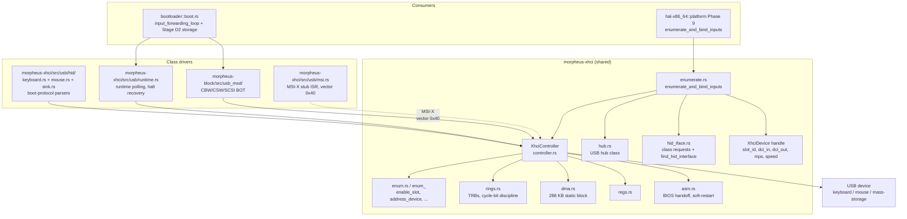
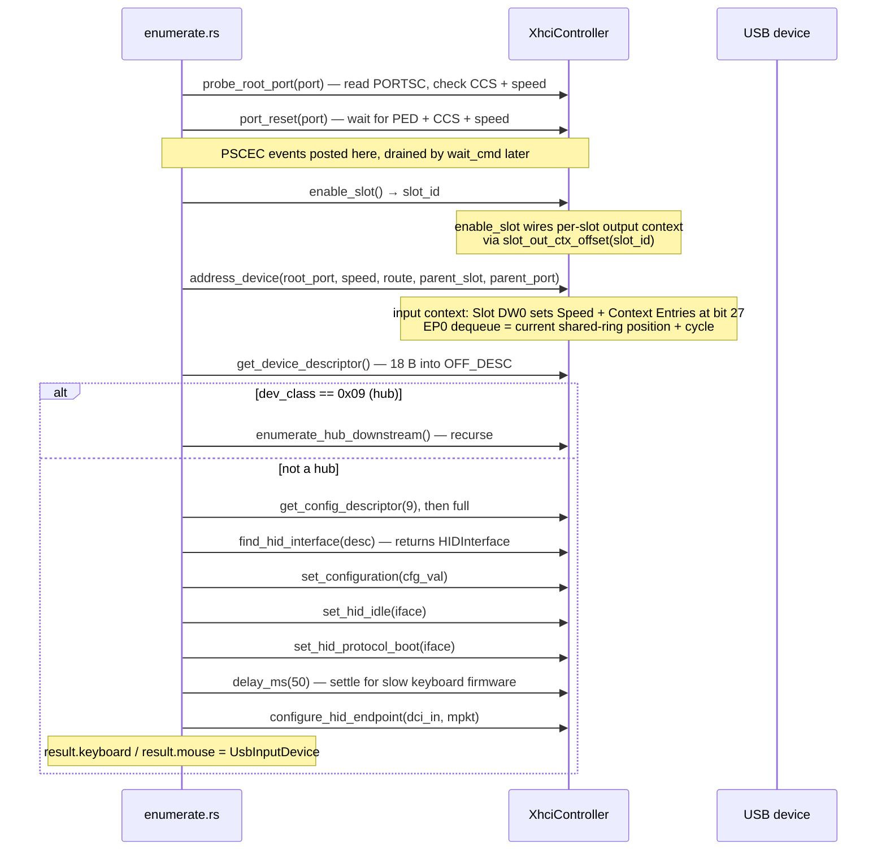
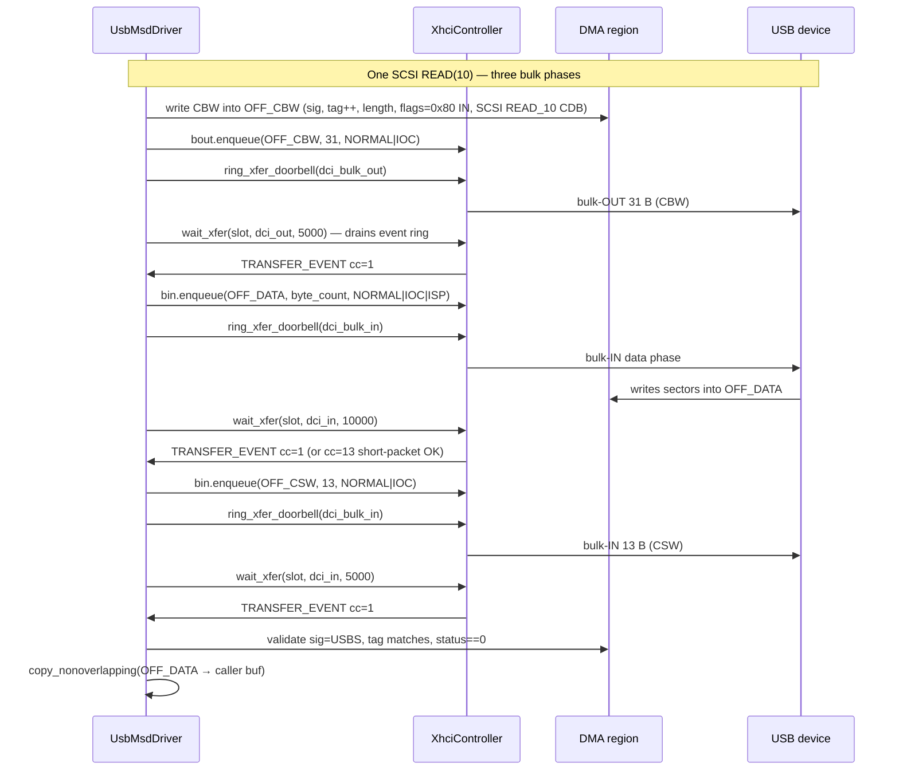
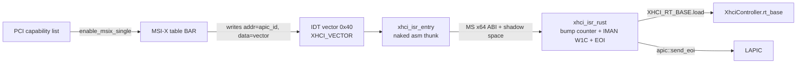

# USB stack

## Current architecture status

Phase 3.7 complete: 12-crate workspace, kernel fully arch-agnostic, the
previous `hwinit/` crate deleted. `morpheus-xhci` is the single shared
host controller crate, consumed by `morpheus-block::usb_msd` (storage)
and by its own `usb::hid` module (input). HID class drivers, MSI-X
wiring (`usb::msi`), and the runtime keyboard poll (`usb::runtime`)
all now live in `morpheus-xhci/src/usb/`. The cycle with
`morpheus-hal-x86_64` was broken by extracting `morpheus-x86-asm` as a
leaf primitives crate (Wave B1), so the dep DAG is now
`bootloader → hal-x86_64 → xhci → kernel → hal-api`.

## Purpose

The USB stack is MorpheusX's hand-rolled, xHCI-only host controller and class-driver layer. It targets USB 3.x compliant xHCI controllers on UEFI x86-64 platforms, takes ownership from firmware via the USBLEGSUP BIOS handoff, and synchronously enumerates every connected port during early boot to bind HID keyboards (and eventually mice) plus to discover a USB mass-storage device for the HelixFS root. No EHCI/OHCI/UHCI fallback.

Phase 2.1 killed the previous **dual implementation** — ~2,200 lines of xHCI logic in the previous `hwinit/src/usb/` for HID input plus 1,783 lines of structurally-identical xHCI logic in `network/src/driver/usb_msd/mod.rs` for storage. The two drifted: the HID side gained PSCEC drain, MaxSlotsEnabled, per-slot output contexts, and hub support; the storage side did not. The xHCI plumbing now lives in `morpheus-xhci`, consumed by both `morpheus_xhci::usb::hid` and `morpheus-block::usb_msd`. USB-MSD's xHCI-layer code dropped from 1,783 → 474 lines. `XhciController::quiesce()` is new in Phase 2.1: the boot chain instantiates two `XhciController` values against the same physical PCI device (one for Phase-9 HID, one for the bootloader's Stage D2 storage probe) and needs a clean handoff between them.

## Architecture overview



`morpheus-xhci` depends on `morpheus-foundation`, `morpheus-hal-api`, `morpheus-x86-asm` (bare primitives), and `morpheus-kernel` (for input/queue sinks). It is consumed by `morpheus-hal-x86_64` (for `UsbHost` impl), by `morpheus-block` (for USB-MSD), and directly by `bootloader` (for the runtime input loop). The HID class driver, MSI-X wiring (`usb::msi`), and the runtime keyboard poll (`usb::runtime`) live in `morpheus-xhci/src/usb/`.

## XhciController API surface

`morpheus_xhci::XhciController` (`morpheus-xhci/src/controller.rs`) is the single host-controller object. All public methods are `unsafe` — DMA-region access is volatile against identity-mapped physical addresses (see [memory:usb_dma_layout](../../~/.claude/projects/-home-explo1t-Documents-repos-morpheusx/memory/usb_dma_layout.md)), and the controller is single-threaded by construction.

- **`new(mmio_base, tsc_freq) -> Result<Self, XhciError>`** — full bring-up: (1) `asm_usb_host_probe` reads CAPLENGTH/HCIVERSION, returns 0 on dead BAR. (2) Cache `op_base`/`rt_base`/`db_base`, `max_slots`/`max_ports`/`ctx_size`/scratchpad count from HCSPARAMS1/2 + HCCPARAMS1. (3) `asm_xhci_bios_handoff` walks the extended-cap list for `EXT_CAP_LEGACY` and requests ownership; 10 ms TSC delay. (4) If UEFI left no port linked, run `asm_xhci_controller_soft_restart` — stop, brief delay, start — followed by 50 ms settle. **HCRST never asserted**; preserves UEFI port enumeration (see [memory:usb_xhci_controller](../../~/.claude/projects/-home-explo1t-Documents-repos-morpheusx/memory/usb_xhci_controller.md)). (5) **Unconditional halt** (clear `CMD_RS`, wait `STS_HCH`, 1 s timeout) — xHCI §5.4.5/§5.4.6: `DCBAAP`/`CRCR` writes are silently dropped while running, and UEFI hands off running (real-hw quirk #2 in [memory:usb_xhci_real_hw_quirks](../../~/.claude/projects/-home-explo1t-Documents-repos-morpheusx/memory/usb_xhci_real_hw_quirks.md)). (6) Scratchpad pages into DCBAA[0]. (7) `OP_CONFIG.MaxSlotsEnabled = min(max_slots, MAX_OUT_CTX_SLOTS)` — quirk #3 (§4.3.3, must precede any `ENABLE_SLOT`). (8) Write DCBAAP, CRCR|RCS, ERST entry, IR0 ERSTBA/ERDP/ERSTSZ, set `IMAN.IE`. (9) Start (`CMD_RS | CMD_INTE`), spin on `STS_HCH` clear (1 s). (10) W1C stale `PORTSC_RW1C`. (11) 200 ms settle.

- **`quiesce(&mut self)`** — Phase 2.1, for the cross-instance handoff. xHCI 1.2 §4.2 stop sequence: (1) `CRCR.CS=1`, wait `CRR=0` (best-effort, 1 s cap). (2) Drain every event TRB via `evt_ring.advance()`, write fresh `ERDP`, W1C `IMAN.IP=1` preserving `IE`. (3) Clear `CMD_RS`, wait `STS_HCH`. **HCRST not asserted** — port state must persist into Stage D2. Without `quiesce`, real hardware kept running with stale DCBAAP/CRCR/ERST pointers and the storage probe's second `XhciController::new` saw silent ring-pointer mismatches. `UsbMsdDriver::Drop` calls `quiesce`.

- **`port_reset(port) -> Result<speed>`** — returns 1=FS, 2=LS, 3=HS, 4+=SS. Ensures `PORTSC_PP`, refuses if no link indicators, issues a warm-reset PLS hint for SS links stuck in U3/Recovery/Resume, asserts `PR`, waits for `PRC` or `PR`-clear (200 ms), then for `PED` or `CCS + speed`. PSCEC drain is in `wait_cmd`/`wait_xfer`, not here.

- **`enable_slot() -> Result<slot_id>`** (`enum.rs`) — enqueues `TRB_ENABLE_SLOT`, rings doorbell, waits 2 s. Three failure paths emit distinct serial codes (251=no completion, 252=CC≠1, 253=slot id=0). On success, allocates a per-slot 4 KB block from `OFF_OUT_CTX_ARRAY` via `slot_out_ctx_offset(slot_id)`, zeroes it, writes its physical address into `DCBAA[slot]`. **One-output-context-per-slot** is quirk #7.

- **`address_device(root_port, speed, route, parent_hub_slot, parent_hub_port)`** — populates input context, enqueues `TRB_ADDRESS_DEV | (slot_id<<24)`. Slot DW0 sets Route String + Speed + **Context Entries=1 at bit 27** (quirk #4: prior code had bit 26 = Hub). DW1: 1-based root-hub port. DW2: parent hub slot/port for LS/FS devices behind an HS hub. EP0 MPS from `ep0_max_packet(speed)`. **Critical**: EP0 dequeue is written to the *current* shared-EP0 ring position with the *current* cycle bit, not ring-base with DCS=1 (see [memory:usb_hub_enumeration](../../~/.claude/projects/-home-explo1t-Documents-repos-morpheusx/memory/usb_hub_enumeration.md) §2).

- **`configure_endpoints(dci_in, dci_out, mpkt_in, mpkt_out)`** — bulk-mode mass-storage path. EP Type 6 (Bulk IN) + 2 (Bulk OUT). Retains the bit-26 vs bit-27 bug from quirk #4 until the USB-MSD path gets the cleaned-up treatment.

- **`configure_hid_endpoint(dci_in, mpkt_in)`** — post-quirk-#6 HID replacement. EP Type 7 (Interrupt IN), one endpoint, **preserves DW0-DW3** of the current slot context (route, Hub bit, MTT, parent-hub fields, speed) before patching Context Entries at the correct offset, reuses `OFF_XFER_BIN`. Interval N=7 (128 microframes ≈ 16 ms) — anything below is out-of-spec for LS, and real Intel xHCs refuse to schedule it.

- **`configure_hub_slot(num_ports, multi_tt, ttt)`** (`hub.rs`) — sets DW0 Hub, optional MTT, copies DW0-DW3 from output context, patches Number of Ports into DW1[31:24] and TT Think Time into DW2[17:16], issues `TRB_CONFIGURE_EP` with add-context-flag A0 only.

- **`get_device_descriptor() -> *const u8`** — three-TRB EP0 control read: SETUP (`IDT` immediate, `pack_setup(0x80, 0x06, 0x0100, 0, 18)`), DATA (`ISP | DIR_IN`, 18 B → `OFF_DESC`), STATUS (`IOC`). Doorbell DCI=1, 5 s timeout.

- **`get_config_descriptor(len) -> *const u8`** — same shape, `wValue=0x0200`. Enumerator fetches the 9-byte head first to learn `wTotalLength`, then re-fetches up to 512 B. `OFF_DESC` is reused for hub descriptors too.

- **`set_configuration(cfg_val)`** — no-data control: `pack_setup(0x00, 0x09, cfg_val, 0, 0)`.

- **`parse_config(desc_ptr) -> Option<(cfg_val, ep_in, ep_out, mp_in, mp_out)>`** — walks the config-descriptor chain for the BOT MSD interface (cls=0x08, sub=0x06, proto=0x50) and its bulk endpoints. HID interface extraction is `find_hid_interface` in `hid_iface.rs`.

- **`wait_cmd(timeout_ms)`** and **`wait_xfer(slot_id, ep_dci, timeout_ms)`** — **event-ring drain invariant lives here.** Both peek, *always* `evt_ring.advance()`, return only on a matching type (and slot, for `wait_xfer`). Mandatory on real Intel xHCI: PSCEC events arrive ahead of the command completion and otherwise time-out the waiter (see [memory:usb_event_ring_drain_invariant](../../~/.claude/projects/-home-explo1t-Documents-repos-morpheusx/memory/usb_event_ring_drain_invariant.md)). `update_erdp()` on success. `wait_xfer(_, _, 0)` is the non-blocking variant used by runtime polling.

- **`reset_endpoint(slot, dci)`** + **`set_tr_dequeue_pointer(slot, dci, deq)`** — STALL/halt recovery. Required because the LS keyboard's interrupt-IN endpoint frequently halts between `CONFIGURE_ENDPOINT` and the first runtime poll (quirk #8: CErr exhaustion → Halted state, doorbells silently ignored). TRB types 14 and 16.

- **`ring_cmd_doorbell()` / `ring_xfer_doorbell(ep_dci)` / `update_erdp()`** — MMIO doorbell/ERDP pokes. `ring_xfer_doorbell` reads `self.slot_id` for the doorbell index; callers must set it.

`pack_setup(req_type, req, val, idx, len) -> u64` packs the 8-byte USB setup packet into a `u64` for `TRB_IDT` immediate-data delivery.

## XhciDevice handle

```rust
pub struct XhciDevice {
    pub slot_id: u8,
    pub dci_in: u8,
    pub dci_out: u8,
    pub mps: u16,
    pub speed: u8,
}
```

Defined in `morpheus-xhci/src/lib.rs` as the abstract handle class drivers should operate against. The fields are sufficient to address any endpoint and size transfers. In practice existing drivers use richer types that pre-date `XhciDevice`: HID via `UsbInputDevice` (adds `interface_num`, `protocol`, `ep_in`, `ep_out`, `max_packet_size`), USB-MSD via fields cached on `XhciController` itself (`dci_bulk_in`, `dci_bulk_out`, `slot_id`). New class drivers should prefer `XhciDevice`.

## DMA layout

The 288 KB static identity-mapped DMA block lives at `morpheus_xhci::dma::XHCI_DMA` (`#[repr(C, align(4096))] static mut XHCI_DMA: XhciDma`). Every DMA-visible structure the controller touches lives at a fixed offset within it; there is no runtime DMA allocator on this path. The base is identity-mapped (VA = PA = bus address) because the kernel maps it under 4 GB via the buddy allocator's `MaxAddress(0xFFFF_FFFF)` constraint during Phase 6.

```mermaid
block-beta
    columns 4

    block:dcbaa["DCBAA<br/>0x0000..0x0800<br/>2 KB"]:1
    end
    block:cmdring["Command ring<br/>0x1000..0x1200<br/>32 TRBs"]:1
    end
    block:evtring["Event ring<br/>0x1200..0x1400<br/>32 TRBs"]:1
    end
    block:erst["ERST<br/>0x1400<br/>16 B"]:1
    end

    block:outctx["OFF_OUT_CTX<br/>0x2000 (DEPRECATED)"]:1
    end
    block:inctx["Input context<br/>0x3000..0x3A00"]:1
    end
    block:ep0["EP0 ring<br/>0x4000"]:1
    end
    block:bout["BulkOUT ring<br/>0x4100"]:1
    end

    block:bin["BulkIN ring<br/>0x4200"]:1
    end
    block:rpt["HID report<br/>0x4300, 64 B"]:1
    end
    block:cbw["BOT CBW<br/>0x4400"]:1
    end
    block:csw["BOT CSW<br/>0x4440"]:1
    end

    block:desc["Descriptor<br/>0x4480, 256 B"]:1
    end
    block:data["Data bounce<br/>0x5000, 4 KB"]:1
    end
    block:scarr["Scratch arr<br/>0x7000"]:1
    end
    block:scpg["Scratch pages<br/>0x8000<br/>up to 64×4 KB"]:1
    end

    block:perslot["Per-slot Output Contexts<br/>OFF_OUT_CTX_ARRAY = 0x48000<br/>16 slots × 4 KB = 64 KB"]:4
    end
```

Offsets (see `morpheus-xhci/src/dma.rs`): `OFF_DCBAA=0x0000` (2 KB), `OFF_CMD_RING=0x1000` (32 TRBs), `OFF_EVT_RING=0x1200` (32 TRBs), `OFF_ERST=0x1400` (16 B), `OFF_OUT_CTX=0x2000` (**DEPRECATED** — was shared output context, quirk #7), `OFF_IN_CTX=0x3000` (2.5 KB), `OFF_XFER_EP0/BOUT/BIN=0x4000/0x4100/0x4200` (256 B each, 16 TRBs), `OFF_REPORT=0x4300` (HID report), `OFF_CBW=0x4400` + `OFF_CSW=0x4440` (BOT), `OFF_DESC=0x4480` (descriptor scratch), `OFF_DATA=0x5000` (4 KB SCSI bounce), `OFF_SCRATCH_ARR=0x7000`, `OFF_SCRATCH_PG=0x8000+` (≤64×4 KB), `OFF_OUT_CTX_ARRAY=0x48000` (16×4 KB per-slot output contexts).

`DMA_SIZE = OFF_OUT_CTX_ARRAY + MAX_OUT_CTX_SLOTS * OUT_CTX_STRIDE`, `MAX_OUT_CTX_SLOTS=16`. `OP_CONFIG.MaxSlotsEnabled` is capped at this count. `slot_out_ctx_offset(slot_id)` is a `const fn`; slot 1 lives at `OFF_OUT_CTX_ARRAY`, slot 2 at `+0x1000`, etc. (slot 0 is reserved for the scratchpad pointer array).

**Coherency model**: all access via `core::ptr::read_volatile`/`write_volatile` (`vr32`/`vw32`/`vw64` helpers in `rings.rs`). No memory barriers, no cache invalidation. Relies on x86-64 TSO plus the DMA region being mapped uncached/WC by Phase 8 page tables. TRB writes order `param_lo` → `param_hi` → `status` → `ctrl` so the cycle bit flip in `ctrl[0]` is the atomic producer→consumer event.

Three transfer rings (EP0, one bulk-IN, one bulk-OUT) means **one active non-control device per `XhciController` instance**. The keyboard and storage paths coexist because they live in separate instances, separated by `quiesce()` + drop + `new()`.

## TRB ring discipline

Per [memory:usb_trb_rings](../../~/.claude/projects/-home-explo1t-Documents-repos-morpheusx/memory/usb_trb_rings.md). Each TRB is 16 B, little-endian: `param_lo [31:0]`, `param_hi [63:32]`, `status [95:64]` (length + CC), `ctrl [127:96]` (type [15:10], flags [9:1], cycle bit [0]).

`write_trb` in `rings.rs` writes fields in order `param_lo` → `param_hi` → `status` → **`ctrl` LAST**. This is load-bearing: the cycle bit in `ctrl[0]` is the entire producer-consumer synchronisation protocol. No locks, no barriers, no atomics. Writing `ctrl` last means the controller cannot observe a partially-written TRB whose cycle bit matches its expected value.

```mermaid
sequenceDiagram
    participant P as Producer<br/>(driver)
    participant DMA as DMA region
    participant C as Consumer<br/>(xHCI controller)

    Note over P,C: cycle bit is the only sync primitive
    P->>DMA: write param_lo
    P->>DMA: write param_hi
    P->>DMA: write status
    P->>DMA: write ctrl (with cycle bit flipped)
    P->>C: ring doorbell (MMIO)
    C->>DMA: read ctrl, sees new cycle bit
    C->>C: dispatch TRB
    C->>DMA: post event TRB (cycle bit flipped on event ring)
    C->>P: (no interrupt — polling) event ring peek
    P->>DMA: read evt.ctrl
    P->>P: peek matches expected cycle → process event
    P->>P: advance dequeue; on wrap flip cycle
    P->>DMA: write back ERDP
```

`CmdRing` and `XferRing` are producer rings: driver writes TRB at `enq`, increments, and when `enq` hits `len-1` writes a **LINK TRB** with `param=base`, `ctrl=TRB_LINK | TRB_TC | cycle`. The Toggle-Cycle (TC) flag tells the controller to flip its own cycle expectation. Then `enq=0`, `cycle ^= 1`. `EvtRing` is the consumer ring: `peek()` returns the current TRB only if `ctrl[0] == cycle`; `advance()` wraps with a cycle flip at `len`. Doorbells must be 32-bit writes.

## Enumeration flow

`enumerate_and_bind_inputs(controller)` in `enumerate.rs` is the entry point. For each root port:



`probe_root_port` reads PORTSC, checks `CCS` and the speed field (bits 13:10). Devices with `CCS=0` or `speed=0` are skipped. `port_reset` then runs the state machine described in the API section.

Speed → EP0 max packet size mapping (`ep0_max_packet`):

| Speed code | USB speed       | EP0 MPS |
|------------|-----------------|---------|
| 1          | FS (12 Mbps)    | 64 B    |
| 2          | LS (1.5 Mbps)   | 8 B     |
| 3          | HS (480 Mbps)   | 64 B    |
| 4+         | SS (5 Gbps+)    | 512 B   |

DCI formula (memorise): `DCI = endpoint_number * 2 + (direction_is_in ? 1 : 0)`. EP0 has DCI=1 (control endpoints are bidirectional but use index 1). EP1 IN → DCI 3, EP1 OUT → DCI 2, etc.

The **ordering of `set_configuration` / `set_hid_idle` / `set_hid_protocol_boot` / delay / `configure_hid_endpoint`** is deliberate: configuring the host-side EP context first would transition the endpoint to Running and start the xHC polling the device immediately. If the device was still in report-protocol mode at power-on (typical despite spec saying boot-subclass should default to boot), it would STALL the first few polls, CErr would decrement to 0, and the endpoint would halt before `SET_PROTOCOL` could even reach it. The current order activates the device's configuration, switches to boot protocol, gives it 50 ms to settle, *then* arms the host-side endpoint context.

## Hub support

`hub.rs` and `enumerate.rs` together implement the USB Hub class. Critical because Intel PCH boards route most chassis USB ports through internal hubs (e.g., the rate-matching hub introduced with ICH8/9). On the target Fujitsu D3674-B13 (Intel 300-series PCH, `8086:a36d`), the keyboard was sitting behind an internal hub and was unreachable without this code.

```mermaid
sequenceDiagram
    participant E as enumerate.rs
    participant H as hub class (hub.rs)
    participant Hub as USB hub device
    participant Child as Downstream device

    E->>E: enumerate_device(root_port, ..., parent=None)
    E->>E: dev_class == 0x09 → recurse into enumerate_hub_downstream

    rect rgb(220, 220, 255)
    Note over E,Hub: PHASE 1: all hub class requests on shared EP0 ring
    E->>H: get_hub_descriptor() → num_ports, tt_think_time, pwr_on_2_pwr_good
    E->>H: configure_hub_slot(num_ports, multi_tt, ttt)<br/>(slot context update)
    loop for p in 1..=num_ports
        E->>H: hub_port_set_feature(p, PORT_POWER)
    end
    E->>E: delay_ms(pwr_on_2_pwr_good + 100)
    loop for p in 1..=num_ports
        E->>H: hub_port_get_status(p) — check CONNECTION
        opt connected
            E->>H: hub_port_reset(p) — SET_FEATURE(RESET) + poll C_RESET<br/>(returns FS/LS/HS speed)
            E->>E: record (port_num, dspeed) in connected[]
        end
    end
    end

    rect rgb(220, 255, 220)
    Note over E,Child: PHASE 2: enumerate children. Never return to hub EP0 after this.
    loop for (down_port, dspeed) in connected
        E->>E: route |= down_port << route_depth_bits<br/>route_depth_bits += 4
        E->>Child: enumerate_device(root_port, dspeed, route, depth, parent=HubParent{...})
        Note over Child: child takes over shared EP0 ring;<br/>child's address_device updates per-slot EP0 dequeue
    end
    end
```

**Two-phase invariant**: hub class requests (`GET_HUB_DESCRIPTOR`, `SET_PORT_POWER`, `GET_PORT_STATUS`, `SET_PORT_FEATURE/RESET`) finish for *every* downstream port *before* any child is enumerated. Once a child slot starts issuing EP0 transfers, the shared EP0 ring past the hub's last dequeue is overwritten with the child's TRBs; any later hub request would re-execute the child's leftover TRBs as the hub's.

xHCI 20-bit route string accumulates 4 bits per hub level (`route |= down_port << route_depth_bits`); max depth 5 hubs. `HubParent { slot_id, port_num, route_depth_bits }` feeds the new slot's DW2 Parent Hub Slot ID + Parent Port Number for TT forwarding.

`USB_CLASS_HUB=0x09`. Port features: POWER=8, RESET=4, C_CONNECTION=16, C_RESET=20. Hub control transfers use `bmRequestType=0xA0` (descriptor), `0xA3` (port status), `0x23` (SET/CLEAR_FEATURE).

## HID class (boot protocol)

Path: `morpheus-xhci/src/usb/hid/{keyboard.rs, mouse.rs, sink.rs, mod.rs}`.

**Boot-protocol only.** No HID Report Descriptor parser. Non-boot-protocol HID (gamepads, tablets, multi-touch) is silently skipped — sufficient for a bring-up kernel that needs only keyboard and mouse.

Class constants (`morpheus_xhci::hid_iface`): `USB_CLASS_HID=0x03`, `USB_SUBCLASS_BOOT=0x01`, `USB_PROTOCOL_KEYBOARD=0x01`, `USB_PROTOCOL_MOUSE=0x02`. `find_hid_interface(desc_ptr)` matches the first interface with `cls=0x03 && sub=0x01 && proto∈{1,2}` — with the quirk-#5 fix that `break`s the moment `ep_in != 0` so a multi-interface keyboard's iface 1 can't clobber the iface 0 match.

Report layouts (HID 1.11 §B):
- **Keyboard (8 B)**: byte 0 = modifier bitmap (bit 0=LCtrl, 1=LShift, 2=LAlt, 3=LGui, 4=RCtrl, 5=RShift, 6=RAlt, 7=RGui); byte 1 reserved; bytes 2–7 = up to 6 simultaneous HID usage codes (Page 0x07).
- **Mouse (4 B)**: byte 0 = button bitmap (bit 0=Left, 1=Right, 2=Middle); bytes 1/2 = signed dx/dy; byte 3 = signed wheel.

`parse_keyboard_report` diffs against a static `PREV_REPORT` to derive press/release events (the boot report has no per-key state bit). Modifier byte 0 is diffed bit-by-bit (eight standard `MODIFIER_USAGE` codes 0xE0–0xE7); the keys array is diffed by set membership.

**USB HID → PS/2 Set 1 translation** in `translate_hid_to_ps2_set1(hid_code) -> (Option<u8>, u8)`. Returns `(extended_prefix, base_scancode)`; `Some(0xE0)` means emit `Key(0xE0, true)` then the base byte, just like real PS/2 sends extended-key sequences. Covers letters, digits, F1–F12, navigation cluster, keypad, modifiers. Examples: HID `0x04` (a) → `0x1E`; HID `0x28` (Enter) → `0x1C`; HID `0x52` (UpArrow) → `0xE0 0x48`; HID `0xE0` (LeftCtrl) → `0x1D`. Break = `scancode | 0x80`. Bytes go through `sink::push_keyboard_byte(byte, true)`; the `pressed` flag is repurposed as "process this byte." Choosing PS/2 Set 1 lets the existing PS/2-native bootloader machinery handle USB for free.

`parse_mouse_report` pushes one composite event via `sink::push_mouse(dx, dy, buttons & 0x07, wheel)`.

The sink layer (`sink.rs`) installs two callbacks at boot (`KeyboardSinkFn`, `MouseSinkFn` via `set_keyboard_sink`/`set_mouse_sink`); HID parsers invoke them. Why: `morpheus-xhci` must not know about `morpheus_kernel::input` directly — the bootloader wires the sinks at boot, keeping the dep DAG clean (xhci does depend on kernel for the input/queue sink types).

## USB-MSD class (BOT)

`morpheus-block/src/usb_msd/mod.rs`. USB Mass Storage Class with Bulk-Only Transport: class `0x08`, subclass `0x06`, protocol `0x50`.

- **CBW** (31 B, written to `OFF_CBW`): `dCBWSignature=0x4342_5355` ("USBC"), `dCBWTag` (monotonic, must match CSW tag), `dCBWDataTransferLength`, `bmCBWFlags` (`0x80` IN / `0x00` OUT), `bCBWLUN`, `bCBWCBLength`, up to 16 B of SCSI CB.
- **CSW** (13 B, read into `OFF_CSW`): `dCSWSignature=0x5342_5355` ("USBS"), `dCSWTag` matching CBW, `dCSWDataResidue`, `bCSWStatus` (0=pass, 1=fail, 2=phase error).

SCSI commands: `0x00` TEST UNIT READY, `0x03` REQUEST SENSE (once during init to clear UNIT ATTENTION), `0x25` READ CAPACITY (10), `0x28` READ (10) into `OFF_DATA` (4 KB bounce). No writes, no INQUIRY/MODE_SENSE, no stall recovery. `submit_write` returns `BlockError::Unsupported`.



`UsbMsdInitError` is intentionally fine-grained — the bootloader's storage probe matches on specific variants to decide retry vs skip. Many variants (`ControllerScratchpadUnsupported`, several port-reset sub-cases) are retained as never-constructed `#[allow(dead_code)]` so existing match arms keep compiling after Phase 2.1.

`UsbMsdDriver::Drop` calls `controller.quiesce()`. In practice the driver lives for the rest of uptime, but the explicit quiesce keeps the contract honest.

## MSI / interrupt path

`morpheus-xhci/src/usb/msi.rs` wires MSI-X for the xHCI controller.



Vector `XHCI_VECTOR = 0x40` — picked above the standard PIC remap range (0x20–0x2F) and clear of the existing timer (0x20). `wire_msix(pci_addr, rt_base)` publishes `rt_base` into a static `AtomicU64` so the ISR can W1C the interrupter's IP bit (`IMAN | 0x01`, preserving IE) without holding a borrow of the controller struct (which is owned by Phase 9 init and dropped immediately afterwards). The naked ISR thunk saves caller-saved GPRs, adds 32 bytes of MS x64 shadow space, calls the Rust handler, restores, `iretq`s. No vector or frame is passed — this ISR doesn't need them. `enable_msix_single` is tried first; on `NoCapability` it falls back to `enable_msi_single`; on any other error it logs and returns without disabling polling.

**Polling is still authoritative.** The MSI-X ISR is currently a Phase 2 stub: increments `XHCI_EVENT_COUNT`, acks IMAN.IP, EOIs the LAPIC, returns. It does not drain the event ring. The `wait_cmd`/`wait_xfer` polling loops remain the only consumers of event TRBs. Phase 3 will swap polling for interrupt-driven HLT-based waits per `.claude/skills/interrupt-driven-refactor/SKILL.md`; for now the path exists to prove MSI-X delivery works. Most of the boot path runs with interrupts disabled (`cli` is asserted at the start of `platform_init_selfcontained` and not released until Phase 11), so polling is the only viable path during enumeration anyway.

## Real-hardware quirks catalog

From [memory:usb_xhci_real_hw_quirks](../../~/.claude/projects/-home-explo1t-Documents-repos-morpheusx/memory/usb_xhci_real_hw_quirks.md), all confirmed on Fujitsu D3674-B13 (Intel 300-series PCH, `8086:a36d`). Each was invisible in QEMU.

1. **`wait_cmd`/`wait_xfer` must drain every event.** Real Intel xHCI posts multiple PSCEC TRBs (type 34) during `port_reset`; these arrive ahead of the type-33 command completion. A match-only waiter spins on the first PSCEC and times out. Fix: peek → unconditional `advance()` → match-or-loop. Code: `morpheus-xhci/src/controller.rs::{wait_cmd, wait_xfer}`. Detail in [memory:usb_event_ring_drain_invariant](../../~/.claude/projects/-home-explo1t-Documents-repos-morpheusx/memory/usb_event_ring_drain_invariant.md).

2. **Controller must be halted before DCBAAP/CRCR/ERST writes** (xHCI §5.4.5/§5.4.6). UEFI hands off running, and the conditional soft-restart is skipped on real boards (linked ports). Without the unconditional halt block in `XhciController::new`, the controller kept using UEFI's old ring addresses; our ENABLE_SLOT TRB landed in a ring the controller never read.

3. **`OP_CONFIG.MaxSlotsEnabled` must be written before ENABLE_SLOT** (xHCI §4.3.3). UEFI may leave a non-zero value but it's firmware-dependent. Symptom: `enable_slot` returns CC=12 ("No Slots Available"). Fix: explicit `OP_CONFIG` write in `XhciController::new`, capped at `MAX_OUT_CTX_SLOTS`.

4. **Slot Context DW0: Hub vs Context Entries bit positions.** Prior `address_device` wrote `(1 << 26)` (Hub) instead of `(1 << 27)` (Context Entries=1). Hub=1 with uninitialised DW1 hub fields = malformed input context; Context Entries=0 is explicitly invalid (§6.2.2.1). Either alone causes ADDRESS_DEVICE non-success on compliant silicon.

5. **`find_hid_interface` dropped multi-interface keyboard matches.** Most keyboards expose iface 0 = boot keyboard + iface 1 = vendor extras. Prior code used `in_hid_boot` as a per-iter flag and gated return on it; walking past iface 1 flipped it to false. Fix: `break` once `ep_in != 0`.

6. **`configure_endpoints` was bulk-only with bit-shift + slot-context bugs.** Hardcoded EP Type 6 (Bulk IN) for HID; bit-26 vs bit-27 as in #4; slot context preservation mask wiped route string, Hub bit, MTT, DW2 — fatal behind a hub. Fix: new `configure_hid_endpoint` with EP Type 7, correct mask, full DW0-DW3 copy. Original `configure_endpoints` left for USB-MSD bulk path.

7. **Shared output context corrupted multi-slot enumeration.** Original code wired every `DCBAA[slot]` to the same `OFF_OUT_CTX`. Enumerating keyboard then USB stick left the buffer holding the stick's context; runtime polling for the keyboard slot followed `DCBAA[3] → OFF_OUT_CTX → stick's context → port 7 → no data ever`. Fix: `OFF_OUT_CTX_ARRAY` (16 × 4 KB) at DMA tail, `slot_out_ctx_offset(slot_id)` helper, `MaxSlotsEnabled` capped.

8. **LS keyboard endpoint halts before runtime polling reaches it.** xHCI §4.10.2: CErr→0 transitions endpoint to Halted, doorbells silently ignored. On real silicon the LS keyboard halts between `CONFIGURE_ENDPOINT` and the first poll (xHC polls 3× during `set_hid_idle` / `set_hid_protocol_boot` / Phase-9→stage-e2, hits CErr errors on LS-on-HS TT timing or SET_PROTOCOL STALL). Fix: `reset_endpoint` (TRB 14) + `set_tr_dequeue_pointer` (TRB 16); `runtime::arm_keyboard_transfer` + `runtime::poll_keyboard` check EP State in the slot's output context (DW0[2:0]; 2=Halted, 4=Error) and recover before any transfer.

Pattern: whenever the xHCI spec says "X shall be Y only when Z" — **assume real silicon enforces it**, even if QEMU doesn't. Untripped candidates: `ERSTSZ` writes also require halt; `ERDP.EHB` clearing has ordering rules vs interrupt acks; SS port reset may need `PORTSC.WPR` (warm reset) for stuck links beyond our current narrow gating; slot-context Max Exit Latency must match BOS LPM values for U1/U2 sleep.

## Boot chain integration

USB is wired into the boot sequence at two distinct points, both running with interrupts disabled (`cli` at start of `platform_init_selfcontained`, `sti` not until Phase 11).

**Phase 9 — HID input enumeration** (`morpheus-hal-x86_64/src/platform.rs`):
1. `input::init()` — zero unified-input queues.
2. PCI-scan for class `0x0C` / subclass `0x03`.
3. For each xHCI device: read BAR0, calibrate TSC locally, `XhciController::new`, `enumerate_and_bind_inputs(&mut controller)`.
4. If a keyboard was found, **`runtime::install_runtime(controller, keyboard)`** moves the controller into `SpinLock<Option<XhciController>>` and arms the first interrupt-IN TRB. Before this existed, `XhciController` was dropped at end of Phase 9 and runtime polling was structurally impossible.
5. Otherwise, register PS/2 handler as fallback.

**Stage D2 — storage USB** (`bootloader/src/storage.rs`):
1. Prefer pre-EBS staged image at `/morpheus/helix.img` if captured.
2. Otherwise `network::scan_all_block_devices` probes VirtIO, AHCI, SDHCI, and xHCI USB-MSD.
3. The USB path instantiates a **separate** `UsbMsdDriver` via `XhciController::new()` on the same physical xHC that Phase 9 used. **This is why `quiesce()` was added in Phase 2.1**: without it, the second instance's bring-up sees stale DCBAAP/CRCR/ERST pointers from the first.
4. The chosen `UnifiedBlockDevice::UsbMsd` is wrapped into a `RawBlockDevice` and registered with `morpheus_helix::vfs::global::replace_root_device`. HelixFS mounts; `/bin/init` is launched.

The runtime polling path (`morpheus-xhci/src/usb/runtime.rs`) keeps the Phase-9 controller alive in a static `SpinLock<Option<XhciController>>`. The bootloader's `input_forwarding_loop` calls `runtime::poll_keyboard()` each iteration: acquire the locks, compute DCI = `(ep_in & 0x7F) * 2 + 1`, **check EP State** in the slot's output context (DW0[2:0]; if Halted/Error, run `reset_endpoint` + `set_tr_dequeue_pointer(ring_base | 1)`, reset producer ring state, re-arm, return false), then `wait_xfer(slot_id, dci, 0)` for the non-blocking peek. On `Ok`: read the 8-byte report from `OFF_REPORT`, run `parse_keyboard_report` (diffs against `PREV_REPORT`, translates HID→PS/2 Set 1, pushes via sink), re-arm with `TRB_NORMAL | TRB_IOC | TRB_ISP`. The bootloader then drains the unified queue and feeds each byte through the same `Keyboard::feed_raw` path PS/2 uses, so existing PS/2 scancode→unicode handles USB for free.

## Key invariants

- **Event-ring drain past every TRB**, not just matching ones. `wait_cmd`/`wait_xfer` call `advance()` unconditionally; required for real Intel xHCI's PSCEC burst during `port_reset`. New `wait_*` helpers must follow peek → advance unconditionally → match-or-loop, and `update_erdp()` on success.
- **Soft-restart only, no HCRST.** Both `XhciController::new` and `quiesce` preserve UEFI port state.
- **TSC-based delays only.** `tsc_delay` / `delay_ms`. Spin with `core::hint::spin_loop()`.
- **`ctrl` written last in TRB construction.** Cycle bit's atomic flip is the producer→consumer event.
- **Per-slot EP0 dequeue tracking.** The shared EP0 ring means each new slot's EP0 dequeue must reflect the current `ep0.enq` + cycle, not ring-base + DCS=1.
- **Two-phase hub enumeration.** All hub-class EP0 traffic completes before any child enumeration. Once a child takes the shared EP0 ring, the parent hub is unreachable.
- **Per-slot output contexts** via `slot_out_ctx_offset(slot_id)`; `MaxSlotsEnabled` capped at `MAX_OUT_CTX_SLOTS`.
- **Volatile-only DMA access**, no memory barriers; relies on x86-64 TSO + UC/WC mapping.
- **Single-handler input model.** USB and PS/2 cannot both register; USB takes priority during Phase 9, PS/2 only as fallback.
- **HID order**: `set_configuration` → `set_hid_idle` → `set_hid_protocol_boot` → 50 ms settle → `configure_hid_endpoint`. Reversing this halts the endpoint via CErr exhaustion before SET_PROTOCOL can take effect.

## Dependency surface

- **`morpheus-xhci`** → `morpheus-foundation`, `morpheus-hal-api`, `morpheus-x86-asm` (bare port-I/O/MMIO/TSC primitives), `morpheus-kernel` (input/queue sinks). Owns HID class drivers, MSI-X wiring (`usb/msi.rs`), runtime keyboard poll (`usb/runtime.rs`), the logger sink, and the `BotExt` trait.
- **`morpheus-hal-x86_64`** → `morpheus-xhci` (for its `UsbHost` impl + Phase-9 enumeration).
- **`morpheus-block`** → `morpheus-xhci`. `UsbMsdDriver` implements `BlockDriver` + `BlockDriverInit`.
- **`bootloader`** → `morpheus-xhci` (for `usb::runtime::poll_keyboard`) + `morpheus-block` (for `UsbMsdDriver` via `UnifiedBlockDevice`). The two USB paths cross only at the shared physical controller, mediated by `quiesce()`.

## Known intentional changes vs pre-refactor

- **Dual implementation killed.** Was ~2,200 lines in the previous `hwinit/src/usb/` + 1,783 lines in `network/src/driver/usb_msd/mod.rs`. Now one canonical `morpheus-xhci`. USB-MSD's xHCI-layer code went from 1,783 → 474 lines in Phase 2.1. Every real-hw bug fix applied once.
- **`quiesce()` is NEW.** Required for the HID-init-then-MSD-init pattern using two `XhciController` instances against the same physical device. Untested on real hardware before the user's smoke test confirmed userland spawn.
- **HID class requests + `find_hid_interface`** live in `morpheus-xhci/src/hid_iface.rs`. They need to call `XhciController` inherent methods; Rust's orphan rule prevents inherent impls from outside the owning crate. The HID *report parsers* (scancode translation, mouse deltas) live in `morpheus-xhci/src/usb/hid/`.
- **`hub.rs` moved into `morpheus-xhci`** for the same orphan-rule reason.
- **`OFF_OUT_CTX` deprecated** but kept as a constant; real per-slot contexts live in `OFF_OUT_CTX_ARRAY` (quirk #7). The deprecated buffer is still referenced by the unused `reset_transfer_state` helper.
- **Phase 9 controller persists past enumeration** via `runtime::install_runtime` into a static `SpinLock<Option<XhciController>>`. Originally it was dropped — the long-running root cause of "USB enumerates but no keystrokes" on real hardware.
- **HID parsers no longer call `crate::input::*` directly.** Use the `sink::*` callback layer; bootloader installs the sinks at boot to route into `morpheus_kernel::input`.
- **`enable_slot` returns three distinguishable failure logs** (251/252/253) for real-hardware disambiguation.

## Cross-references

- Storage stack documentation — `UnifiedBlockDevice`, `BlockDriver` trait, how the bootloader stitches USB-MSD into HelixFS root-device replacement.
- HAL trait surface documentation — `Mmio` + `Dma` traits that `morpheus-xhci` will consume once Phase 3.2 Batch D lands (currently uses `morpheus_hal_x86_64::asm::mmio` directly).
- Memory files (under `~/.claude/projects/-home-explo1t-Documents-repos-morpheusx/memory/`): [usb_subsystem_overview](../../~/.claude/projects/-home-explo1t-Documents-repos-morpheusx/memory/usb_subsystem_overview.md), [usb_xhci_controller](../../~/.claude/projects/-home-explo1t-Documents-repos-morpheusx/memory/usb_xhci_controller.md), [usb_dma_layout](../../~/.claude/projects/-home-explo1t-Documents-repos-morpheusx/memory/usb_dma_layout.md), [usb_trb_rings](../../~/.claude/projects/-home-explo1t-Documents-repos-morpheusx/memory/usb_trb_rings.md), [usb_enumeration](../../~/.claude/projects/-home-explo1t-Documents-repos-morpheusx/memory/usb_enumeration.md), [usb_hub_enumeration](../../~/.claude/projects/-home-explo1t-Documents-repos-morpheusx/memory/usb_hub_enumeration.md), [usb_hid_class](../../~/.claude/projects/-home-explo1t-Documents-repos-morpheusx/memory/usb_hid_class.md), [usb_bot_mass_storage](../../~/.claude/projects/-home-explo1t-Documents-repos-morpheusx/memory/usb_bot_mass_storage.md), [usb_input_integration](../../~/.claude/projects/-home-explo1t-Documents-repos-morpheusx/memory/usb_input_integration.md), [usb_runtime_polling](../../~/.claude/projects/-home-explo1t-Documents-repos-morpheusx/memory/usb_runtime_polling.md), [usb_boot_integration](../../~/.claude/projects/-home-explo1t-Documents-repos-morpheusx/memory/usb_boot_integration.md), [usb_event_ring_drain_invariant](../../~/.claude/projects/-home-explo1t-Documents-repos-morpheusx/memory/usb_event_ring_drain_invariant.md), [usb_xhci_real_hw_quirks](../../~/.claude/projects/-home-explo1t-Documents-repos-morpheusx/memory/usb_xhci_real_hw_quirks.md), [usb_hardware_bringup_plan](../../~/.claude/projects/-home-explo1t-Documents-repos-morpheusx/memory/usb_hardware_bringup_plan.md).
